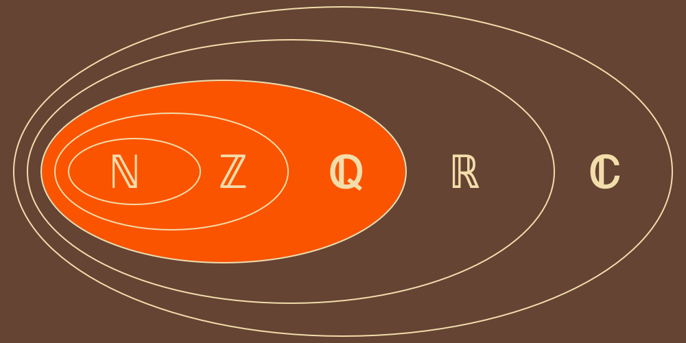
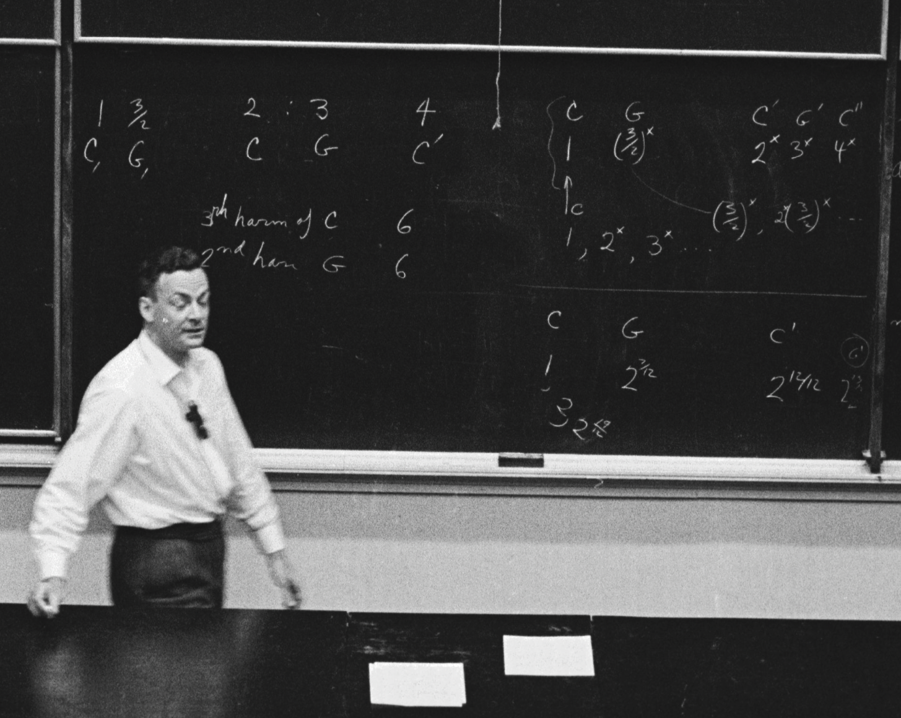

```{r, echo=F, message=F, include=F}
devtools::load_all(".")
source('./man/code/plot.R')
source('./man/code/utils.R')
knitr::opts_chunk$set(
  collapse = TRUE,
  comment = "#>",
  fig.path = "man/figures/README-",
  warning = FALSE, 
  message = FALSE,
  fig.crop= T
)
remove_floating_point_mistakes <- function(errors, uncertainty) {
  errors = errors[errors>=-uncertainty]
  errors[errors<=uncertainty]
}
c_sound = 343
plot_fundamental_wavelength <- function(midi) {
  freq = hrep::midi_to_freq(midi)
  wavelength = c_sound / freq
  wavenumber = (2 * pi) / wavelength
  tibble::tibble(
    meters=seq(0, wavelength ,0.001),
    amplitude=sin(wavenumber * meters)
  ) %>% ggplot2::ggplot(ggplot2::aes(meters, amplitude)) +
    ggplot2::geom_line()
}
```

# Harmony Perception Overview


(The information design of this diagram is intended as a respectful homage to a hero, [Claude Shannon](https://en.wikipedia.org/wiki/Claude_Shannon), and his seminal work [The Mathematical Theory of Communication](https://www.google.com/books/edition/The_Mathematical_Theory_of_Communication/IZ77BwAAQBAJ).)


## 2D Harmony: Major-Minor and Consonance-Dissonance

```math
\mathbf{H} = (h_f - h_\lambda) \mathbf{i} + (h_f + h_\lambda) \mathbf{j}
```

```math
\mathbf{H_{{P1}_{pure}}} = 0 \mathbf{i} + 0 \mathbf{j} \ Sz
```

```math
\mathbf{H_{{M3}_{10}}} = 2.32 \mathbf{i} + 9.49 \mathbf{j} \ Sz
```

```math
\mathbf{H_{{m3}_{10}}} = -2.32 \mathbf{i} + 9.49 \mathbf{j} \ Sz
```

[Introducing Stolzenburgs (Sz), a psychophysical unit of perceived dissonance.]

```math
{MaMi} = (h_f - h_\lambda)
```

```math
{CoDi} = (h_f + h_\lambda)
```


```math
p(x,t) = \sum_{n=1}^{N} A_n(x,t) e^{-i \left( 2 \pi n f t - \frac{2 \pi n}{\lambda} x \right)}
```

```math
h_f = \log_2 \left( \text{LCD}\left( \left\{ \frac{f_n}{f_{\text{min}}} \pm \sigma_t \sigma_f \right\}_{n=1}^{N} \right) \right)
```

```math
h_\lambda = \log_2 \left( \text{LCD}\left( \left\{ \frac{\lambda_n}{\lambda_{\text{min}}} \pm \sigma_x \sigma_\lambda \right\}_{n=1}^{N} \right) \right)
```

## 2D Signals: Space-Time and Wavelength-Frequency

In signal processing, the fundamental frequency of a set of frequencies  $f_1, \ldots, f_N$ is determined by the formula $\text{GCD}(f_1, \ldots, f_N) / \text{LCD}(f_1, \ldots, f_N)$. We apply this principle in multiple ways. First, following Stolzenburg, we treat the log of the least common denominator (LCD) component as a psychophysical quantity, measured in a unit we introduce called Stolzenburg (Sz), to quantify dissonance perception. 

Since our model uses ratios that always include one of the partials in the denominator, the greatest common divisor (GCD) is always unity. By multiplying  $1/\text{LCD}$ by a reference tone's frequency or wavelength we can derive the fundamental frequency or the fundamental wavelength of the complex wave. When the fundamental values $f_0$ or $\lambda_0$ are converted to a common dimension (e.g., temporal period, $T$), they will not necessarily provide the same value. That is to say, spatial and temporal measures of the cycle length of a complex wave will usually be different, even when uncertainty is zero. We identify this inherent difference (or modulation) as the source of major-minor tonality perception.

Consider the case of a 1 Hz wave with three harmonics, where $f = 1, 2, 3$ Hz. The least common denominator (LCD) of the frequency ratios is given by

``` math
\text{LCD}\left(\frac{1}{1}, \frac{2}{1}, \frac{3}{1}\right) = 1
```

For simplicity, assume natural units where the speed of sound $c_{\text{sound}} = 1$ m/s. The wavelengths are $\lambda = \frac{1}{1}, \frac{1}{2}, \frac{1}{3}$ with $\lambda_{\text{min}} = \frac{1}{3}$. Now, calculating

``` math
\text{LCD}\left( \frac{1}{1/3}, \frac{1/2}{1/3}, \frac{1/3}{1/3} \right) = \text{LCD}\left(\frac{3}{1}, \frac{3}{2}, \frac{1}{1}\right) = 2
```

Thus, even with three harmonics that can be easily expressed as rational fraction ratios for frequency and wavelength, we obtain two different estimates of cycle length of the complex wave.

The temporal cycle estimate is $log_2(\text{LCD}_f) = \log_2(1) = 0 \ \text{Sz}$, and the spatial cycle estimate is $log_2(\text{LCD}_\lambda) = log_2(2) = 1 \ \text{Sz}$.

We believe that these space-time discrepancies in cycle length are the source of major-minor tonality perception.

```{r, echo=F, message=F, include=T, results='asis'}
# Define the intervals
intervals <- list(
  P1 = c(60, 60),
  P8 = c(60, 72),
  tt = c(60, 66),
  P5 = c(60, 67),
  P4 = c(60, 65),
  M3 = c(60, 64),
  m6 = c(60, 68),
  M6 = c(60, 69),
  m3 = c(60, 63)
)
framed_intervals <- purrr::map(intervals, ~c(.x, 72))
```

### 2D Plots: Fundamentals of Complex Traveling Waves

The plots are generated using the computed fundamental wavenumber (spatial frequency) and the computed fundamental (temporal) frequency. Major chords have an angle above the 45, neutral chords at the 45 and minor chords below the 45.

This is akin to Shamma's mapping onto a 2D plane.

Notice that octave complements have their $k_0$ and $f_0$ values swapped which leads to wave angles that are mirror images of one another. 

```{r, echo=F, message=F, include=T, results='asis',fig.align='center'}
num_harmonics = 2

results <- purrr::map_dfr(names(framed_intervals), function(interval_name) {
  result <- framed_intervals[[interval_name]] %>% mami.codi(
    num_harmonics = num_harmonics,
    beat_pass_filter = BEAT_PASS_FILTER$NONE,
    sfoae_num_harmonics = 0,
    verbose=T
  )
  
  
  print(plot_space_time(1/result$time_cycles,
                        1/result$space_cycles,
                        majorness=result$majorness,
                        chord_name=interval_name))
  tibble::tibble(
    Interval = interval_name,
    Harmonics = num_harmonics,
    TimeCycles = result$time_cycles,
    SpaceCycles = result$space_cycles,
    Majorness = result$majorness,
    Dissonance = result$dissonance,
    Chord = list(framed_intervals[[interval_name]]),
  )
})

# Print the results in a knitr table for the current num_harmonics
cat("\n\n")
cat(paste("### Framed Harmonics:", num_harmonics, "\n\n"))
print(knitr::kable(results, format = "pipe",))
cat("\n\n")  # Add spacing between tables
```

### Major Minor Tonality

Every pitch has 2 harmonics. These data are computed at the resolution of the cent, 100 data points per semitone. Every dyad includes 60 and 72, known as octave doubling. One pitch per dyad is varied from 48 to 72. Example chords: (56,60,72), (60,64,72), (60,68,72), (60,72,76).

```{r, echo=F, message=F, include=T, results='asis'}
# Define the intervals and framed_intervals
intervals <- seq(-12, 24, 1/100) + 60
unison = 60
octave = unison + 12
framed_intervals <- purrr::map(intervals, ~c(unison, .x, octave))
num_harmonics <- 2

# Run mami.codi on each interval and combine results into a tibble
mami_codi <- purrr::map_dfr(framed_intervals, function(interval) {
  mami.codi(
    interval,
    num_harmonics = num_harmonics,
    beat_pass_filter = BEAT_PASS_FILTER$NONE,
    sfoae_num_harmonics = 0,
    verbose = TRUE,
    metadata = list(
      num_harmonics = num_harmonics,
      semitone = interval[2]
    )
  )
})

semitone_mami_codi <- mami_codi %>% dplyr::rowwise() %>% dplyr::mutate(
  num_harmonics = metadata$num_harmonics,
  semitone      = metadata$semitone
)

semitone_mami_codi$consonance         = z_scores(-semitone_mami_codi$dissonance)
semitone_mami_codi$consonance_z       = z_scores(semitone_mami_codi$consonance)
semitone_mami_codi$majorness_z        = z_scores(semitone_mami_codi$majorness)
semitone_mami_codi$space_consonance   = -semitone_mami_codi$space_dissonance
semitone_mami_codi$time_consonance    = -semitone_mami_codi$time_dissonance
semitone_mami_codi$space_consonance_z = z_scores(semitone_mami_codi$space_consonance)
semitone_mami_codi$time_consonance_z  = z_scores(semitone_mami_codi$time_consonance)
```

```{r, echo=F, message=F, include=T, results='asis'}
framing = paste('(unison:',unison,'octave:',octave,')')
xlab=paste('Semitone',framing)
plot_semitone_codi(semitone_mami_codi, title=paste('Consonance'),
                   black_vlines=c(unison,octave),
                   xlab=xlab)
```

```{r, echo=F, message=F, include=T, results='asis'}
plot_semitone_space_time(semitone_mami_codi, paste('Space and Time Consonance'),
                         black_vlines=c(unison,octave),
                         xlab=xlab)
```

```{r, echo=F, message=F, include=T, results='asis'}
plot_semitone_mami(semitone_mami_codi, 'Major-Minor',
                   black_vlines=c(unison,octave),
                   xlab=xlab)
```


### Uncertainty

Our approach must also address two issues concerning uncertainty. The first challenge is that our GCD/LCD approach necessitates rational fractions. If we only considered just-intoned intervals that would not be a problem. But our model will accommodate equal-tempered intervals, micro-tuning, and timbre manipulation. We will need to convert real numbers into rational fractions. To accomplish this, we introduce a controlled measure of uncertainty to find a rational fraction that approximates the actual number.

The second uncertainty issue stems from the nature of waves and auditory processing: the auditory system transforms stimuli signals from the space-time physical domain into the space-time frequency domain. 

> ”… daß kanonisch konjugierte Größen simultan nur mit einer charakteristischen Ungenauigkeit bestimmt werden können.”
> — Heisenberg
>
> (… that canonically conjugate quantities can only be determined simultaneously with a characteristic uncertainty.)

Accurately modeling this transformation requires accounting for Gabor uncertainty in both the time-frequency and space-wavelength forms. When addressing similar uncertainty constraints in quantum mechanics, Max Born introduced the probabilistic interpretation of the wave function, linking the wave amplitude to probability density. In our case, however, we seek a deterministic model of cycle perception and aim to avoid reliance on probabilistic interpretations. To approximate rational fractions, Stolzenburg employed the Stern-Brocot tree, enabling rational approximation within a relative deviation from a target number. Following this method, we also use the Stern-Brocot tree, but apply fixed deviations. 

Remarkably, when aligning our model with extensive human behavioral data on consonance perception, we found that the closest matches between theory and experiment emerged at the product of the Gabor’s uncertainty limit,  $\frac{1}{4 \pi}$, for both the space-wavelength and time-frequency uncertainties. If our model evaluated one frequency at a time we would likely need to compute the $\Delta f$ from the $\Delta t$ (or the reverse) for each frequency partial and then the equivalent for the space-wavelength uncertainty. But our model computes all the partials as simultaneous ratios. One can imagine that whatever temporal window $\Delta t$ was used to transform from time to frequency would be accounted for in the uncertainty product $\Delta t \Delta x$. Therefore it is not a surprise that it is this product that aligned best with the experimental data.

Although we do not explicitly use the Fourier transform in our model, it serves as a clear reminder of how uncertainty is introduced when transitioning from the physical domain to the frequency domain.

``` math
F(f, \lambda) = \iint f(x, t) \, e^{-i \left(2 \pi f t - 2 \pi \frac{x}{\lambda}\right)} \, dx \, dt
```

```math
\sigma_x \sigma_\lambda \geq \frac{1}{4 \pi}, \ \sigma_t\sigma_f \geq \frac{1}{4 \pi}
```
Note 1: We have previously considered each uncertainty product—space-wavelength and time-frequency—as independent. However, in a 2D space-time context, these uncertainties likely interrelate. Let’s explore how they might connect.

Assuming that $\sigma_x$ is constant due to cochlear geometry, and that $\sigma_t$ relates to the temporal window for recognizing repeating patterns in complex waves, we might find that as $\sigma_t$ narrows, $\sigma_\lambda$ decreases. This continues until $\Delta t = 0$, allowing precise identification of the displaced inner hair cell for each wave partial. Of course, the opposite is true for frequency. As $\Delta t$ shrinks, frequency uncertainty grows.

Let's start with a simple question whether the two uncertainty products are equal to one another.

``` math
\frac{1}{4 \pi} = \sigma_x \sigma_\lambda \stackrel{?}{=} \sigma_t \sigma_f = \frac{1}{4 \pi}
```

Given the fixed spatial geometry of the cochlea, we set $\sigma_x = \kappa_{cochlea}$. Considering the variability of integration times used by the auditory system, we let $\sigma_t \equiv \Delta t_{integration}$.

``` math
\Delta t_{integration} \propto \frac{\sigma_{\lambda}}{\sigma_f} \kappa_{cochlea}
```

As the integration time increases, both wavelength and frequency uncertainty must change. A narrow window provides precise wavelength information but poor frequency data, while a wider window yields more frequency data at the expense of wavelength detail. Specifically, when the temporal window increases, frequency uncertainty improves, while wavelength uncertainty decreases.

After reviewing the literature, it seems that proofs for an uncertainty principle emerging from the 2D spatiotemporal Fourier transform are elusive. This remains an interesting area for future exploration.

Note 2: Based on the bimodal shape of the Stern-Brocot distribution below, explore modeling the two-slit experiment using the deterministic SB method instead of a probabilistic curve; consult Bohmian researchers, who may find the Stern-Brocot’s deterministic approach relevant to quantum mechanics.

# Beats

Beats are not detected in the temporal frequency domain. But they are detected in the 
spatial frequency domain. Our model computes the difference among all wavelengths 
in the complex waveform (including SFOAE) and then only includes difference wavelengths
greater than the largest wavelength in the waveform.

## Physics

``` math
\lambda_{\text{ij}} = \frac{\lambda_i \cdot \lambda_j}{|\lambda_i - \lambda_j|}
```

``` math
p_{\text{ij}} = p_{\text{i}} + p_{\text{j}}
```

## Psychophysics

We apply a beat pass filter so that only pitches below the lowest tone 
(longer wavelength) are included.

``` math
\lambda_{\text{low}} = (\lambda_{\text{ij}} > \text{max}(\lambda_{\text{n}}))
```

In our model, the low wavelengths $\lambda_{\text{low}}$ are passed to the 
wavelength spectrum (but not the frequency spectrum) and computed just like the
other wavelengths from the stimulus and the SFOAE.

### A Measure of Beat Perception

We use beats to see how many harmonics should be included in the SFOAE waveform.

We created this metric for beat perception:

``` math
\log_2 \left( 1 + \sum_{n=1}^{N} p_{\text{max}}^2 \cdot \lambda_{\text{n}} \right)
```

## Pure

[](https://www.youtube.com/watch?v=cVHmb-fJuVg)

## 5 Partials No 3

[](https://www.youtube.com/watch?v=cOp3gnFVnPU)

## 5 Partials

[](https://www.youtube.com/watch?v=aZRqkwwS9jg)

## Bonang

[](https://www.youtube.com/watch?v=1V-BsZqS9Mw)

## Compressed

[](https://www.youtube.com/watch?v=sB1npeSe2Tc)

## Harmonic

[](https://www.youtube.com/watch?v=2vrnfYxZBGM)

## Stretched

[](https://www.youtube.com/watch?v=cOVlcK7-tBU)

# Wavelengths

Consider the fundamental tone of middle C playing from $t=-\infty$ to $t=\infty$. 

Assuming room temperature air at sea level, the wavelength $\lambda$ is `r sprintf(c_sound / hrep::midi_to_freq(60), fmt = '%#.2f')`m.

```{r, echo=F, message=F, include=T}
midi=60
plot_fundamental_wavelength(midi)
```

The human cochlea is $\sim 33 mm$ long.


How does a 1.3m wave fit in the cochlea?


## t=0

If we freeze time at $t=0$, then we have a plane wave:

$$e ^ {i k x}$$


```{r, echo=T, message=F, include=T}
midi=24
C1 = c(midi) %>% hrep::sparse_fr_spectrum(num_harmonics=5)
C1 %>% plot(cochlea=T,ggplot=T,xlim=c(0,100))
```

```{r, echo=T, message=F, include=T}
midi=60
C4 = c(midi) %>% hrep::sparse_fr_spectrum(num_harmonics=5)
C4 %>% plot(cochlea=T,ggplot=T,xlim=c(0,100))
```

```{r, echo=T, message=F, include=T}
midi=97
C7 = c(midi) %>% hrep::sparse_fr_spectrum(num_harmonics=5)
C7 %>% plot(cochlea=T,ggplot=T,xlim=c(0,100))
```

## t=0+deltas

If we briefly unfreeze time for a few times $t=0+0\delta$, $t=0+1\delta$, 
$t=0+2\delta$, $t=0+3\delta$ we get a changes of phase. Our uncertainty increases.


# Frequencies

Imagine an oscilloscope attached to every hair cell bundle, each $x$ position.

When $t=0$ there is no time. So there is no frequency. We have complete uncertainty. 

## x=0

$$e ^ {-i \left( \omega t\right)}$$

For a fixed location, say $x=0$ is the hair cell bundle with resonant frequency 
at 300 Hz, we will have a better idea about frequency as time unfolds.


```{r, echo=T, message=F, include=T}
midi=24
C1 = c(midi) %>% hrep::sparse_fr_spectrum(num_harmonics=5)
C1 %>% plot(ggplot=T,xlim=c(10,12000),trans='log10')
```

```{r, echo=T, message=F, include=T}
midi=60
C4 = c(midi) %>% hrep::sparse_fr_spectrum(num_harmonics=5)
C4 %>% plot(ggplot=T,xlim=c(10,12000),trans='log10')
```

```{r, echo=T, message=F, include=T}
midi=97
C7 = c(midi) %>% hrep::sparse_fr_spectrum(num_harmonics=5)
C7 %>% plot(ggplot=T,xlim=c(10,12000),trans='log10')
```

# 2D: Wavelengths and Frequencies

## Shamma


## Oxenham


## Gabor


# Uncertainty


$${\sigma_t} {\sigma_f} \ge \frac{1} {4 \pi}$$

$${\sigma_x} {\sigma_k} \ge \frac{1} {4 \pi}$$

We have: \

$$\frac{1}{4 \pi} \approx 0.08$$

Because we are dealing with ratios of an entire complex wave the assertion is that we 
are accounting for the entire system. So for our temporal uncertainty we use the 
uncertainty product at the limit: ${\sigma_t} {\sigma_f} = \frac{1} {4 \pi}$

And we do the same for our spatial uncertainty: ${\sigma_x} {\sigma_k} = \frac{1} {4 \pi}$


# Computing Fundamentals

### Least Common Denominator of Ratios


## Fundamental Frequency

$$f_{0} = \frac{f_{min}}{{ LCD}\left(r_{f 1},..., r_{f N}\right)}$$
$LCD()$ is the least common denominator.\

$$r_{f i} = \frac{f_{i}}{f_{min}} \pm \sigma_{f}^{2} = \frac{a_{i}}{b_{i}}$$

$\sigma^2$ is the tolerance for converting a real number into a rational fraction.
Later we will treat the Stern-Brocot function as a strictly localized probability 
distribution with uncertainty $\sigma^2$.

$${GCD}(a_{i}, b_{i}) = 1$$

$GCD()$ is the greatest common divisor.\

## Fundamental Wavelength

$$\lambda_{0} = \lambda_{max} { LCD}\left(r_{\lambda 1},..., r_{\lambda N}\right)$$

$$r_{\lambda i} = \frac{\lambda_{i}}{\lambda_{min}} \pm \sigma_{\lambda}^{2} = \frac{c_{i}}{d_{i}}$$

$${ GCD}(c_{i}, d_{i}) = 1$$

## Least Common Denominator as Relative Periodicity


# Stern-Brocot

## Stern-Brocot as Rational Number Finder

[](https://en.wikipedia.org/wiki/Rational_number)


## Stern-Brocot as Strictly Localized Probability Distribution

```{r, echo=F, message=F}
uncertainty = uncertainty_limit()
path = paste0('./man/data/output/stern_brocot_',uncertainty,'.rds')
fractions = readRDS(path)
```

```{r, echo=F, message=F}
bins = 21
print(plot_error_hist(fractions$error,
                      bins=bins,
                      'fundamental', 
                      uncertainty,
                      'Stern-Brocot Curve'))
cat("  \n")

```
Number of Samples: `r fractions %>% nrow() %>% format(big.mark=',',scientific=F,trim=T)` \
Number of Bins: `r bins` \
[Additional Stern-Brocot Plots](/man/thoughts/SternBrocotCurve.md)

## 2D Variance Searches


## M3 Variance Search: Frequency and Wavelength Equal 


## M3 Variance Search: Frequency and Wavelength Equal 


# Stretching and Compressing

[](https://www.feynmanlectures.caltech.edu/I_50.html)

## Approximate LCD

### Corrupted Harmonics


### Automotive Engine Harmonics


### Moving Targets


# Attention


# Gabor Signals in Neuroscience


```{r, echo=F, message=F, include=T, results='asis'}
# Define the intervals
intervals <- list(
  # consonant intervals
  M3 = c(60, 64),
  m6 = c(60, 68),
  M6 = c(60, 69),
  m3 = c(60, 63),
  # perfect intervals
  P5 = c(60, 67),
  P4 = c(60, 65),
  P1 = c(60, 60),
  P8 = c(60, 72),
  # dissonant intervals
  tt = c(60, 66),
  M7 = c(60, 71),
  m2 = c(60, 61),
  M2 = c(60, 62),
  m7 = c(60, 70)
)
framed_intervals <- purrr::map(intervals, ~c(.x, 72))
```

# Major-Minor Tonality

## Hypothesis


We aim to test whether humans identify major-minor tonality using only the first two harmonics while framing the chord with an octave above or below the tonic, depending on pitch direction.

For harmonic experiments, stimuli can frame the dyad within an octave, allowing differentiation between M3 and m6, for example.

For melodic experiments, stimuli will present upward or downward pitch contours, using the framing only in the model to compare results.


### Framed Dyads with 2 Harmonics

```{r, echo=F, message=F, include=T, results='asis'}
num_harmonics = 2
results <- purrr::map_dfr(names(framed_intervals), function(interval_name) {
  result <- mami.codi(framed_intervals[[interval_name]], num_harmonics = num_harmonics)
  tibble::tibble(
    Interval = interval_name,
    Majorness = result$majorness,
    Chord = list(framed_intervals[[interval_name]]),
    Dissonance = result$dissonance
  )
})

# Print the results in a knitr table for the current num_harmonics
print(knitr::kable(results, format = "pipe",))
```


# Behavioral

## Manipulating Harmonic Frequencies

```{r, include=F}
timbre_paper = readRDS('./man/data/output/readme.rds')
```

```{r, include=F}
dyads <- timbre_paper %>% dplyr::rowwise() %>% dplyr::mutate(
  type          = metadata$type,
  num_harmonics = metadata$num_harmonics,
  octave_ratio  = metadata$octave_ratio,
  semitone      = metadata$semitone,
  timbre        = metadata$timbre,
  label         = round(metadata$semitone),
  chord_max     = max(frequencies),
  chord_min     = min(frequencies),
  .before=1
)
```

```{r, fig.height=8, fig.width=12, echo=F, results='asis', message=F}
params = list(
  list(h=1, o=2.0,t='Pure', dashed_minor=F),
  list(h=10,o=2.0,t='Harmonic', dashed_minor=F),
  list(h=5, o=2.0,t='5Partials', dashed_minor=F),
  list(h=5, o=2.0,t='5PartialsNo3', dashed_minor=F),
  list(h=4, o=2.0,t='Bonang', dashed_minor=F),
  list(h=10,o=2.1,t='Stretched', dashed_minor=F),
  list(h=10,o=1.9,t='Compressed', dashed_minor=F),
  list(h=10,o=2.0,t='M3', dashed_minor=F),
  list(h=10,o=2.0,t='M6', dashed_minor=F),
  list(h=10,o=2.0,t='P8', dashed_minor=F)
)

BEHAVIOURAL_SMOOTH_BROAD  <- 0.2
BEHAVIOURAL_SMOOTH_NARROW <- 0.035

p = params %>% purrr::map(\(p) {
  gray_vlines = c()
  black_vlines = c()
  description = ''
  
  if (p$o==2 & p$h==10 & p$t == 'Harmonic') {
    black_vlines  = c(2,3,4,5,7,8,9,12)
    description   = '   For 10 harmonics, behavioral results and theoretical predictions agree.'
    sigma = BEHAVIOURAL_SMOOTH_BROAD
  } else if (p$o==2 & p$h==5 & p$t == '5Partials') {
    black_vlines  = c(3,4,5,7,9,12,14)
    description = '  For 5 harmonics, behavioral results and theoretical predictions agree. For comparison with the study below (5 partils with the third partial deleted), notice that the m3 peak is only slightly lower than the M3 peak.'
    sigma = BEHAVIOURAL_SMOOTH_BROAD
  } else if (p$o==2 & p$h==5 & p$t == '5PartialsNo3') {
    black_vlines  = c(4,5,7,9,12,14)
    description = '  For 5 harmonics with the 3rd partial deleted, behavioral results and theoretical predictions mostly agree. As expected, the m3 peak without the third partial is now lower than the m3 peak with all 5 harmonics while the M3 peak is slightly higher without the 3rd partial.'
    sigma = BEHAVIOURAL_SMOOTH_BROAD
  } else if (p$o==2 & p$h==1 & p$t == 'Pure') {
    black_vlines  = c(7,12)
    description = '  For pure tones, the behavioral results and the theoretical predictions mostly agree. Only P5 and P8 have pronounced two-sided peaks. The behavioral results show subtle variations in consonance height across the 15 semitones but the overall peak structure agrees with MaMi.CoDi predictions. For futher comparison, the theoretical predictions for major-minor versus the behavioral results are included in a plot below.'
    sigma = BEHAVIOURAL_SMOOTH_BROAD
  } else if (p$o>2 & p$t == 'Stretched') {
    black_vlines  = c(4.2,7.5,9.4,12.78)
    description = '  For stretched harmonics, behavioral results and theoretical predictions mostly agree. MaMi.Codi predicts peaks with minor polarity just above m3 and m7 that do not exist in the behavioral results.'
    sigma = BEHAVIOURAL_SMOOTH_BROAD
  } else if (p$o<2 & p$t == 'Compressed') {
    black_vlines  = c(3.8,4.8,11.1,14.5)
    description = '  For compressed harmonics, the pronounced behavioral peaks mostly agree with the theoretical peaks.'
    sigma = BEHAVIOURAL_SMOOTH_BROAD
  } else if (p$t == 'Bonang') {
    black_vlines = c(2.60, 4.80, 12.0)
    gray_vlines  = c(7.2, 9.6)
    description = "  For gamalan dyads with a harmonic bass pitch and bonang upper pitch, behavioral results and theoretical predictions mostly agree. MaMi.CoDi predicts a dissonance trough with minor polarity at P4 that is not in the behavioral results.  MaMi.CoDi predicts P5 to have minor polarity and be relatively higher than the behavioral results."
    sigma = BEHAVIOURAL_SMOOTH_BROAD
  } else if (p$t == 'M3') {
    gray_vlines = c(hrep::freq_to_midi(hrep::midi_to_freq(60) * 5/4)-60,4,4.092442)
    black_vlines  = c(3.95)
    description = '  Description is below.'
    sigma = BEHAVIOURAL_SMOOTH_NARROW
  } else if (p$t == 'M6') {
    gray_vlines = c(hrep::freq_to_midi(hrep::midi_to_freq(60) * 5/3)-60,9,8.66952)
    black_vlines  = c(8.78,8.93)
    description = '  Description is below.'
    sigma = BEHAVIOURAL_SMOOTH_NARROW
  } else if (p$t == 'P8') {
    gray_vlines = c(hrep::freq_to_midi(hrep::midi_to_freq(60) * 2/1)-60)
    black_vlines  = c(11.94, 12.08)
    description = '  Description is below.'
    sigma = BEHAVIOURAL_SMOOTH_NARROW
  }
  
  title = paste(
    p$t,
    '~',
    'Partials:', p$h
  )

  chords <- dyads %>% dplyr::filter(timbre == p$t)

  chords$consonance_z = z_scores(-chords$dissonance)
  chords$major_z = z_scores(chords$majorness)
  chords$space_consonance = -chords$space_dissonance
  chords$time_consonance = -chords$time_dissonance
  chords$space_consonance_z = z_scores(-chords$space_dissonance)
  chords$time_consonance_z = z_scores(-chords$time_dissonance)
  
  experiment.rds = paste0('./man/data/input/',
                          p$t,
                          '.rds')
  
  experiment_all = readRDS(experiment.rds)
  
  experiment = experiment_all$profile %>%
    dplyr::rename(semitone=interval)
  
  experiment <- experiment %>% dplyr::mutate(
    consonance = rating
  )
  
  experiment_raw = experiment_all$data %>% 
    dplyr::rename(semitone=interval, 
                  consonance_z=rating)
  
  if (p$t=='Pure') {
    cat('  \n#### Dyads spanning 15 semitones\n')
  }
  if (p$t=='M3') {
    cat('  \n#### Dyads spanning 1 quarter tone\n')
  }
  cat("  \n#####", title, '\n')
  cat(description)
  sfoae_num_harmonics = chords$sfoae_num_harmonics %>% max()
  t_v = chords$time_uncertainty %>% max()
  s_v = chords$space_uncertainty %>% max()
  p_o = chords$space_fractions[[1]]$pseudo_octave %>% max() 
  print(knitr::kable(tibble::tibble_row(
    sfoae_num_harmonics = sfoae_num_harmonics,
    time_uncertainty = paste(round(t_v, 5), collapse = ' '),
    space_uncertainty  = paste(round(s_v, 5), collapse = ' '),
    smoothing_sigma   = sigma,
    pseudo_octave = p_o
  )))
  
  print(plot_semitone_codi(chords, paste('Consonance-Dissonance'),
                           goal=experiment,sigma=sigma,include_points=T,
                           black_vlines=black_vlines,gray_vlines=gray_vlines))
  cat("  \n")
  
  print(plot_semitone_beating(chords, paste('Beating'),
                           sigma=sigma,include_points=T,include_line=F,
                           black_vlines=black_vlines,gray_vlines=gray_vlines))
  cat("  \n")

  print(plot_semitone_space_time(chords, paste('space and time Consonance'),
                                 dashed_minor = p$dashed_minor,
                                 goal=NULL,sigma=sigma,include_points=T,
                                 black_vlines=black_vlines,gray_vlines=gray_vlines))
  cat("  \n")
  
  print(plot_semitone_mami(chords, paste('Major-Minor'),
                           goal=NULL,sigma=sigma,include_points=T,
                           black_vlines=black_vlines,gray_vlines=gray_vlines))
  cat("  \n")
  
  
  time_error = (chords %>% tidyr::unnest(time_fractions))$error
  time_error = remove_floating_point_mistakes(time_error, t_v)
  print(plot_error_hist(time_error, bins=21, 'major', t_v, 'time Variance'))
  cat("  \n")
  
  space_error = (chords %>% tidyr::unnest(space_fractions))$error
  space_error = remove_floating_point_mistakes(space_error, s_v)
  print(plot_error_hist(space_error,  bins=21, 'minor', s_v, 'space Variance'))
  cat("  \n")
  
})
```

### Manipulating amplitudes

```{r, include=F}
timbre_paper = readRDS('./man/data/output/roll_off_timbre_paper.rds')
```

```{r, include=F}
dyads <- timbre_paper %>% dplyr::rowwise() %>% dplyr::mutate(
  type          = metadata$type,
  num_harmonics = metadata$num_harmonics,
  octave_ratio  = metadata$octave_ratio,
  semitone      = metadata$semitone,
  roll_off      = metadata$roll_off,
  label         = round(metadata$semitone),
  .before=1
)
```

```{r, include=F}
params = list(
  list(h=10,r=12),
  list(h=10,r=7),
  list(h=10,r=2)
)
```


# Fourier Transform Between Wavelength and Frequency Probability Waves

A fourier transform from wavenumber to angular frequency.

$$\psi(\omega, t) = \int \phi(k) e^{-i \left( \omega t - k x \right) } dk$$

A fourier transform from angular frequency to wavenumber.

$$\phi(k, t) = \int \psi(\omega, t) e^{-i \left( k x \right) } d\omega$$

# Frequency and Wavelength Patterns

```{r, echo=F, message=F}
f0 = 100
num_harmonics = 3
f = 1:num_harmonics * f0
f_formatted = sprintf(f, fmt = '%#.2f')
```

Consider a $`r f0`$ Hz wave with $`r num_harmonics`$ harmonics:

$f_i=`r f_formatted`$ Hz\

If we put those waves in a medium with a wave speed of

```{r, echo=F, message=F}
c_medium = max(f) * min(f)
l=c_medium/f
l_formatted = sprintf(l, fmt = '%#.2f')
```

$c = max(f) * min(f) = `r c_medium`$

for an infinitely long time then the range of values for the wavelengths 
$\lambda = \frac{c}{f}$ will be the same as the range for the frequencies:

$\lambda_i=`r l_formatted`$ m\

Lets calculate the overall cycle of the whole wave with harmonics twice, using 
a traditional signal processing technique. We will find the frequency and 
wavelength ratios as rational fractions using the Stern-Brocot tree with uncertaintys
at the Heisenberg limit and then compute the least common denominator (LCD) for 
each. Using the LCD we will find the overall cycle. \

But a quick glance at the normalized wavelength and frequency values, above, will 
show us that we are headed for a disagreement: the denominators of those ratios 
will not be the same (even with complete precision) and ultimately we will have 
two different values for the overall cycle.\

Frequency Ratios

```{r, echo=F, message=F, results='asis'}
f_ratios = (f / min(f)) %>% sort()
l_ratios = (l / min(l)) %>% sort()
f_rational = approximate_rational_fractions(f_ratios, uncertainty_limit(), default_integer_harmonics_tolerance())
print(knitr::kable(f_rational %>% dplyr::select(num, den)))
```

Wavelength Ratios

```{r, echo=F, message=F, results='asis'}
l_rational = approximate_rational_fractions(l_ratios, uncertainty_limit(), default_integer_harmonics_tolerance())
print(knitr::kable(l_rational %>% dplyr::select(num, den)))
```

And the period(s) is (are?):

```{r, echo=F, message=F, results='asis'}
results = tibble::tibble(
  frequency_lcd  = lcm_integers(f_rational$den),
  f_whole        = min(f) / frequency_lcd,
  T_from_f       = 1 / f_whole,
  wavelength_lcd = lcm_integers(l_rational$den),
  l_whole        = max(l) * wavelength_lcd,
  T_from_l       = l_whole / c_medium
)
T_from_f = results$T_from_f
T_from_l = results$T_from_l
print(knitr::kable(
  results  
))
```

From the frequency perspective, the period of the whole wave is $`r T_from_f`$ s.\

From the wavelength (space) perspective, the period of the whole wave is $`r T_from_l`$ s.\

The periods disagree. The disagreement is not due to a lack of precision in the 
sensors or the time duration that the waves were in the medium or even the rational 
fraction approximation ($3/2$ is precisely $150/100$). The disagreement seems 
to be a fundamental difference in the way the pattern would be perceived between
wavelength and frequency sensors. This disagreement at the level of pattern 
recognition of the combined wave is not the same as the uncertainty between 
the wavelength and frequency of each partial in the wave, above.\

## How MaMi.CoDi is Implemented

### The Math

#### Traveling Waves

$$s_{i}(x, t) = \sin \left( \frac{2\pi x}{\lambda_{i}} - 2 \pi f_{i} t \right)$$
$N$ is the number of traveling waves in the chord.

$$i=1...N$$

#### Heisenberg Uncertainty

$$\sigma_{\lambda}^{2} \sigma_{f}^{2} = \frac{1}{16\pi^{2}}$$

The Stern-Brocot approximation is 0 outside $\pm\sigma^{2}$ which satisfies the
exponential decay constraint and so we can presume equality.

#### Consonance Perception

space Consonance

$$C_{\lambda} = 50- \log_{2}\left({ ALCD}\left(r_{\lambda 1},..., r_{\lambda N}\right)\right)$$
time Consonance

$$C_{f} = 50 - \log_{2}\left({ ALCD}\left(r_{f 1},..., r_{f N}\right)\right)$$

Total Consonance

$$C_{\lambda f} = C_{\lambda} + C_{f}$$

Pure tone will have a total consonance $C_{\lambda f}$ of 100.

Major-Minor

$$M_{\lambda f} = C_{f} - C_{\lambda}$$
Neutral chords will have a major-minor value $M_{\lambda f}$ of 0.

### The Basilar Membrane

When a chord is sounded, pressure waves travel through the air. Those pressure
waves enter the ear canal where they vibrate the ear drum. The ear drum transfers
the energy of the pressure waves through a series of bones in the fluid of the 
middle ear to an oval window on the shell-shaped cochlea of the inner ear. 
Within the fluid of the cochlea, the sound energy is converted into a traveling 
surface wave along the basilar membrane.\

Human basilar membranes are around 33 mm long. Thousands of evenly-spaced hair 
cells are arranged in a line on the basilar membrane. The hair cells transduce
mechanical vibrations into electrical activity that is sent along the auditory 
nerve to the central auditory system. When a sound wave travels along the basilar 
membrane, the hair cells positioned near the wavelength of that sound will send 
electrical activity along the auditory nerve.\

The fundamental tone of middle C is over a meter long
in room temperature air at sea level. But the basilar membrane is only 33mm long. 
How can the hair cells positioned along the basilar membrane detect wavelengths that are
longer than the entire basilar membrane?\

The traveling sound waves shorten as they travel around the spiral
cochlea. Middle C's fundamental wavelength of 1.31 meters in air shrinks to 
26 mm along the basilar membrane. So, when the fundamental tone of middle C is 
sounded, the hair cells positioned 26 mm (81%) from the base of the cochlea
send electrical activity along the auditory nerve.\

When a musical chord comprised of many fundamental tones and harmonics is sounded,
the hair cells at each shortened wavelength position send signals along 
the auditory nerve. This space or rate-place arrangement of hair cell positions and 
wavelengths of tones is known as tonotopy.\

### The Core Idea of MaMi.CoDi

If we play a chord, freeze time and observe which hair cells are displaced, what 
are we observing? Are we observing frequencies? Periods? No. Time is frozen.
Frequency (1/s) and period (s) are time observations. We are making a purely 
space observation about wavelengths (m). We will come back to time
observations shortly.\

When we combine all the component parts of a chord together into a whole, 
we can estimate the overall wavelength for the whole chord. A technique used in digital signal 
processing and bricklaying is to estimate ratios (within an acceptable uncertainty)
between each of the parts and a selected reference part.
The greatest common divisor (LCD) of those part ratios will be a measure of the periodicity 
of the whole.\

Chords with short wavelengths relative to the component wavelengths sound pleasant. 
And chords with long wavelengths relative to component wavelengths sound unpleasant. 
MaMi.CoDi uses this measure of relative wavelengths to predict the 
perceived space consonance of a chord.\

Let us unfreeze time and start counting how often a hair cell moves due to a 
pure tone of our sounded chord. If we count the number of movements relative to a
certain amount of time, we will be observing the frequency of the partial. 
This would be a time observation. The auditory system has a property called 
phase locking which allows it to encode the time intervals, periods, between spikes from 
sound waves.\

When we combine the period components of a chord together, we can estimate 
the overall period for the whole chord. That chord period will be as long as
or longer than the longest component period of the chord. Short relative periods
sound pleasant. Long relative periods sound unpleasant.
MaMi.CoDi uses this measure of chord period to predict the perceived time 
consonance of a chord.\

MaMi.CoDi sums the space and time consonance predictions to create
an overall consonance-dissonance prediction. MaMi.CoDi subtracts
the space consonance from the time consonance to create a major-minor polarity 
prediction. Positive values will sound major, negative values minor and values 
around zero will sound neutral.\

Because wavelength and frequency are inverse of each other one might imagine that 
the space and time signals would have the same values. However, for complex 
pitches that is not the case. The pattern of the two sets of components are different.
See the example of the major triad with 5 harmonics, below.

# ```{r, child=c('man/Space_Time_Cycles.Rmd')}
# ```

### Finding the uncertainty Values

"One difficulty with distinguishing between place and time (or place-time) models of
pitch is that spectral and time representations of a signal are mathematically equivalent:
any change in the spectral representation is reflected by a change in the time
representation, and vice versa . Discovering what the auditory system does means focusing
on the physiological limits imposed by the cochlea and auditory nerve.\

"For instance, the
place theory can be tested using known limits of frequency selectivity: if pitch can be heard
when only unresolved harmonics are presented (eliminating place information), then place
information is not necessary for pitch. Similarly, if all the frequencies within a stimulus are
above the upper limits of phase locking, and the time envelope information is somehow
suppressed, then time information is not necessary for pitch perception."\

from "Revisiting place and time theories of pitch", Andrew J. Oxenham, 2014.\

The MaMi.CoDi model, based on Stolzenburg (2015), has one one parameter: 
uncertainty. Variance is used by the Stern-Brocot algorithm to find tone
ratios as rational fractions that are then used to estimate the relative 
periodicity of chords. uncertainty acts as the physiological limits mentioned by 
Oxenham, above.\

Considering that the space and time signals had two different physiological
origins, we searched a two-dimensional uncertainty space in order to match model
predictions with the large-scale behavioral results. It turned out that the 
values that best matched large-scale behavioral results were always the
same for time and space uncertainty. This might indicate that the physiological 
limitations are not specific to place signals or time signals separetely. But 
instead the limitation is higher in the auditory system after the signals have
been passed along.\

That is to say, the limits that creates differences between time and space 
signals might not be frequency selectivity or phase locking but instead a limit
of higher-level perception or pattern recognition, where estimates of the period 
of a complex signal is made from components.\

MaMi.CoDi uses the Stern-Brocot tree to find rational fractions for the ratios 
within a given uncertainty. How do we find the best uncertainty values? For the 
MaMi.CoDi model we ran thousands of computations with various uncertainty values 
and compared the predictions with results from six of the large-scale behavioral 
experiments.\

Because the space signal and the time signal have different origins
we initially did a two-dimensional uncertainty search. However the closest 
fits to the behavioral data came from space and uncertainty values being the 
same. Insofar as this model represents processing in the auditory cortex, it 
would seem that estimating the cyclicity of the two signals happens higher up
in the auditoray system after the space and time signals have been processed.\


### Difference between Stern-Brocot Rational Fraction Approximations and Floating Point Values

The Stern-Brocot curve is a repeatable, deterministic curve of where rational 
fractions exist or do not exist within a given uncertainty.\

However, the value is 0 outside $\pm \sigma^{2}$ and the area of the 
curve equals one so that we can use it like a probability density 
function.\ 

When I see the shape of this curve of rational numbers at the Heisenberg limit
I can't help but think about the double-slit experiment and chance versus 
determinism, in general.\

Perhaps things are quantized but not probabilistic?\

Maybe God does not play dice with the universe. Whatever the game, God keeps 
score with rational fractions at the Heisenberg limit.\

## Theoretical predictions compared to large-scale behavioral results

The large-scale behavioral data in the plots below are from [Timbral effects on consonance disentangle psychoacoustic mechanisms and suggest perceptual origins for musical scales](https://www.nature.com/articles/s41467-024-45812-z) by Raja Marjieh, Peter M. C. Harrison, Harin Lee, Fotini Deligiannaki & Nori Jacoby.


#### Notes on plots:

In the plots above:

* The cream lines are smoothed experimental data from Marjieh, Harrison et al.

* The multi-colored points are MaMi.CoDi computational predictions

* The multi-colored lines are smoothed MaMi.CoDi computational predictions

* The colors represent MaMi.CoDi computational predictions for major-minor polarity:
* Gold is major
* Red is neutral
* Blue is minor

* The vertical axis is z-scored consonance-dissonance

* The horizontal axis is the width of the dyad from 0 to 15 semitones
* For example, the data at 4 represents the equal tempered major third, M3
* While the data at 8 represents the equal tempered minor sixth, m6

#' We are dealing with frequency and wavelength ratios. The speed of sound
#' constant will disappear. We could estimate the speed of sound as:
#' * room temperature air at sea level (343 m/s)
#' * the fluid of the inner ear (1,522 m/s, ocean water at room temperature)
#' * the basilar membrane (1,640 m/s, human cartilage)
#' No matter which one we pick we will get the same consonance results.
#'
#' For giggles, though, consider a speed of sound that normalizes the range of
#' the two signals:
#'
#' c_sound = max(f) * min(f)
#'
#' For a pitch with a 100Hz fundamental and 10 harmonics, our speed of sound would be:
#'
#' c_sound = 1000 * 100 -> 1e+05
#'
#' That is a fast material. The advantage, though, for our analysis is that our
#' wavelength and frequency numbers have the same range.
#'
#' frequencies: 100 200 300 400 500 600 700 800 900 1000
#' fractions f/f_min: 1/1 2/1 3/1 4/1 5/1 6/1 7/1 8/1 9/1 10/1
#' LCD: 1
#'
#' wavelengths = l = c_sound / f
#' wavelengths: 100 111.11 125.00 142.85 166.66 200.00 250.00 333.33 500.00 1000
#' fractions l/l_min: 1/1 7/6 5/4 3/2 5/3 2/1 5/2 10/3 5/1 10/1
#' LCD: 12
#'
#' The frequency and wavelength vectors have the same range 100 to 1,000 but
#' only 4 of the same values: 100, 200, 500 and 1,000. The other 6 values are
#' different. And so the pattern recognition machinery of the auditory system,
#' which we approximate with the LCD, will perceive different cycle lengths:
#' 1 cycle for frequencies but 12 cycles for wavelengths.
#'
#' Many of the wavelength ratios will look familiar to those who know their
#' just intoned music intervals. However, the familiar ratios are not for the
#' familiar intervals
#' For example, 5/4 is the major third ratio of the high fundamental frequency
#' relative to the low fundamental frequency. However, 5/4 above is
#' the ratio of the 8th harmonic's wavelength relative to the 10th harmonic's
#' wavelength. And the ratio isn't just an approximation:
#' 125.00 / 100.00 is precisely 5 / 4.
#'
#' The two cycle estimates for the same set of harmonics are different.
#' Because the wavelength values were precisely calculated from the frequency
#' values, our model indicates that the disparity in the two estimates isn't the
#' result of a lack of precision from the hair cell locations of the basilar
#' membrane or the phase-locking speed of the auditory neurons.
#'
#' Instead, the difference in cycle estimates seems be a fundamental uncertainty
#' that is built into the conjugate relationship between frequencies
#' and wavelengths. See Gabor 1946.
#'
#' see:
#' https://www.ncbi.nlm.nih.gov/pmc/articles/PMC6662181/#:~:text=The%20speed%20of%20sound%20in,%2Fs)%20for%20image%20reconstruction.
#' https://itis.swiss/virtual-population/tissue-properties/database/acoustic-properties/speed-of-sound/
#' https://www.engineeringtoolbox.com/sound-speed-water-d_598.html
#' https://www.engineeringtoolbox.com/air-speed-sound-d_603.html
#'
