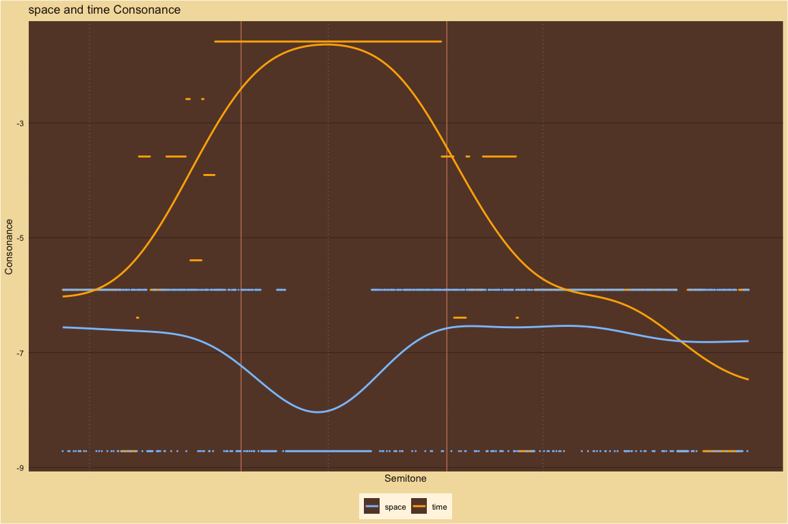
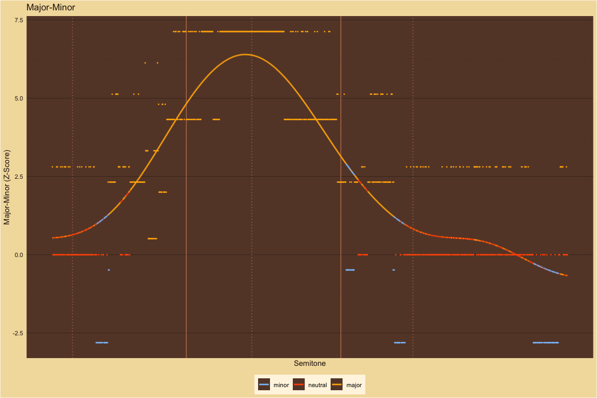
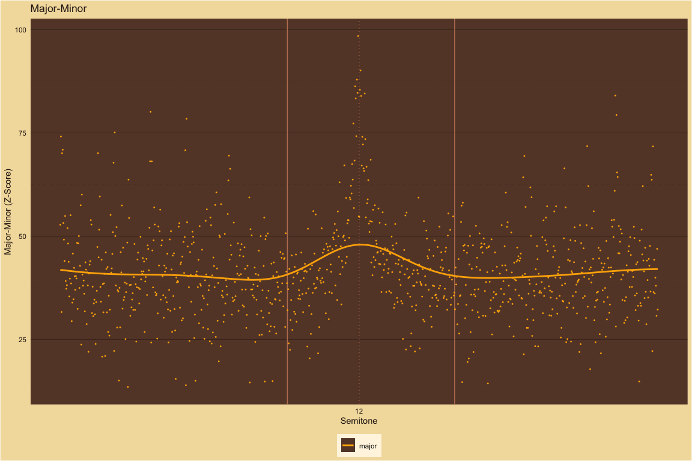
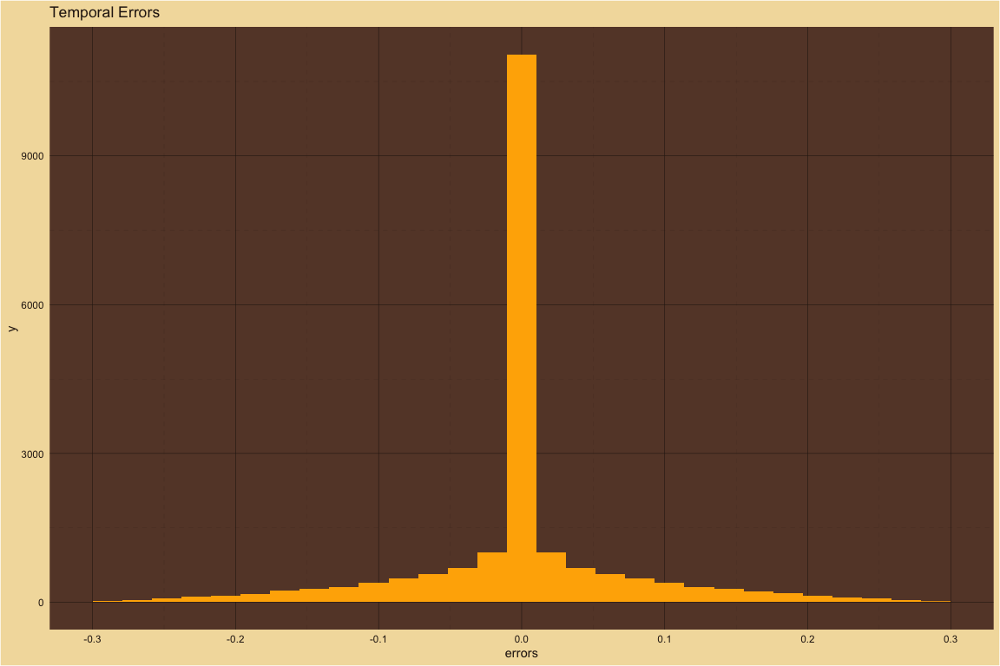
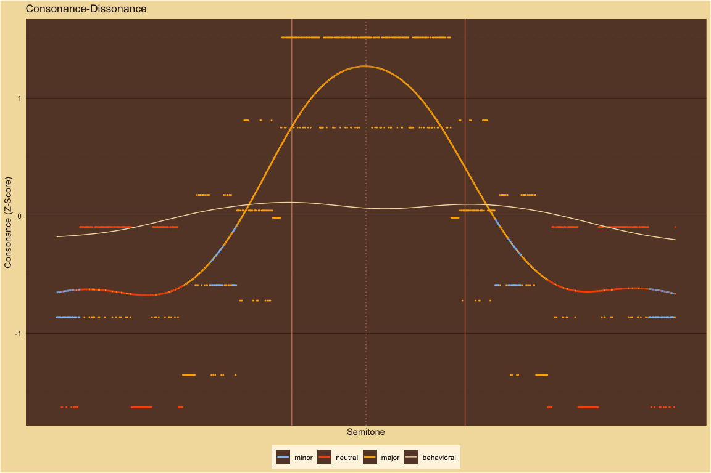
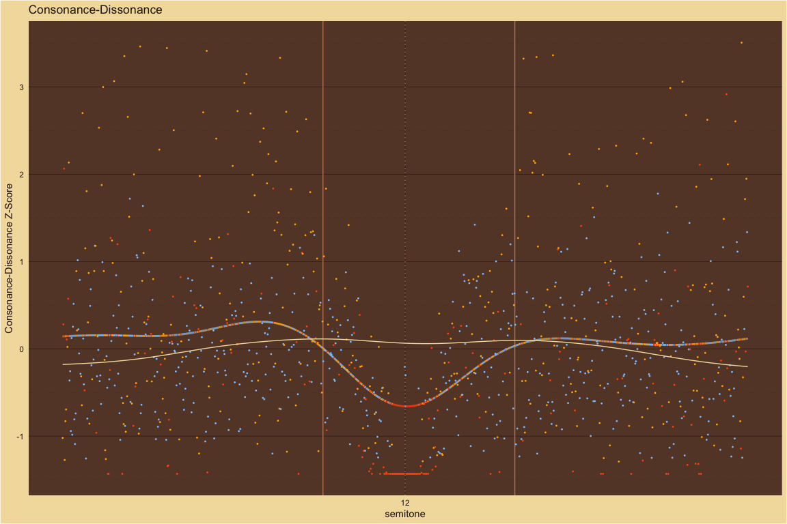
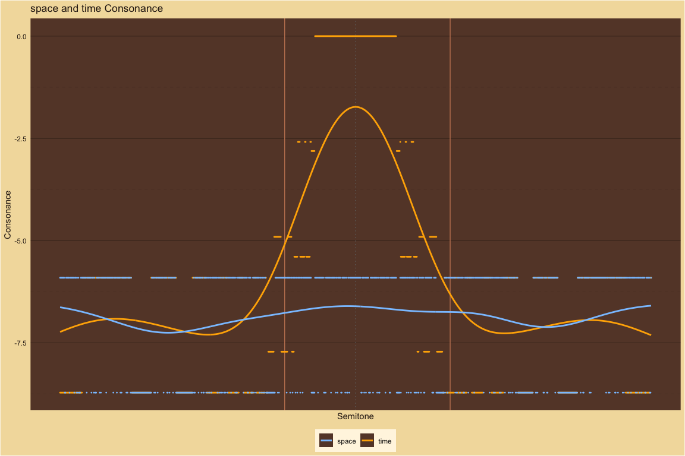
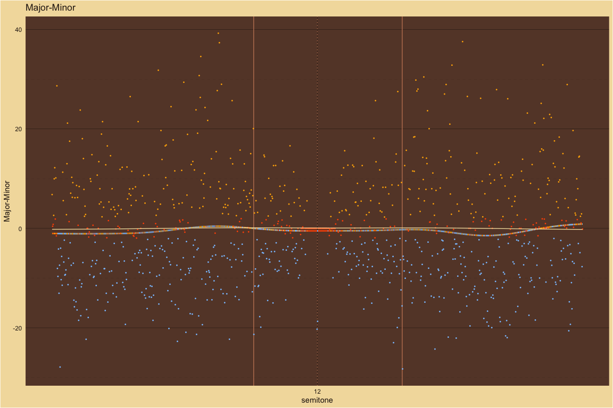
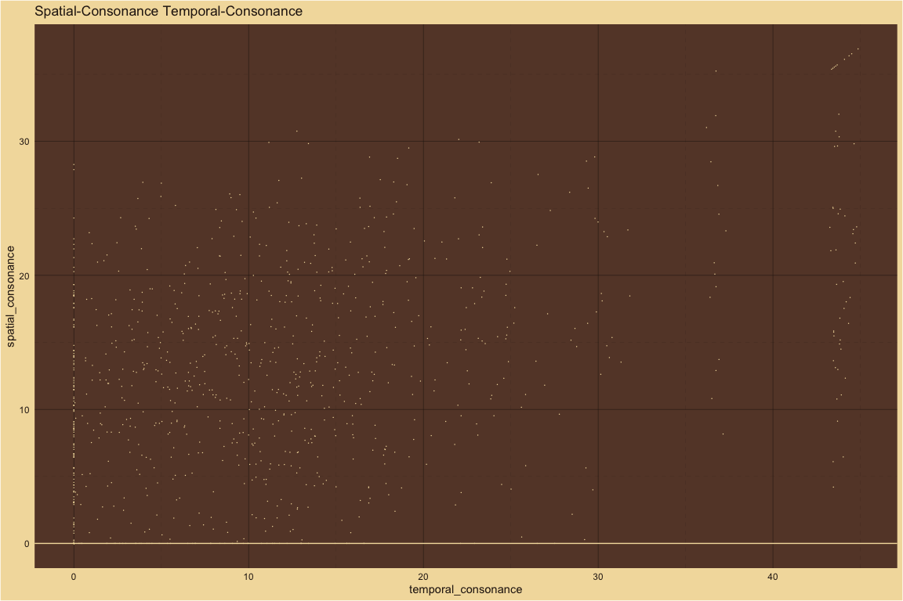
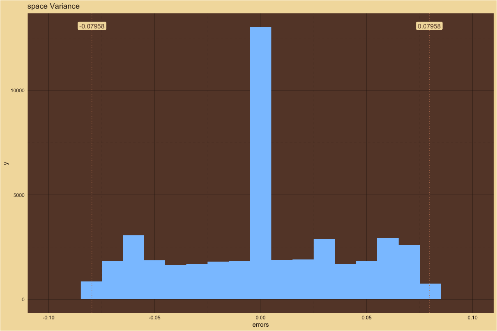

MaMi.CoDi: A Model of Harmony Perception
================

# Behavioral

## Manipulating Harmonic Frequencies

#### Dyads spanning 15 semitones

##### Pure ~ Partials: 1

For pure tones, the behavioral results and the theoretical predictions
mostly agree. Only P5 and P8 have pronounced two-sided peaks. The
behavioral results show subtle variations in consonance height across
the 15 semitones but the overall peak structure agrees with MaMi.CoDi
predictions. For futher comparison, the theoretical predictions for
major-minor versus the behavioral results are included in a plot below.

| cochlear_amplifier_num_harmonics | beat_pass_filter | time_uncertainty | space_uncertainty | smoothing_sigma | pseudo_octave |
|---:|:---|:---|:---|---:|---:|
| 2 | low | 0.07958 | 0.07958 | 0.2 | 2 |

<!-- -->  
<!-- -->  
<!-- -->  
<!-- -->  
<!-- -->  
<!-- -->

##### Harmonic ~ Partials: 10

For 10 harmonics, behavioral results and theoretical predictions agree.

| cochlear_amplifier_num_harmonics | beat_pass_filter | time_uncertainty | space_uncertainty | smoothing_sigma | pseudo_octave |
|---:|:---|:---|:---|---:|---:|
| 2 | low | 0.07958 | 0.07958 | 0.2 | 2 |

<!-- -->  
<!-- -->  
<!-- -->  
<!-- -->  
<!-- -->  
<!-- -->

##### 5Partials ~ Partials: 5

For 5 harmonics, behavioral results and theoretical predictions agree.
For comparison with the study below (5 partils with the third partial
deleted), notice that the m3 peak is only slightly lower than the M3
peak.

| cochlear_amplifier_num_harmonics | beat_pass_filter | time_uncertainty | space_uncertainty | smoothing_sigma | pseudo_octave |
|---:|:---|:---|:---|---:|---:|
| 2 | low | 0.07958 | 0.07958 | 0.2 | 2 |

<!-- -->  
<!-- -->  
<!-- -->  
<!-- -->  
<!-- -->  
<!-- -->

##### 5PartialsNo3 ~ Partials: 5

For 5 harmonics with the 3rd partial deleted, behavioral results and
theoretical predictions mostly agree. As expected, the m3 peak without
the third partial is now lower than the m3 peak with all 5 harmonics
while the M3 peak is slightly higher without the 3rd partial.

| cochlear_amplifier_num_harmonics | beat_pass_filter | time_uncertainty | space_uncertainty | smoothing_sigma | pseudo_octave |
|---:|:---|:---|:---|---:|---:|
| 2 | low | 0.07958 | 0.07958 | 0.2 | 2 |

<!-- -->  
<!-- -->  
<!-- -->  
<!-- -->  
<!-- -->  
<!-- -->

##### Bonang ~ Partials: 4

For gamalan dyads with a harmonic bass pitch and bonang upper pitch,
behavioral results and theoretical predictions mostly agree. MaMi.CoDi
predicts a dissonance trough with minor polarity at P4 that is not in
the behavioral results. MaMi.CoDi predicts P5 to have minor polarity and
be relatively higher than the behavioral results.

| cochlear_amplifier_num_harmonics | beat_pass_filter | time_uncertainty | space_uncertainty | smoothing_sigma | pseudo_octave |
|---:|:---|:---|:---|---:|---:|
| 2 | low | 0.07958 | 0.07958 | 0.2 | 2 |

<!-- -->  
<!-- -->  
<!-- -->  
<!-- -->  
<!-- -->  
<!-- -->

##### Stretched ~ Partials: 10

For stretched harmonics, behavioral results and theoretical predictions
mostly agree. MaMi.Codi predicts peaks with minor polarity just above m3
and m7 that do not exist in the behavioral results.

| cochlear_amplifier_num_harmonics | beat_pass_filter | time_uncertainty | space_uncertainty | smoothing_sigma | pseudo_octave |
|---:|:---|:---|:---|---:|---:|
| 2 | low | 0.07958 | 0.07958 | 0.2 | 2.1 |

<!-- -->  
<!-- -->  
<!-- -->  
<!-- -->  
<!-- -->  
<!-- -->

##### Compressed ~ Partials: 10

For compressed harmonics, the pronounced behavioral peaks mostly agree
with the theoretical peaks.

| cochlear_amplifier_num_harmonics | beat_pass_filter | time_uncertainty | space_uncertainty | smoothing_sigma | pseudo_octave |
|---:|:---|:---|:---|---:|---:|
| 2 | low | 0.07958 | 0.07958 | 0.2 | 1.9 |

<!-- -->  
<!-- -->  
<!-- -->  
<!-- -->  
<!-- -->  
<!-- -->

#### Dyads spanning 1 quarter tone

##### M3 ~ Partials: 10

Description is below.

| cochlear_amplifier_num_harmonics | beat_pass_filter | time_uncertainty | space_uncertainty | smoothing_sigma | pseudo_octave |
|---:|:---|:---|:---|---:|---:|
| 2 | low | 0.07958 | 0.07958 | 0.035 | 2 |

<!-- -->  
<!-- -->  
<!-- -->  
<!-- -->  
<!-- -->  
<!-- -->

##### M6 ~ Partials: 10

Description is below.

| cochlear_amplifier_num_harmonics | beat_pass_filter | time_uncertainty | space_uncertainty | smoothing_sigma | pseudo_octave |
|---:|:---|:---|:---|---:|---:|
| 2 | low | 0.07958 | 0.07958 | 0.035 | 2 |

<!-- -->  
<!-- -->  
<!-- -->  
<!-- -->  
<!-- -->  
<!-- -->

##### P8 ~ Partials: 10

Description is below.

| cochlear_amplifier_num_harmonics | beat_pass_filter | time_uncertainty | space_uncertainty | smoothing_sigma | pseudo_octave |
|---:|:---|:---|:---|---:|---:|
| 2 | low | 0.07958 | 0.07958 | 0.035 | 2 |

<!-- -->  
<!-- -->  
<!-- -->  
<!-- -->  
<!-- -->  
<!-- -->
