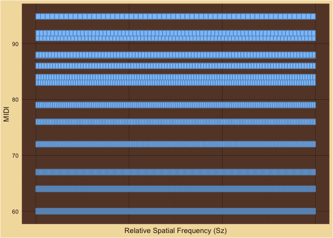
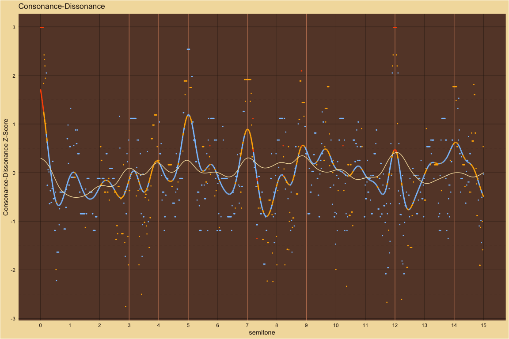
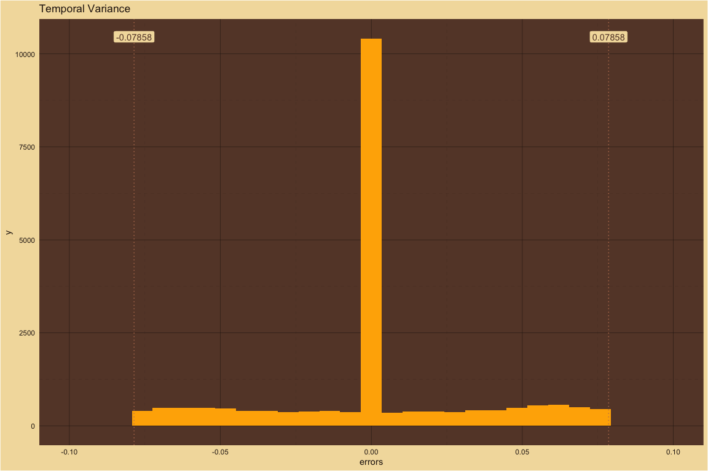
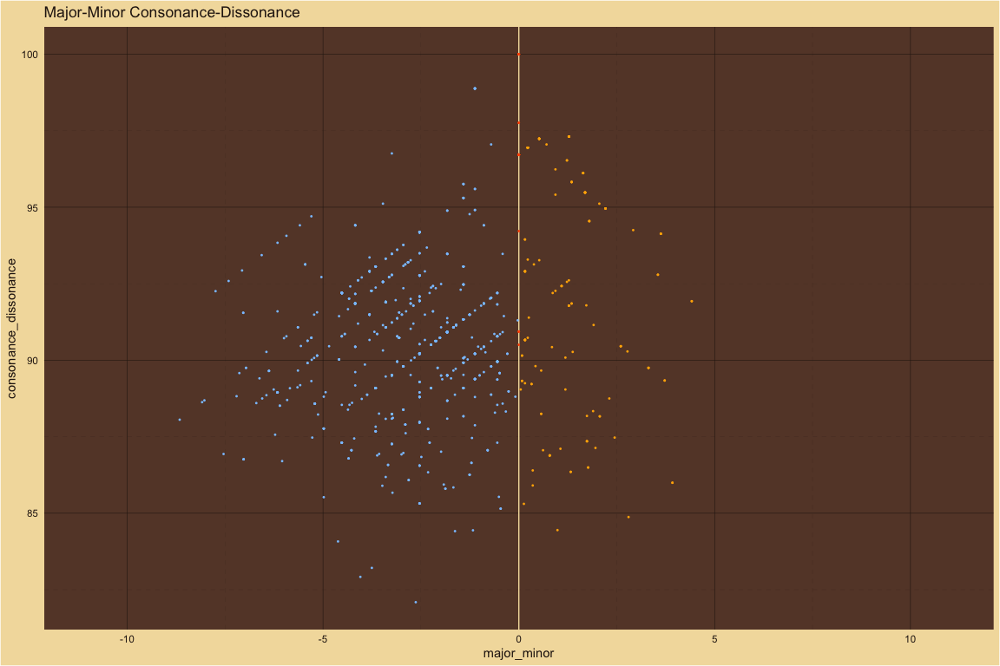
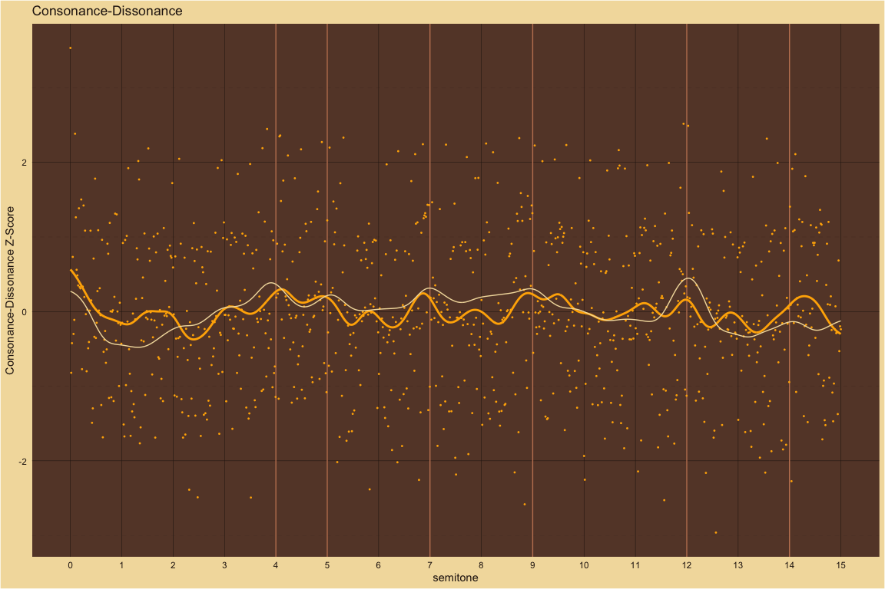
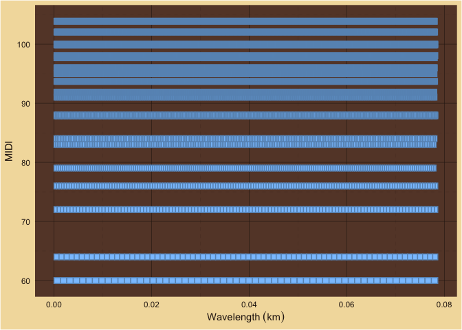

MaMi.CoDi: A Spatiotemporal Periodicity Model of Consonance Perception
================

## How MaMi.CoDi Works

### Estimating Spatiotemporal Periodicity

To estimate the periodicity of a chord, the MaMi.CoDi model uses a
signal processing technique. It creates ratios for every tone in the
chord (fundamental, harmonics, noise, etc.) relative to a reference
tone. The least common multiple of those ratios is a measure of the
cycle length, relative to the reference tone.  

MaMi.CoDi creates two estimates of the chord’s period: a temporal
estimate and a spatial estimate.  

For the frequency (i.e. phase-locking or temporal) estimate the
reference tone is the smallest frequency. Small frequencies are low
tones and are detected by the inner ear hair cells closest to the apex
of the cochlea, which is the end furthest from the source of the wave.  

For the wavelength (i.e. rate-place or spatial) estimate, the reference
tone is the smallest wavelength. Small wavelengths are high tones and
are detected by the inner ear hair cells closest to the base of the
cochlea, which is the end closest to the middle ear, the source of the
wave.  

#### Chord

Below, we estimate the periodicity of the C4, E4 and G4 major triad with
5 harmonics per pitch.

- Fundamental Frequencies: 261.6255653, 329.6275569, 391.995436  

- Fundamental Wavelengths: 1.311034, 1.0405683, 0.8750102  

- MIDI: 60, 64, 67  

- Number of Harmonics: 5

#### Temporal Estimate

| chord_Hz |  chord_m |   chord_s | chord_Sz | tol |
|---------:|---------:|----------:|---------:|----:|
| 21.80213 | 15.73241 | 0.0458671 |       12 | 0.1 |

##### Periods

<!-- -->

##### Relative Periodicity

<!-- -->

#### Frequency Ratios

| index | num | den |    ratio |      tone | reference_tone |
|------:|----:|----:|---------:|----------:|---------------:|
|     1 |   1 |   1 | 1.000000 |  261.6256 |       261.6256 |
|     2 |   4 |   3 | 1.259921 |  329.6276 |       261.6256 |
|     3 |   3 |   2 | 1.498307 |  391.9954 |       261.6256 |
|     4 |   2 |   1 | 2.000000 |  523.2511 |       261.6256 |
|     5 |   5 |   2 | 2.519842 |  659.2551 |       261.6256 |
|     6 |   3 |   1 | 2.996614 |  783.9909 |       261.6256 |
|     7 |   3 |   1 | 3.000000 |  784.8767 |       261.6256 |
|     8 |  15 |   4 | 3.779763 |  988.8827 |       261.6256 |
|     9 |   4 |   1 | 4.000000 | 1046.5023 |       261.6256 |
|    10 |   9 |   2 | 4.494921 | 1175.9863 |       261.6256 |
|    11 |   5 |   1 | 5.000000 | 1308.1278 |       261.6256 |
|    12 |   5 |   1 | 5.039684 | 1318.5102 |       261.6256 |
|    13 |   6 |   1 | 5.993228 | 1567.9817 |       261.6256 |
|    14 |  19 |   3 | 6.299605 | 1648.1378 |       261.6256 |
|    15 |  15 |   2 | 7.491535 | 1959.9772 |       261.6256 |

#### Spatial Estimate

| chord_Hz |  chord_m |   chord_s | chord_Sz | tol |
|---------:|---------:|----------:|---------:|----:|
| 4.360426 | 10.50012 | 0.2293354 |       60 | 0.1 |

##### Wavenumbers

<!-- -->

##### Relative Spatial Frequency

<!-- -->

##### Wavelength Ratios

| index | num | den |    ratio |      tone | reference_tone |
|------:|----:|----:|---------:|----------:|---------------:|
|    15 |   1 |   1 | 1.000000 | 0.1750020 |       0.175002 |
|    14 |   5 |   4 | 1.189207 | 0.2081137 |       0.175002 |
|    13 |   4 |   3 | 1.250000 | 0.2187525 |       0.175002 |
|    12 |   3 |   2 | 1.486509 | 0.2601421 |       0.175002 |
|    11 |   3 |   2 | 1.498307 | 0.2622068 |       0.175002 |
|    10 |   5 |   3 | 1.666667 | 0.2916701 |       0.175002 |
|     9 |   9 |   5 | 1.872884 | 0.3277585 |       0.175002 |
|     8 |   2 |   1 | 1.982012 | 0.3468561 |       0.175002 |
|     7 |   5 |   2 | 2.497178 | 0.4370113 |       0.175002 |
|     6 |   5 |   2 | 2.500000 | 0.4375051 |       0.175002 |
|     5 |   3 |   1 | 2.973018 | 0.5202842 |       0.175002 |
|     4 |  11 |   3 | 3.745768 | 0.6555170 |       0.175002 |
|     3 |   5 |   1 | 5.000000 | 0.8750102 |       0.175002 |
|     2 |   6 |   1 | 5.946035 | 1.0405683 |       0.175002 |
|     1 |  15 |   2 | 7.491535 | 1.3110340 |       0.175002 |

### Finding the Tolerance Values

MaMi.CoDi uses the Stern-Brocot tree to find rational fractions for the
ratios within a given tolerance. How do we find the best tolerance
values? For the MaMi.CoDi model we ran thousands of computations with
various tolerance values and compared the predictions with results from
six of the large-scale behavioral experiments.  

Because spatial and temporal information is encoded via different
mechanisms by the cochlea, we assume that the wavelength and frequency
tolerances will have different values.  

So, our tolerance searches were two-dimensional. The image below is a
sample of a 2D tolerance search using the harmonic experiment from
large-scale behavioral study.  

Click here, for the [full 2D tolerance
search](https://github.com/homeymusic/mami.codi.R/blob/2D_tolerance/man/tolerance_search_plots/Harmonic2D.jpg)
image for the harmonics experiment. Click here, for the [2D_tolerance
branch on
GitHub](https://github.com/homeymusic/mami.codi.R/tree/2D_tolerance) to
recreate all the 2D searches.  

The best fits across the experiments were given by a wavelength
tolerance of 0.15 and a frequency tolerance of 0.075. The frequency
tolerance is half the size of the wavelength tolerance. Does that mean
that the perception mechanism for frequency is twice as discriminating
as the wavelength mechanism? “At 1 kHz information contained in temporal
discharges was an order of magnitude better than that obtained by a
rate–place mechanism. Heinz et al. (2001)” from Winter (2005).  

## Theoretical predictions compared to large-scale behavioral results

The large-scale behavioral data in the plots below are from [Timbral
effects on consonance disentangle psychoacoustic mechanisms and suggest
perceptual origins for musical
scales](https://www.nature.com/articles/s41467-024-45812-z) by Raja
Marjieh, Peter M. C. Harrison, Harin Lee, Fotini Deligiannaki & Nori
Jacoby.

### Manipulating harmonic frequencies

#### Dyads spanning 15 semitones

##### Harmonic ~ Partials: 10

For 10 harmonics, behavioral results and theoretical predictions agree.

| detected_pseudo_octave | ignore_amplitudes_below | wavelength_tolerance | frequency_tolerance | smoothing_sigma |
|:-----------------------|:------------------------|:---------------------|:--------------------|----------------:|
| 2                      | 0.03                    | 0.15                 | 0.075               |             0.2 |

<!-- -->

##### 5Partials ~ Partials: 5

For 5 harmonics, behavioral results and theoretical predictions agree.
For comparison with the study below (5 partils with the third partial
deleted), notice that the m3 peak is only slightly lower than the M3
peak.

| detected_pseudo_octave | ignore_amplitudes_below | wavelength_tolerance | frequency_tolerance | smoothing_sigma |
|:-----------------------|:------------------------|:---------------------|:--------------------|----------------:|
| 2                      | 0.03                    | 0.15                 | 0.075               |             0.2 |

<!-- -->

##### 5PartialsNo3 ~ Partials: 5

For 5 harmonics with the 3rd partial deleted, behavioral results and
theoretical predictions mostly agree. As expected, the m3 peak without
the third partial is now lower than the m3 peak with all 5 harmonics
while the M3 peak is slightly higher without the 3rd partial.

| detected_pseudo_octave | ignore_amplitudes_below | wavelength_tolerance | frequency_tolerance | smoothing_sigma |
|:-----------------------|:------------------------|:---------------------|:--------------------|----------------:|
| 2                      | 0.03                    | 0.15                 | 0.075               |             0.2 |

<!-- -->

##### Pure ~ Partials: 1

For pure tones, the behavioral results and the theoretical predictions
mostly agree. Only P5 and P8 have pronounced two-sided peaks. The
behavioral results show subtle variations in consonance height across
the 15 semitones but the overall peak structure agrees with MaMi.CoDi
predictions. Theoretical predictions for major-minor versus the
beharvoiral results are included in a plot further below.

| detected_pseudo_octave | ignore_amplitudes_below | wavelength_tolerance | frequency_tolerance | smoothing_sigma |
|:-----------------------|:------------------------|:---------------------|:--------------------|----------------:|
| 2                      | 0.03                    | 0.15                 | 0.075               |             0.2 |

<!-- -->  
For pure tones, MaMi.CoDi’s theoretical predictions for major-minor have
similar contours to the behavioral results for
consonance-dissonance.<!-- -->

##### Stretched ~ Partials: 10

For stretched harmonics, behavioral results and theoretical predictions
mostly agree. MaMi.Codi predicts peaks with minor polarity just above m3
and m7 that do not exist in the behavioral results.

| detected_pseudo_octave | ignore_amplitudes_below | wavelength_tolerance | frequency_tolerance | smoothing_sigma |
|:-----------------------|:------------------------|:---------------------|:--------------------|----------------:|
| 2.1                    | 0.03                    | 0.15                 | 0.075               |             0.2 |

<!-- -->

##### Compressed ~ Partials: 10

For compressed harmonics, the pronounced behavioral peaks mostly agree
with the theoretical peaks.

| detected_pseudo_octave | ignore_amplitudes_below | wavelength_tolerance | frequency_tolerance | smoothing_sigma |
|:-----------------------|:------------------------|:---------------------|:--------------------|----------------:|
| 1.9                    | 0.03                    | 0.15                 | 0.075               |             0.2 |

<!-- -->

##### Bonang ~ Partials: 4

For gamalan dyads with a harmonic bass pitch and bonang upper pitch,
behavioral results and theoretical predictions mostly agree. MaMi.CoDi
predicts a dissonance trough with minor polarity at P4 that is not in
the behavioral results. MaMi.CoDi predicts P5 to have minor polarity and
be relatively higher than the behavioral results.

| detected_pseudo_octave | ignore_amplitudes_below | wavelength_tolerance | frequency_tolerance | smoothing_sigma |
|:-----------------------|:------------------------|:---------------------|:--------------------|----------------:|
| 2                      | 0.03                    | 0.15                 | 0.075               |             0.2 |

<!-- -->

#### Dyads spanning 1 quarter tone

##### M3 ~ Partials: 10

Description is below.

| detected_pseudo_octave | ignore_amplitudes_below | wavelength_tolerance | frequency_tolerance | smoothing_sigma |
|:-----------------------|:------------------------|:---------------------|:--------------------|----------------:|
| 2                      | 0.03                    | 3e-04                | 0.00015             |           0.035 |

<!-- -->

##### M6 ~ Partials: 10

Description is below.

| detected_pseudo_octave | ignore_amplitudes_below | wavelength_tolerance | frequency_tolerance | smoothing_sigma |
|:-----------------------|:------------------------|:---------------------|:--------------------|----------------:|
| 2                      | 0.03                    | 3e-04                | 0.00015             |           0.035 |

<!-- -->

##### P8 ~ Partials: 10

Description is below.

| detected_pseudo_octave | ignore_amplitudes_below | wavelength_tolerance | frequency_tolerance | smoothing_sigma |
|:-----------------------|:------------------------|:---------------------|:--------------------|----------------:|
| 2                      | 0.03                    | 3e-04                | 0.00015             |           0.035 |

<!-- -->

### Consonance peaks in dissonance troughs

For the high-resolution dyads centered on M3, M6 and P8, the large-scale
behavioral results and the MaMi.CoDi theoretical predictions both show
dissonance troughs centered on the JT dyads.  

MaMi.CoDi, though, predicts a local maximum consonance peak at the
center of each dissonance trough.  

Secondary maximums occur at the Pythagorean third and grave major sixth.
Those secondary peaks are also surrounded by dissonance troughs. There
are also tertiary troughs near the ET intervals.  

### Theoretical consonance peak at P1 in octave-wide dissonance trough

| multicolored_line_sigma | green_line_sigma | pseudo_octave | wavelength_tolerance | frequency_tolerance |
|------------------------:|-----------------:|:--------------|:---------------------|:--------------------|
|                     0.2 |                2 | 2             | 0.15                 | 0.0375              |

<!-- -->

Performers of instruments with quantized semitones like keyboards and
fretted strings–especially beginners and their audiences–are aware that
the globally maximum consonant peak at the unison, P1, has dissonant
neighbors on both sides, M7 and m2. Consonance increases with each
semitone step out of the trough: downward from M7 to P4 below and upward
from m2 to P5 above.  

The green line in the plot above was generated using a smoothing sigma
an order of magnitude broader than the default soothing sigma, 2.0
versus 0.2. At the broader resolution, the green line highlights the
dissonance trough and ignore the consonance peak at P1.

That is, at the resolution of an octave, MaMi.CoDi predicts a global
maximum consonance peak in the center of a smoothed dissonance trough.  

At other resolutions, for example stringed instruments without frets,
the nearest playable neighbors to P1 are not necessarily dissonant.

In the harmonic study with the narrow resolution, above, the behavioral
results shows dissonance troughs and MaMi.CoDi predicts consonance peaks
in the center of those dissonance troughs.

### MaMi.CoDi resolution correlates with dissonance troughs and consonance peaks

As the tolerance value of the MaMi.CoDi model varies from very small to
very large the consonance peaks expand their width until they overcome
the dissonance troughs. See plot sets, below, for M3, M6 and P8.  

MaMi.CoDi’s tolerance value is the only parameter in the model and
indicates the resolution for turning irrational ratios into rational
fractions. Those fractions are then used to estimate wavelength
periodicity and frequency periodicity.  

- Small tolerances give more accurate fractions which give longer
  periods.
- Large tolerances give less accurate fractions which give shorter
  period estimates.

#### M3 ~ Major Third

Plot of M3 with MaMi.CoDi tolerance values varying from 1e-08 to 0.1:

- JT: 5/4
- ET: 2^(4/12)

<!-- -->

    #> # A tibble: 1 × 4
    #>   just_M3_freq just_M3_midi M3_freq M3_midi
    #>          <dbl>        <dbl>   <dbl>   <dbl>
    #> 1         327.         63.9    330.      64

##### Intervals near the major third ranked by consonance

    #> # A tibble: 1,000 × 2
    #>    semitone consonance_dissonance
    #>       <dbl>                 <dbl>
    #>  1     63.8                  96.1
    #>  2     63.8                  96.1
    #>  3     63.8                  96.1
    #>  4     63.8                  96.1
    #>  5     63.8                  96.1
    #>  6     63.8                  96.1
    #>  7     63.8                  96.1
    #>  8     63.9                  96.1
    #>  9     63.9                  96.1
    #> 10     63.9                  96.1
    #> # ℹ 990 more rows

###### The JT M3 has the highest consonance

    #> [1] 63.8467

    #> # A tibble: 1 × 2
    #>   semitone consonance_dissonance
    #>      <dbl>                 <dbl>
    #> 1     63.8                  96.1

###### Frequency ratios of the JT M3

    #>    index num den     ratio pseudo_ratio      tone reference_tone
    #> 1      1   1   1  1.000000     1.000000  261.6256       261.6256
    #> 2      2   5   4  1.248814     1.248814  326.7215       261.6256
    #> 3      3   2   1  2.000000     2.000000  523.2511       261.6256
    #> 4      4   5   2  2.497627     2.497627  653.4431       261.6256
    #> 5      5   3   1  3.000000     3.000000  784.8767       261.6256
    #> 6      6  15   4  3.746441     3.746441  980.1646       261.6256
    #> 7      7   4   1  4.000000     4.000000 1046.5023       261.6256
    #> 8      8   5   1  4.995254     4.995254 1306.8862       261.6256
    #> 9      9   5   1  5.000000     5.000000 1308.1278       261.6256
    #> 10    10   6   1  6.000000     6.000000 1569.7534       261.6256
    #> 11    11  25   4  6.244068     6.244068 1633.6077       261.6256
    #> 12    12   7   1  7.000000     7.000000 1831.3790       261.6256
    #> 13    13  15   2  7.492881     7.492881 1960.3293       261.6256
    #> 14    14   8   1  8.000000     8.000000 2093.0045       261.6256
    #> 15    15  35   4  8.741695     8.741695 2287.0508       261.6256
    #> 16    16   9   1  9.000000     9.000000 2354.6301       261.6256
    #> 17    17  10   1  9.990508     9.990508 2613.7724       261.6256
    #> 18    18  10   1 10.000000    10.000000 2616.2556       261.6256
    #> 19    19  45   4 11.239322    11.239322 2940.4939       261.6256
    #> 20    20  25   2 12.488135    12.488135 3267.2155       261.6256

##### Intervals near the major third ranked by lowest consonance

    #> # A tibble: 1,000 × 2
    #>    semitone consonance_dissonance
    #>       <dbl>                 <dbl>
    #>  1     64.0                  91.3
    #>  2     64.0                  91.3
    #>  3     64.0                  91.3
    #>  4     64.0                  91.3
    #>  5     64.0                  91.3
    #>  6     64.0                  91.3
    #>  7     64.0                  91.3
    #>  8     64.0                  91.3
    #>  9     64.0                  91.3
    #> 10     64.0                  91.3
    #> # ℹ 990 more rows

###### The lowest consonance

    #> [1] 64.01136

    #> # A tibble: 1 × 2
    #>   semitone consonance_dissonance
    #>      <dbl>                 <dbl>
    #> 1     64.0                  91.3

###### The lowest consonance ratios

    #>    index num den     ratio pseudo_ratio      tone reference_tone
    #> 1      1   1   1  1.000000     1.000000  261.6256       261.6256
    #> 2      2   4   3  1.260748     1.260748  329.8439       261.6256
    #> 3      3   2   1  2.000000     2.000000  523.2511       261.6256
    #> 4      4   5   2  2.521496     2.521496  659.6879       261.6256
    #> 5      5   3   1  3.000000     3.000000  784.8767       261.6256
    #> 6      6  15   4  3.782244     3.782244  989.5318       261.6256
    #> 7      7   4   1  4.000000     4.000000 1046.5023       261.6256
    #> 8      8   5   1  5.000000     5.000000 1308.1278       261.6256
    #> 9      9   5   1  5.042993     5.042993 1319.3758       261.6256
    #> 10    10   6   1  6.000000     6.000000 1569.7534       261.6256
    #> 11    11  19   3  6.303741     6.303741 1649.2198       261.6256
    #> 12    12   7   1  7.000000     7.000000 1831.3790       261.6256
    #> 13    13  15   2  7.564489     7.564489 1979.0636       261.6256
    #> 14    14   8   1  8.000000     8.000000 2093.0045       261.6256
    #> 15    15  44   5  8.825237     8.825237 2308.9076       261.6256
    #> 16    16   9   1  9.000000     9.000000 2354.6301       261.6256
    #> 17    17  10   1 10.000000    10.000000 2616.2556       261.6256
    #> 18    18  71   7 10.085985    10.085985 2638.7515       261.6256
    #> 19    19  34   3 11.346733    11.346733 2968.5955       261.6256
    #> 20    20  38   3 12.607482    12.607482 3298.4396       261.6256

###### The Pythagorean third is the second highest consonance

MIDI:

    #> [1] 63.8472

Cents:

    #> [1] 384.7197

Consonance:

    #> # A tibble: 1 × 2
    #>   semitone consonance_dissonance
    #>      <dbl>                 <dbl>
    #> 1     63.8                  96.1

###### Frequency ratios of the second highest consonance

    #>    index num den     ratio pseudo_ratio      tone reference_tone
    #> 1      1   1   1  1.000000     1.000000  261.6256       261.6256
    #> 2      2   5   4  1.248850     1.248850  326.7310       261.6256
    #> 3      3   2   1  2.000000     2.000000  523.2511       261.6256
    #> 4      4   5   2  2.497699     2.497699  653.4620       261.6256
    #> 5      5   3   1  3.000000     3.000000  784.8767       261.6256
    #> 6      6  15   4  3.746549     3.746549  980.1930       261.6256
    #> 7      7   4   1  4.000000     4.000000 1046.5023       261.6256
    #> 8      8   5   1  4.995398     4.995398 1306.9239       261.6256
    #> 9      9   5   1  5.000000     5.000000 1308.1278       261.6256
    #> 10    10   6   1  6.000000     6.000000 1569.7534       261.6256
    #> 11    11  25   4  6.244248     6.244248 1633.6549       261.6256
    #> 12    12   7   1  7.000000     7.000000 1831.3790       261.6256
    #> 13    13  15   2  7.493098     7.493098 1960.3859       261.6256
    #> 14    14   8   1  8.000000     8.000000 2093.0045       261.6256
    #> 15    15  35   4  8.741947     8.741947 2287.1169       261.6256
    #> 16    16   9   1  9.000000     9.000000 2354.6301       261.6256
    #> 17    17  10   1  9.990797     9.990797 2613.8479       261.6256
    #> 18    18  10   1 10.000000    10.000000 2616.2556       261.6256
    #> 19    19  45   4 11.239646    11.239646 2940.5789       261.6256
    #> 20    20  25   2 12.488496    12.488496 3267.3098       261.6256

###### References for the Pythagorean third

- “19/15 409.2443014 (good approximation of Pythagorean 3rd)”
  - from [M3 in the Encyclopedia of Microtonal Music
    Theory](http://www.tonalsoft.com/enc/m/major-3rd.aspx)
- [Pythagorean ditone](https://en.wikipedia.org/wiki/Ditone)

#### M6 ~ Major Sixth

Plot of M6 with MaMi.CoDi tolerance values varying from 1e-08 to 0.1:

- JT: 5/3
- ET: 2^(9/12)

<!-- -->

    #> # A tibble: 1 × 4
    #>   just_M6_freq just_M6_midi M6_freq M6_midi
    #>          <dbl>        <dbl>   <dbl>   <dbl>
    #> 1         436.         68.8     440      69

##### Intervals near the major sixth ranked by consonance

    #> # A tibble: 1,000 × 2
    #>    semitone consonance_dissonance
    #>       <dbl>                 <dbl>
    #>  1     68.9                  97.1
    #>  2     68.9                  97.1
    #>  3     68.9                  97.1
    #>  4     68.9                  97.1
    #>  5     68.9                  97.1
    #>  6     68.9                  97.1
    #>  7     68.9                  97.1
    #>  8     68.9                  97.1
    #>  9     68.9                  97.1
    #> 10     68.9                  97.1
    #> # ℹ 990 more rows

###### The JT M6 has the highest consonance

    #> [1] 68.91276

    #> # A tibble: 1 × 2
    #>   semitone consonance_dissonance
    #>      <dbl>                 <dbl>
    #> 1     68.9                  97.1

###### Frequency ratios of the JT M6

    #>    index num den     ratio pseudo_ratio      tone reference_tone
    #> 1      1   1   1  1.000000     1.000000  261.6256       261.6256
    #> 2      2   5   3  1.673340     1.673340  437.7884       261.6256
    #> 3      3   2   1  2.000000     2.000000  523.2511       261.6256
    #> 4      4   3   1  3.000000     3.000000  784.8767       261.6256
    #> 5      5  10   3  3.346679     3.346679  875.5768       261.6256
    #> 6      6   4   1  4.000000     4.000000 1046.5023       261.6256
    #> 7      7   5   1  5.000000     5.000000 1308.1278       261.6256
    #> 8      8   5   1  5.020019     5.020019 1313.3652       261.6256
    #> 9      9   6   1  6.000000     6.000000 1569.7534       261.6256
    #> 10    10  20   3  6.693358     6.693358 1751.1537       261.6256
    #> 11    11   7   1  7.000000     7.000000 1831.3790       261.6256
    #> 12    12   8   1  8.000000     8.000000 2093.0045       261.6256
    #> 13    13  25   3  8.366698     8.366698 2188.9421       261.6256
    #> 14    14   9   1  9.000000     9.000000 2354.6301       261.6256
    #> 15    15  10   1 10.000000    10.000000 2616.2556       261.6256
    #> 16    16  10   1 10.040037    10.040037 2626.7305       261.6256
    #> 17    17  35   3 11.713377    11.713377 3064.5189       261.6256
    #> 18    18  40   3 13.386717    13.386717 3502.3073       261.6256
    #> 19    19  15   1 15.060056    15.060056 3940.0957       261.6256
    #> 20    20  50   3 16.733396    16.733396 4377.8841       261.6256

##### Intervals near the major sixth ranked by lowest consonance

    #> # A tibble: 1,000 × 2
    #>    semitone consonance_dissonance
    #>       <dbl>                 <dbl>
    #>  1     68.7                  91.3
    #>  2     68.7                  91.3
    #>  3     68.7                  91.3
    #>  4     68.7                  91.3
    #>  5     68.7                  91.3
    #>  6     68.7                  91.3
    #>  7     68.7                  91.3
    #>  8     68.7                  91.3
    #>  9     68.7                  91.3
    #> 10     68.7                  91.3
    #> # ℹ 990 more rows

###### The lowest consonance

    #> [1] 68.68453

    #> # A tibble: 1 × 2
    #>   semitone consonance_dissonance
    #>      <dbl>                 <dbl>
    #> 1     68.7                  91.3

###### The lowest consonance ratios

    #>    index num den     ratio pseudo_ratio      tone reference_tone
    #> 1      1   1   1  1.000000     1.000000  261.6256       261.6256
    #> 2      2   5   3  1.651425     1.651425  432.0549       261.6256
    #> 3      3   2   1  2.000000     2.000000  523.2511       261.6256
    #> 4      4   3   1  3.000000     3.000000  784.8767       261.6256
    #> 5      5  10   3  3.302850     3.302850  864.1099       261.6256
    #> 6      6   4   1  4.000000     4.000000 1046.5023       261.6256
    #> 7      7   5   1  4.954274     4.954274 1296.1648       261.6256
    #> 8      8   5   1  5.000000     5.000000 1308.1278       261.6256
    #> 9      9   6   1  6.000000     6.000000 1569.7534       261.6256
    #> 10    10  20   3  6.605699     6.605699 1728.2198       261.6256
    #> 11    11   7   1  7.000000     7.000000 1831.3790       261.6256
    #> 12    12   8   1  8.000000     8.000000 2093.0045       261.6256
    #> 13    13  33   4  8.257124     8.257124 2160.2747       261.6256
    #> 14    14   9   1  9.000000     9.000000 2354.6301       261.6256
    #> 15    15  69   7  9.908549     9.908549 2592.3296       261.6256
    #> 16    16  10   1 10.000000    10.000000 2616.2556       261.6256
    #> 17    17  23   2 11.559973    11.559973 3024.3846       261.6256
    #> 18    18  53   4 13.211398    13.211398 3456.4395       261.6256
    #> 19    19  74   5 14.862823    14.862823 3888.4944       261.6256
    #> 20    20  33   2 16.514248    16.514248 4320.5494       261.6256

###### The grave major sixth is the second highest consonance

MIDI:

    #> [1] 68.91326

Cents:

    #> [1] 891.3263

Consonance:

    #> # A tibble: 1 × 2
    #>   semitone consonance_dissonance
    #>      <dbl>                 <dbl>
    #> 1     68.9                  97.1

###### Frequency ratios of the second highest consonance

    #>    index num den     ratio pseudo_ratio      tone reference_tone
    #> 1      1   1   1  1.000000     1.000000  261.6256       261.6256
    #> 2      2   5   3  1.673388     1.673388  437.8011       261.6256
    #> 3      3   2   1  2.000000     2.000000  523.2511       261.6256
    #> 4      4   3   1  3.000000     3.000000  784.8767       261.6256
    #> 5      5  10   3  3.346776     3.346776  875.6021       261.6256
    #> 6      6   4   1  4.000000     4.000000 1046.5023       261.6256
    #> 7      7   5   1  5.000000     5.000000 1308.1278       261.6256
    #> 8      8   5   1  5.020164     5.020164 1313.4032       261.6256
    #> 9      9   6   1  6.000000     6.000000 1569.7534       261.6256
    #> 10    10  20   3  6.693552     6.693552 1751.2042       261.6256
    #> 11    11   7   1  7.000000     7.000000 1831.3790       261.6256
    #> 12    12   8   1  8.000000     8.000000 2093.0045       261.6256
    #> 13    13  25   3  8.366939     8.366939 2189.0053       261.6256
    #> 14    14   9   1  9.000000     9.000000 2354.6301       261.6256
    #> 15    15  10   1 10.000000    10.000000 2616.2556       261.6256
    #> 16    16  10   1 10.040327    10.040327 2626.8063       261.6256
    #> 17    17  35   3 11.713715    11.713715 3064.6074       261.6256
    #> 18    18  40   3 13.387103    13.387103 3502.4085       261.6256
    #> 19    19  15   1 15.060491    15.060491 3940.2095       261.6256
    #> 20    20  50   3 16.733879    16.733879 4378.0105       261.6256

###### References for the grave major sixth

- [List of Pitch
  Intervals](https://en.wikipedia.org/wiki/List_of_pitch_intervals)
- [Grave major sixth on
  C](https://en.m.wikipedia.org/wiki/File:Grave_major_sixth_on_C.png)

#### P8 Octave

Plot of P8 with MaMi.CoDi tolerance values varying from 1e-08 to 0.1:

#### Notes on plots:

In the plots above:

- The cream lines are smoothed experimental data from Marjieh, Harrison
  et al.

- The multi-colored points are MaMi.CoDi computational predictions

- The multi-colored lines are smoothed MaMi.CoDi computational
  predictions

- The colors represent MaMi.CoDi computational predictions for
  major-minor polarity:

- Gold is major

- Red is neutral

- Blue is minor

- The vertical axis is z-scored consonance-dissonance

- The horizontal axis is the width of the dyad from 0 to 15 semitones

- For example, the data at 4 represents the equal tempered major third,
  M3

- While the data at 8 represents the equal tempered minor sixth, m6
