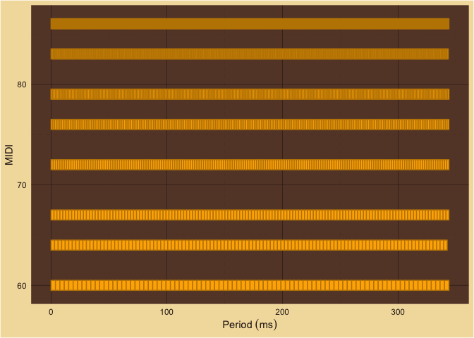
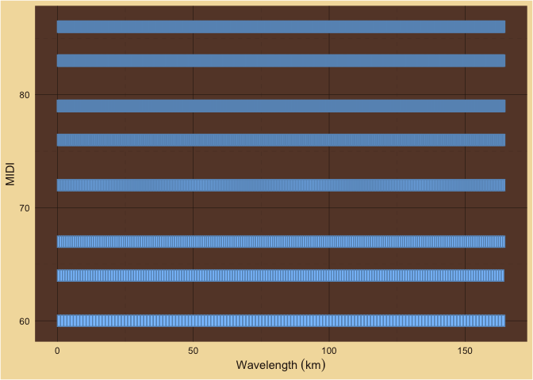
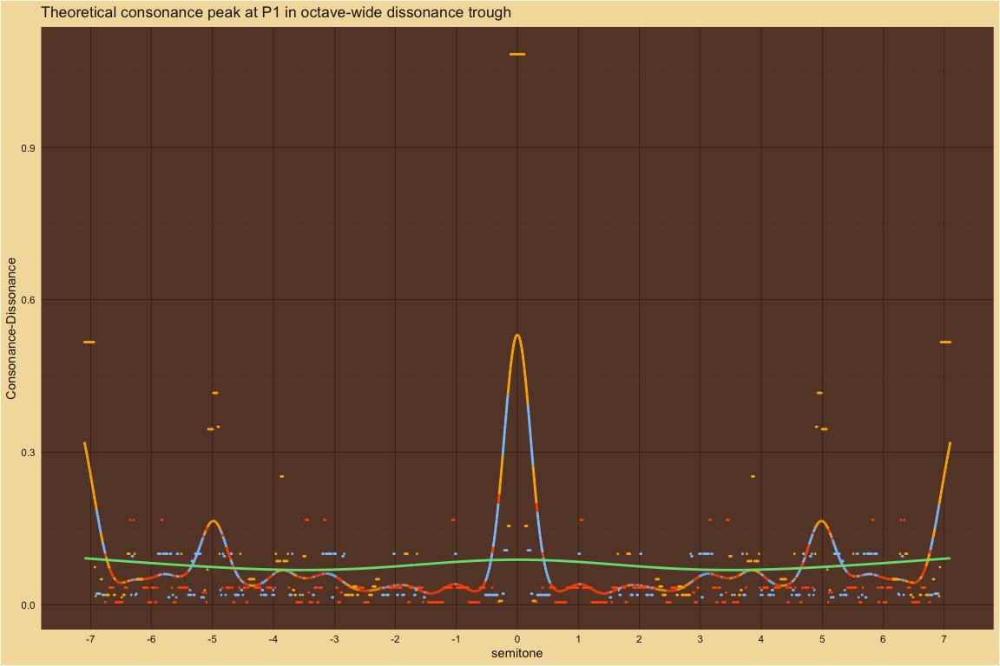

MaMi.CoDi: A Spatiotemporal Periodicity Model of Consonance Perception
================

## How MaMi.CoDi Works

### The Basilar Membrane

When a chord is sounded, pressure waves travel through the air. Those
pressure waves enter the ear canal where they vibrate the ear drum. The
ear drum transfers the energy of the pressure waves through a series of
bones in the fluid of the middle ear to an oval window on the
shell-shaped cochlea of the inner ear. Within the fluid of the cochlea,
the sound energy is converted into a traveling surface wave along the
basilar membrane.  

Human basilar membranes are around 33 mm long. Thousands of
evenly-spaced hair cells are arranged in a line on the basilar membrane.
The hair cells transduce mechanical vibrations into electrical activity
that is sent along the auditory nerve to the central auditory system.
When a sound wave travels along the basilar membrane, the hair cells
positioned near the wavelength of that sound will send electrical
activity along the auditory nerve.  

The fundamental tone of middle C is over a meter long in room
temperature air at sea level. But the basilar membrane is only 33mm
long. How can the hair cells positioned along the basilar membrane
detect wavelengths that are longer than the entire basilar membrane?  

The traveling sound waves shorten as they travel around the spiral
cochlea. Middle C’s fundamental wavelength of 1.31 meters in air shrinks
to 26 mm along the basilar membrane. So, when the fundamental tone of
middle C is sounded, the hair cells positioned 26 mm (81%) from the base
of the cochlea send electrical activity along the auditory nerve.  

When a musical chord comprised of many fundamental tones and harmonics
is sounded, the hair cells at each shortened wavelength position send
signals along the auditory nerve. This spatial or rate-place arrangement
of hair cell positions and wavelengths of tones is known as tonotopy.  

### The Core Idea of MaMi.CoDi

If we play a chord, freeze time and observe which hair cells are
displaced, what are we observing? Are we observing frequencies? Periods?
No. Time is frozen. Frequency (1/s) and period (s) are temporal
observations. We are making a purely spatial observation about
wavelengths (m). We will come back to temporal observations shortly.  

When we combine all the component parts of a chord together into a
whole, we can estimate the overall wavelength for the whole chord. A
technique used in digital signal processing and bricklaying is to
estimate ratios (within an acceptable tolerance) between each of the
parts and a selected reference part. The least common denominator (LCD)
of those part ratios will be a measure of the periodicity of the whole
relative to the selected reference part.  

The overall chord wavelength will be as long as or longer than the
longest component wavelength of the chord. Chords with short wavelengths
relative to the component wavelengths sound pleasant. And chords with
long wavelengths relative to component wavelengthsound unpleasant.
MaMi.CoDi uses this measure of relative wavelength to predict the
perceived spatial consonance of a chord.  

Let us unfreeze time and start counting how often a hair cell moves due
to a pure tone of our sounded chord. If we count the number of movements
relative to a certain amount of time, we will be observing the frequency
of the partial. This would be a temporal observation. The auditory
system has a property called phase locking which allows it to encode the
time intervals, periods, between spikes from sound waves.  

When we combine the period components of a chord together, we can
estimate the overall period for the whole chord. That chord period will
be as long as or longer than the longest component period of the chord.
Short relative periods sound pleasant. Long relative periods sound
unpleasant. MaMi.CoDi uses this measure of chord period to predict the
perceived temporal consonance of a chord.  

MaMi.CoDi sums the spatial and temporal consonance predictions to create
an overall consonance-dissonance prediction. MaMi.CoDi subtracts the
spatial consonance from the temporal consonance to create a major-minor
polarity prediction. Positive values will sound major, negative values
minor and values around zero will sound neutral.  

Because wavelength and frequency are inverse of each other one might
imagine that the spatial and temporal signals would have the same
values. However, for complex pitches that is not the case. The pattern
of the two sets of components are different. See the example of the
major triad with 5 harmonics, below.

### Estimating Spatiotemporal Periodicity

To estimate the periodicity of a chord, the MaMi.CoDi model uses a
signal processing technique. It finds ratios, within a given tolerance,
for every tone in the chord (fundamental, harmonics, noise, etc.)
relative to a reference tone. The least common denominator of those
ratios is a measure of the cycle length, relative to the reference tone.
Long relative cycles are predicted to sound unpleasant and short
relative cycles are predicted to sound pleasant.  

MaMi.CoDi creates two estimates of the chord’s period: a temporal
estimate and a spatial estimate.  

For the temporal (i.e. phase-locking or frequency) estimate the
reference tone is the smallest frequency. Small frequencies are low
tones and are detected by the inner ear hair cells closest to the apex
of the cochlea, which is the end furthest from the source of the wave.  

For the spatial (i.e. rate-place or wavelength) estimate, the reference
tone is the smallest wavelength. Small wavelengths are high tones and
are detected by the inner ear hair cells closest to the base of the
cochlea, which is the end closest to the middle ear, the source of the
wave.  

MaMi.CoDi combines the two cycle estimates into a two-dimensional space
with consonance-dissonance along one dimension and major-minor on the
orthogonal dimension.

#### Example Chord: Major Triad

Below, we estimate the periodicity of the C4, E4 and G4 major triad with
3 harmonics per pitch. The MaMi.CoDi model is based on ratios of tones -
both frequency and wavelength ratios. The input to the model is a sparse
frequency spectrum. We convert frequencies to wavelengths by dividing a
speed of sound constant by the frequency.  

For tone ratios, the value of the speed of sound constant does not
impact the mathematics. Ideally, we could choose any media for the speed
of sound: air, cochlear fluid, basilar membrane, etc.

However, for calculations in a computer, the constant does make a
difference because of the way computers handle very small and very large
numbers. So, we chose a constant for each chord that ensures the
wavelength and frequency values are in the same range. Choosing a
constant that gives similar ranges for frequencies and wavelengths makes
it easier to see how different the ratios for the two signals will be.

- Fundamentals in MIDI: 60, 64, 67  

- Number of Harmonics: 3

- Frequencies: 261.6, 329.6, 392.0, 523.3, 659.3, 784.0, 784.9, 988.9,
  1176.0  

- Speed of Sound: 307668.1

- Wavelengths: 1176.0, 933.4, 784.9, 588.0, 466.7, 392.4, 392.0, 311.1,
  261.6  

###### MaMi.CoDi Predictions

| consonance_dissonance | major_minor | temporal_consonance | spatial_consonance |
|----------------------:|------------:|--------------------:|-------------------:|
|              93.67807 |    2.321928 |                  48 |           45.67807 |

#### Temporal Periodicity

| lcd | chord_Sz | chord_Hz |  c_sound |  chord_m |  chord_s |   tol |
|----:|---------:|---------:|---------:|---------:|---------:|------:|
|   4 |        2 | 65.40639 | 307668.1 | 4703.945 | 0.015289 | 0.063 |

##### Partial Periods

<!-- -->

##### Chord Period

<!-- -->

##### Frequency Ratios

| index | num | den |    ratio |   tone_hz | reference_tone_hz |
|------:|----:|----:|---------:|----------:|------------------:|
|     1 |   1 |   1 | 1.000000 |  261.6256 |          261.6256 |
|     2 |   5 |   4 | 1.259921 |  329.6276 |          261.6256 |
|     3 |   3 |   2 | 1.498307 |  391.9954 |          261.6256 |
|     4 |   2 |   1 | 2.000000 |  523.2511 |          261.6256 |
|     5 |   5 |   2 | 2.519842 |  659.2551 |          261.6256 |
|     6 |   3 |   1 | 2.996614 |  783.9909 |          261.6256 |
|     7 |   3 |   1 | 3.000000 |  784.8767 |          261.6256 |
|     8 |  15 |   4 | 3.779763 |  988.8827 |          261.6256 |
|     9 |   9 |   2 | 4.494921 | 1175.9863 |          261.6256 |

#### Spatial Periodicity

| lcd | chord_Sz | chord_Hz |  c_sound |  chord_m |   chord_s |   tol |
|----:|---------:|---------:|---------:|---------:|----------:|------:|
|  20 | 4.321928 | 13.08128 | 307668.1 | 23519.73 | 0.0764451 | 0.063 |

##### Partial Wavelengths

<!-- -->

##### Chord Wavelength

<!-- -->

##### Wavelength Ratios

| index | num | den |    ratio |    tone_m | reference_tone_m |
|------:|----:|----:|---------:|----------:|-----------------:|
|     9 |   1 |   1 | 1.000000 |  261.6256 |         261.6256 |
|     8 |   5 |   4 | 1.189207 |  311.1270 |         261.6256 |
|     7 |   3 |   2 | 1.498307 |  391.9954 |         261.6256 |
|     6 |   3 |   2 | 1.500000 |  392.4383 |         261.6256 |
|     5 |   7 |   4 | 1.783811 |  466.6905 |         261.6256 |
|     4 |   9 |   4 | 2.247461 |  587.9932 |         261.6256 |
|     3 |   3 |   1 | 3.000000 |  784.8767 |         261.6256 |
|     2 |  18 |   5 | 3.567621 |  933.3810 |         261.6256 |
|     1 |   9 |   2 | 4.494921 | 1175.9863 |         261.6256 |

### Finding the Tolerance Values

“One difficulty with distinguishing between place and temporal (or
place-time) models of pitch is that spectral and temporal
representations of a signal are mathematically equivalent: any change in
the spectral representation is reflected by a change in the temporal
representation, and vice versa . Discovering what the auditory system
does means focusing on the physiological limits imposed by the cochlea
and auditory nerve.  

“For instance, the place theory can be tested using known limits of
frequency selectivity: if pitch can be heard when only unresolved
harmonics are presented (eliminating place information), then place
information is not necessary for pitch. Similarly, if all the
frequencies within a stimulus are above the upper limits of phase
locking, and the temporal envelope information is somehow suppressed,
then temporal information is not necessary for pitch perception.”  

from “Revisiting place and temporal theories of pitch”, Andrew J.
Oxenham, 2014.  

The MaMi.CoDi model, based on Stolzenburg (2015), has one one parameter:
tolerance. Tolerance is used by the Stern-Brocot algorithm to find tone
ratios as rational fractions that are then used to estimate the relative
periodicity of chords. Tolerance acts as the physiological limits
mentioned by Oxenham, above.  

Considering that the spatial and temporal signals had two different
physiological origins, we searched a two-dimensional tolerance space in
order to match model predictions with the large-scale behavioral
results. It turned out that the values that best matched large-scale
behavioral results were always the same for temporal and spatial
tolerance. This might indicate that the physiological limitations are
not specific to place signals or time signals separetely. But instead
the limitation is higher in the auditory system after the signals have
been passed along.  

That is to say, the limits that creates differences between temporal and
spatial signals might not be frequency selectivity or phase locking but
instead a limit of higher-level perception or pattern recognition, where
estimates of the period of a complex signal is made from components.  

MaMi.CoDi uses the Stern-Brocot tree to find rational fractions for the
ratios within a given tolerance. How do we find the best tolerance
values? For the MaMi.CoDi model we ran thousands of computations with
various tolerance values and compared the predictions with results from
six of the large-scale behavioral experiments.  

Because the spatial signal and the temporal signal have different
origins we initially did a two-dimensional tolerance search. However the
closest fits to the behavioral data came from spatial and tolerance
values being the same. Insofar as this model represents processing in
the auditory cortex, it would seem that estimating the cyclicity of the
two signals happens higher up in the auditoray system after the spatial
and temporal signals have been processed.  

## Theoretical predictions compared to large-scale behavioral results

The large-scale behavioral data in the plots below are from [Timbral
effects on consonance disentangle psychoacoustic mechanisms and suggest
perceptual origins for musical
scales](https://www.nature.com/articles/s41467-024-45812-z) by Raja
Marjieh, Peter M. C. Harrison, Harin Lee, Fotini Deligiannaki & Nori
Jacoby.

### Manipulating harmonic frequencies

#### Dyads spanning 15 semitones

##### Pure ~ Partials: 1

For pure tones, the behavioral results and the theoretical predictions
mostly agree. Only P5 and P8 have pronounced two-sided peaks. The
behavioral results show subtle variations in consonance height across
the 15 semitones but the overall peak structure agrees with MaMi.CoDi
predictions. For futher comparison, the theoretical predictions for
major-minor versus the behavioral results are included in a plot below.

| min_amplitude | spatial_tolerance | temporal_tolerance | smoothing_sigma |
|:--------------|:------------------|:-------------------|----------------:|
| 0             | 0.025             | 0.025              |             0.2 |

<!-- -->  
<!-- -->

##### Bonang ~ Partials: 4

For gamalan dyads with a harmonic bass pitch and bonang upper pitch,
behavioral results and theoretical predictions mostly agree. MaMi.CoDi
predicts a dissonance trough with minor polarity at P4 that is not in
the behavioral results. MaMi.CoDi predicts P5 to have minor polarity and
be relatively higher than the behavioral results.

| min_amplitude | spatial_tolerance | temporal_tolerance | smoothing_sigma |
|:--------------|:------------------|:-------------------|----------------:|
| 0             | 0.05              | 0.05               |             0.2 |

<!-- -->  
<!-- -->

##### 5PartialsNo3 ~ Partials: 5

For 5 harmonics with the 3rd partial deleted, behavioral results and
theoretical predictions mostly agree. As expected, the m3 peak without
the third partial is now lower than the m3 peak with all 5 harmonics
while the M3 peak is slightly higher without the 3rd partial.

| min_amplitude | spatial_tolerance | temporal_tolerance | smoothing_sigma |
|:--------------|:------------------|:-------------------|----------------:|
| 0             | 0.05              | 0.05               |             0.2 |

<!-- -->  
<!-- -->

##### 5Partials ~ Partials: 5

For 5 harmonics, behavioral results and theoretical predictions agree.
For comparison with the study below (5 partils with the third partial
deleted), notice that the m3 peak is only slightly lower than the M3
peak.

| min_amplitude | spatial_tolerance | temporal_tolerance | smoothing_sigma |
|:--------------|:------------------|:-------------------|----------------:|
| 0             | 0.05              | 0.05               |             0.2 |

<!-- -->  
<!-- -->

##### Harmonic ~ Partials: 10

For 10 harmonics, behavioral results and theoretical predictions agree.

| min_amplitude | spatial_tolerance | temporal_tolerance | smoothing_sigma |
|:--------------|:------------------|:-------------------|----------------:|
| 0             | 0.05              | 0.05               |             0.2 |

<!-- -->  
<!-- -->

##### Stretched ~ Partials: 10

For stretched harmonics, behavioral results and theoretical predictions
mostly agree. MaMi.Codi predicts peaks with minor polarity just above m3
and m7 that do not exist in the behavioral results.

| min_amplitude | spatial_tolerance | temporal_tolerance | smoothing_sigma |
|:--------------|:------------------|:-------------------|----------------:|
| 0             | 0.0082            | 0.0082             |             0.2 |

<!-- -->  
<!-- -->

##### Compressed ~ Partials: 10

For compressed harmonics, the pronounced behavioral peaks mostly agree
with the theoretical peaks.

| min_amplitude | spatial_tolerance | temporal_tolerance | smoothing_sigma |
|:--------------|:------------------|:-------------------|----------------:|
| 0             | 0.00333           | 0.00333            |             0.2 |

<!-- -->  
<!-- -->

#### Dyads spanning 1 quarter tone

##### M3 ~ Partials: 10

Description is below.

| min_amplitude | spatial_tolerance | temporal_tolerance | smoothing_sigma |
|:--------------|:------------------|:-------------------|----------------:|
| 0             | 1e-04             | 1e-04              |           0.035 |

<!-- -->  
<!-- -->

##### M6 ~ Partials: 10

Description is below.

| min_amplitude | spatial_tolerance | temporal_tolerance | smoothing_sigma |
|:--------------|:------------------|:-------------------|----------------:|
| 0             | 1e-04             | 1e-04              |           0.035 |

<!-- -->  
<!-- -->

##### P8 ~ Partials: 10

Description is below.

| min_amplitude | spatial_tolerance | temporal_tolerance | smoothing_sigma |
|:--------------|:------------------|:-------------------|----------------:|
| 0             | 1e-04             | 1e-04              |           0.035 |

<!-- -->  
<!-- -->

### TODO: run the in-depth tolerance searches again for M3, M6 and P8

### Consonance peaks in dissonance troughs

For the high-resolution dyads centered on M3, M6 and P8, the large-scale
behavioral results and the MaMi.CoDi theoretical predictions both show
dissonance troughs centered on the JT dyads.  

MaMi.CoDi, though, predicts a local maximum consonance peak at the
center of each dissonance trough.  

Secondary maximums occur at the Pythagorean third and grave major sixth.
Those secondary peaks are also surrounded by dissonance troughs. There
are also tertiary troughs near the ET intervals.  

### Theoretical consonance peak at P1 in octave-wide dissonance trough

| multicolored_line_sigma | green_line_sigma | spatial_tolerance | temporal_tolerance |
|------------------------:|-----------------:|:------------------|:-------------------|
|                     0.2 |                2 | 0.063             | 0.063              |

<!-- -->

Performers of instruments with quantized semitones like keyboards and
fretted strings–especially beginners and their audiences–are aware that
the globally maximum consonant peak at the unison, P1, has dissonant
neighbors on both sides, M7 and m2. Consonance increases with each
semitone step out of the trough: downward from M7 to P4 below and upward
from m2 to P5 above.  

The green line in the plot above was generated using a smoothing sigma
an order of magnitude broader than the default soothing sigma, 2.0
versus 0.2. At the broader resolution, the green line highlights the
dissonance trough and ignore the consonance peak at P1.

That is, at the resolution of an octave, MaMi.CoDi predicts a global
maximum consonance peak in the center of a smoothed dissonance trough.  

At other resolutions, for example stringed instruments without frets,
the nearest playable neighbors to P1 are not necessarily dissonant.

In the harmonic study with the narrow resolution, above, the behavioral
results shows dissonance troughs and MaMi.CoDi predicts consonance peaks
in the center of those dissonance troughs.

### MaMi.CoDi resolution correlates with dissonance troughs and consonance peaks

As the tolerance value of the MaMi.CoDi model varies from very small to
very large the consonance peaks expand their width until they overcome
the dissonance troughs. See plot sets, below, for M3, M6 and P8.  

MaMi.CoDi’s tolerance value is the only parameter in the model and
indicates the resolution for turning irrational ratios into rational
fractions. Those fractions are then used to estimate wavelength
periodicity and frequency periodicity.  

- Small tolerances give more accurate fractions which give longer
  periods.
- Large tolerances give less accurate fractions which give shorter
  period estimates.

#### M3 ~ Major Third

Plot of M3 with MaMi.CoDi tolerance values varying from 1e-08 to 0.1:

- JT: 5/4
- ET: 2^(4/12)

<!-- -->

    #> # A tibble: 1 × 4
    #>   just_M3_freq just_M3_midi M3_freq M3_midi
    #>          <dbl>        <dbl>   <dbl>   <dbl>
    #> 1         327.         63.9    330.      64

##### Intervals near the major third ranked by consonance

    #> # A tibble: 1,000 × 2
    #>    semitone consonance_dissonance
    #>       <dbl>                 <dbl>
    #>  1     63.8                  91.1
    #>  2     63.8                  91.1
    #>  3     63.8                  91.1
    #>  4     63.8                  91.1
    #>  5     63.8                  91.1
    #>  6     63.8                  91.1
    #>  7     63.8                  91.1
    #>  8     63.8                  91.1
    #>  9     63.8                  91.1
    #> 10     63.8                  91.1
    #> # ℹ 990 more rows

###### The JT M3 has the highest consonance

    #> [1] 63.82317

    #> # A tibble: 1 × 2
    #>   semitone consonance_dissonance
    #>      <dbl>                 <dbl>
    #> 1     63.8                  91.1

###### Frequency ratios of the JT M3

    #>    index num den     ratio      tone reference_tone
    #> 1      1   1   1  1.000000  261.6256       261.6256
    #> 2      2   5   4  1.247118  326.2779       261.6256
    #> 3      3   2   1  2.000000  523.2511       261.6256
    #> 4      4   5   2  2.494236  652.5558       261.6256
    #> 5      5   3   1  3.000000  784.8767       261.6256
    #> 6      6  15   4  3.741353  978.8337       261.6256
    #> 7      7   4   1  4.000000 1046.5023       261.6256
    #> 8      8   5   1  4.988471 1305.1116       261.6256
    #> 9      9   5   1  5.000000 1308.1278       261.6256
    #> 10    10   6   1  6.000000 1569.7534       261.6256
    #> 11    11  25   4  6.235589 1631.3895       261.6256
    #> 12    12   7   1  7.000000 1831.3790       261.6256
    #> 13    13  15   2  7.482707 1957.6674       261.6256
    #> 14    14   8   1  8.000000 2093.0045       261.6256
    #> 15    15  35   4  8.729825 2283.9453       261.6256
    #> 16    16   9   1  9.000000 2354.6301       261.6256
    #> 17    17  10   1  9.976942 2610.2232       261.6256
    #> 18    18  10   1 10.000000 2616.2556       261.6256
    #> 19    19  45   4 11.224060 2936.5011       261.6256
    #> 20    20  25   2 12.471178 3262.7790       261.6256

##### Intervals near the major third ranked by lowest consonance

    #> # A tibble: 1,000 × 2
    #>    semitone consonance_dissonance
    #>       <dbl>                 <dbl>
    #>  1     63.7                  81.6
    #>  2     63.7                  81.6
    #>  3     63.7                  81.6
    #>  4     63.7                  81.6
    #>  5     63.7                  81.6
    #>  6     63.7                  81.6
    #>  7     63.7                  81.6
    #>  8     63.7                  81.6
    #>  9     63.7                  81.6
    #> 10     63.7                  81.6
    #> # ℹ 990 more rows

###### The lowest consonance

    #> [1] 63.69354

    #> # A tibble: 1 × 2
    #>   semitone consonance_dissonance
    #>      <dbl>                 <dbl>
    #> 1     63.7                  81.6

###### The lowest consonance ratios

    #>    index num den     ratio      tone reference_tone
    #> 1      1   1   1  1.000000  261.6256       261.6256
    #> 2      2   5   4  1.237815  323.8440       261.6256
    #> 3      3   2   1  2.000000  523.2511       261.6256
    #> 4      4   5   2  2.475629  647.6879       261.6256
    #> 5      5   3   1  3.000000  784.8767       261.6256
    #> 6      6  11   3  3.713444  971.5319       261.6256
    #> 7      7   4   1  4.000000 1046.5023       261.6256
    #> 8      8   5   1  4.951259 1295.3759       261.6256
    #> 9      9   5   1  5.000000 1308.1278       261.6256
    #> 10    10   6   1  6.000000 1569.7534       261.6256
    #> 11    11  25   4  6.189073 1619.2198       261.6256
    #> 12    12   7   1  7.000000 1831.3790       261.6256
    #> 13    13  37   5  7.426888 1943.0638       261.6256
    #> 14    14   8   1  8.000000 2093.0045       261.6256
    #> 15    15  26   3  8.664703 2266.9077       261.6256
    #> 16    16   9   1  9.000000 2354.6301       261.6256
    #> 17    17  69   7  9.902517 2590.7517       261.6256
    #> 18    18  10   1 10.000000 2616.2556       261.6256
    #> 19    19  56   5 11.140332 2914.5957       261.6256
    #> 20    20  37   3 12.378147 3238.4396       261.6256

###### The Pythagorean third is the second highest consonance

MIDI:

    #> [1] 63.82367

Cents:

    #> [1] 382.3674

Consonance:

    #> # A tibble: 1 × 2
    #>   semitone consonance_dissonance
    #>      <dbl>                 <dbl>
    #> 1     63.8                  91.1

###### Frequency ratios of the second highest consonance

    #>    index num den     ratio      tone reference_tone
    #> 1      1   1   1  1.000000  261.6256       261.6256
    #> 2      2   5   4  1.247154  326.2873       261.6256
    #> 3      3   2   1  2.000000  523.2511       261.6256
    #> 4      4   5   2  2.494308  652.5747       261.6256
    #> 5      5   3   1  3.000000  784.8767       261.6256
    #> 6      6  15   4  3.741462  978.8620       261.6256
    #> 7      7   4   1  4.000000 1046.5023       261.6256
    #> 8      8   5   1  4.988616 1305.1494       261.6256
    #> 9      9   5   1  5.000000 1308.1278       261.6256
    #> 10    10   6   1  6.000000 1569.7534       261.6256
    #> 11    11  25   4  6.235769 1631.4367       261.6256
    #> 12    12   7   1  7.000000 1831.3790       261.6256
    #> 13    13  15   2  7.482923 1957.7241       261.6256
    #> 14    14   8   1  8.000000 2093.0045       261.6256
    #> 15    15  35   4  8.730077 2284.0114       261.6256
    #> 16    16   9   1  9.000000 2354.6301       261.6256
    #> 17    17  10   1  9.977231 2610.2987       261.6256
    #> 18    18  10   1 10.000000 2616.2556       261.6256
    #> 19    19  45   4 11.224385 2936.5861       261.6256
    #> 20    20  25   2 12.471539 3262.8734       261.6256

###### References for the Pythagorean third

- “19/15 409.2443014 (good approximation of Pythagorean 3rd)”
  - from [M3 in the Encyclopedia of Microtonal Music
    Theory](http://www.tonalsoft.com/enc/m/major-3rd.aspx)
- [Pythagorean ditone](https://en.wikipedia.org/wiki/Ditone)

#### M6 ~ Major Sixth

Plot of M6 with MaMi.CoDi tolerance values varying from 1e-08 to 0.1:

- JT: 5/3
- ET: 2^(9/12)

<!-- -->

    #> # A tibble: 1 × 4
    #>   just_M6_freq just_M6_midi M6_freq M6_midi
    #>          <dbl>        <dbl>   <dbl>   <dbl>
    #> 1         436.         68.8     440      69

##### Intervals near the major sixth ranked by consonance

    #> # A tibble: 1,000 × 2
    #>    semitone consonance_dissonance
    #>       <dbl>                 <dbl>
    #>  1     68.8                  91.5
    #>  2     68.8                  91.5
    #>  3     68.8                  91.5
    #>  4     68.8                  91.5
    #>  5     68.8                  91.5
    #>  6     68.8                  91.5
    #>  7     68.8                  91.5
    #>  8     68.8                  91.5
    #>  9     68.8                  91.5
    #> 10     68.8                  91.5
    #> # ℹ 990 more rows

###### The JT M6 has the highest consonance

    #> [1] 68.77813

    #> # A tibble: 1 × 2
    #>   semitone consonance_dissonance
    #>      <dbl>                 <dbl>
    #> 1     68.8                  91.5

###### Frequency ratios of the JT M6

    #>    index num den     ratio      tone reference_tone
    #> 1      1   1   1  1.000000  261.6256       261.6256
    #> 2      2   5   3  1.660377  434.3970       261.6256
    #> 3      3   2   1  2.000000  523.2511       261.6256
    #> 4      4   3   1  3.000000  784.8767       261.6256
    #> 5      5  10   3  3.320754  868.7940       261.6256
    #> 6      6   4   1  4.000000 1046.5023       261.6256
    #> 7      7   5   1  4.981130 1303.1910       261.6256
    #> 8      8   5   1  5.000000 1308.1278       261.6256
    #> 9      9   6   1  6.000000 1569.7534       261.6256
    #> 10    10  20   3  6.641507 1737.5881       261.6256
    #> 11    11   7   1  7.000000 1831.3790       261.6256
    #> 12    12   8   1  8.000000 2093.0045       261.6256
    #> 13    13  25   3  8.301884 2171.9851       261.6256
    #> 14    14   9   1  9.000000 2354.6301       261.6256
    #> 15    15  10   1  9.962261 2606.3821       261.6256
    #> 16    16  10   1 10.000000 2616.2556       261.6256
    #> 17    17  35   3 11.622637 3040.7791       261.6256
    #> 18    18  40   3 13.283014 3475.1761       261.6256
    #> 19    19  15   1 14.943391 3909.5731       261.6256
    #> 20    20  50   3 16.603768 4343.9701       261.6256

##### Intervals near the major sixth ranked by lowest consonance

    #> # A tibble: 1,000 × 2
    #>    semitone consonance_dissonance
    #>       <dbl>                 <dbl>
    #>  1     69.0                  81.6
    #>  2     69.0                  81.6
    #>  3     69.0                  81.6
    #>  4     69.0                  81.6
    #>  5     69.0                  81.6
    #>  6     69.0                  81.6
    #>  7     69.0                  81.6
    #>  8     69.0                  81.6
    #>  9     69.0                  81.6
    #> 10     69.0                  81.6
    #> # ℹ 990 more rows

###### The lowest consonance

    #> [1] 68.9528

    #> # A tibble: 1 × 2
    #>   semitone consonance_dissonance
    #>      <dbl>                 <dbl>
    #> 1     69.0                  81.6

###### The lowest consonance ratios

    #>    index num den     ratio      tone reference_tone
    #> 1      1   1   1  1.000000  261.6256       261.6256
    #> 2      2   5   3  1.677214  438.8021       261.6256
    #> 3      3   2   1  2.000000  523.2511       261.6256
    #> 4      4   3   1  3.000000  784.8767       261.6256
    #> 5      5  10   3  3.354428  877.6042       261.6256
    #> 6      6   4   1  4.000000 1046.5023       261.6256
    #> 7      7   5   1  5.000000 1308.1278       261.6256
    #> 8      8   5   1  5.031642 1316.4063       261.6256
    #> 9      9   6   1  6.000000 1569.7534       261.6256
    #> 10    10  20   3  6.708857 1755.2084       261.6256
    #> 11    11   7   1  7.000000 1831.3790       261.6256
    #> 12    12   8   1  8.000000 2093.0045       261.6256
    #> 13    13  25   3  8.386071 2194.0105       261.6256
    #> 14    14   9   1  9.000000 2354.6301       261.6256
    #> 15    15  10   1 10.000000 2616.2556       261.6256
    #> 16    16  81   8 10.063285 2632.8126       261.6256
    #> 17    17  47   4 11.740499 3071.6147       261.6256
    #> 18    18  67   5 13.417713 3510.4168       261.6256
    #> 19    19 106   7 15.094927 3949.2189       261.6256
    #> 20    20  67   4 16.772141 4388.0210       261.6256

###### The grave major sixth is the second highest consonance

MIDI:

    #> [1] 68.77863

Cents:

    #> [1] 877.8629

Consonance:

    #> # A tibble: 1 × 2
    #>   semitone consonance_dissonance
    #>      <dbl>                 <dbl>
    #> 1     68.8                  91.5

###### Frequency ratios of the second highest consonance

    #>    index num den     ratio      tone reference_tone
    #> 1      1   1   1  1.000000  261.6256       261.6256
    #> 2      2   5   3  1.660425  434.4096       261.6256
    #> 3      3   2   1  2.000000  523.2511       261.6256
    #> 4      4   3   1  3.000000  784.8767       261.6256
    #> 5      5  10   3  3.320850  868.8192       261.6256
    #> 6      6   4   1  4.000000 1046.5023       261.6256
    #> 7      7   5   1  4.981275 1303.2288       261.6256
    #> 8      8   5   1  5.000000 1308.1278       261.6256
    #> 9      9   6   1  6.000000 1569.7534       261.6256
    #> 10    10  20   3  6.641699 1737.6383       261.6256
    #> 11    11   7   1  7.000000 1831.3790       261.6256
    #> 12    12   8   1  8.000000 2093.0045       261.6256
    #> 13    13  25   3  8.302124 2172.0479       261.6256
    #> 14    14   9   1  9.000000 2354.6301       261.6256
    #> 15    15  10   1  9.962549 2606.4575       261.6256
    #> 16    16  10   1 10.000000 2616.2556       261.6256
    #> 17    17  35   3 11.622974 3040.8671       261.6256
    #> 18    18  40   3 13.283399 3475.2767       261.6256
    #> 19    19  15   1 14.943824 3909.6863       261.6256
    #> 20    20  50   3 16.604248 4344.0958       261.6256

###### References for the grave major sixth

- [List of Pitch
  Intervals](https://en.wikipedia.org/wiki/List_of_pitch_intervals)
- [Grave major sixth on
  C](https://en.m.wikipedia.org/wiki/File:Grave_major_sixth_on_C.png)

#### P8 Octave

Plot of P8 with MaMi.CoDi tolerance values varying from 1e-08 to 0.1:

#### Notes on plots:

In the plots above:

- The cream lines are smoothed experimental data from Marjieh, Harrison
  et al.

- The multi-colored points are MaMi.CoDi computational predictions

- The multi-colored lines are smoothed MaMi.CoDi computational
  predictions

- The colors represent MaMi.CoDi computational predictions for
  major-minor polarity:

- Gold is major

- Red is neutral

- Blue is minor

- The vertical axis is z-scored consonance-dissonance

- The horizontal axis is the width of the dyad from 0 to 15 semitones

- For example, the data at 4 represents the equal tempered major third,
  M3

- While the data at 8 represents the equal tempered minor sixth, m6
