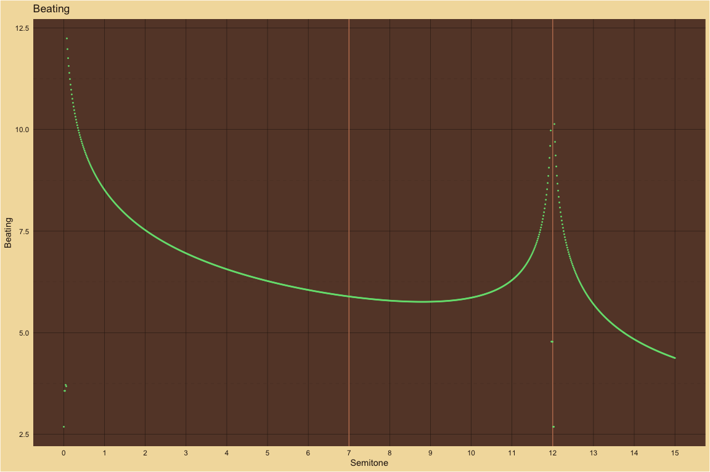

MaMi.CoDi: A Spatiotemporal Periodicity Model of Consonance Perception
================

# Theoretical predictions compared to large-scale behavioral results

The large-scale behavioral data in the plots below are from [Timbral
effects on consonance disentangle psychoacoustic mechanisms and suggest
perceptual origins for musical
scales](https://www.nature.com/articles/s41467-024-45812-z) by Raja
Marjieh, Peter M. C. Harrison, Harin Lee, Fotini Deligiannaki & Nori
Jacoby.

# Manipulating harmonic frequencies

## Dyads spanning 15 semitones

### Harmonic ~ Partials: 10

For 10 harmonics, behavioral results and theoretical predictions agree.
With the default smoothing parameter from the large-scale behavioral
study, the smoothed theoretical peaks at M2 and P8 are relatively lower
than the theoretical predictions plotted as points. In a plot below, we
temporarily adjust the smoothing parameter to show how the behavioral
and theoretical curves change.

| detected_pseudo_octave | ignore_amplitudes_below | wavelength_tolerance | frequency_tolerance | smoothing_sigma |
|:-----------------------|:------------------------|:---------------------|:--------------------|----------------:|
| 2                      | 0.03                    | 0.1                  | 0.05                |             0.2 |

<!-- -->

### Harmonic ~ Smoothing Variation ~ Sigma: 0.02

With a smaller smoothing parameter (0.02 versus 0.2), the smoothed peaks
at M2 and P8 more closely align with the theoretical predictions plotted
as points. However, for the remaining plots we will continue to use the
larger smoothing parameter from the large-scale behavioral study.

| detected_pseudo_octave | ignore_amplitudes_below | wavelength_tolerance | frequency_tolerance | smoothing_sigma |
|:-----------------------|:------------------------|:---------------------|:--------------------|----------------:|
| 2                      | 0.03                    | 0.1                  | 0.05                |            0.02 |

<!-- -->

### 5Partials ~ Partials: 5

For 5 harmonics, behavioral results and theoretical predictions agree.
For comparison with the study below with the third partial deleted,
notice that the m3 peak is only slightly lower than the M3 peak. Near
M2, the theoretical smoothed curve is relatively lower than the
theoretical predictions plotted as points.

| detected_pseudo_octave | ignore_amplitudes_below | wavelength_tolerance | frequency_tolerance | smoothing_sigma |
|:-----------------------|:------------------------|:---------------------|:--------------------|----------------:|
| 2                      | 0.03                    | 0.1                  | 0.05                |             0.2 |

<!-- -->

### 5PartialsNo3 ~ Partials: 5

For 5 harmonics with the 3rd partial deleted, behavioral results and
theoretical predictions largely agree. As expected, the m3 peak without
the third partial is now lower than the m3 peak with all 5 harmonics
while the M3 peak is mostly the same for both sets of harmonics.
MaMi.CoDi predicts a peak with minor polarity just below the tritone
that does not exist in the behavioral data. Near M2, the theoretical
smoothed curve is relatively lower than the theoretical predictions
plotted as points.

| detected_pseudo_octave | ignore_amplitudes_below | wavelength_tolerance | frequency_tolerance | smoothing_sigma |
|:-----------------------|:------------------------|:---------------------|:--------------------|----------------:|
| 2                      | 0.03                    | 0.1                  | 0.05                |             0.2 |

<!-- -->

### Pure ~ Partials: 1

For pure tones, the behavioral results and the theoretical predictions
agree. Only P5 and P8 have pronounced two-sided peaks. The behavioral
results show more variation in consonance height across the 15 semitones
than MaMi.CoDi predicts.

| detected_pseudo_octave | ignore_amplitudes_below | wavelength_tolerance | frequency_tolerance | smoothing_sigma |
|:-----------------------|:------------------------|:---------------------|:--------------------|----------------:|
| 2                      | 0.03                    | 0.1                  | 0.05                |             0.2 |

<!-- -->

### Stretched ~ Partials: 10

For stretched harmonics, behavioral results and theoretical predictions
mostly agree. MaMi.CoDi predicts a relatively higher consonance peak
just above P4 than the behavioral results. MaMi.Codi predicts peaks with
minor polarity just above m3 and m7 that do not exist in the behavioral
results. Near M2, the theoretical smoothed curve is relatively lower
than the theoretical predictions plotted as points.

| detected_pseudo_octave | ignore_amplitudes_below | wavelength_tolerance | frequency_tolerance | smoothing_sigma |
|:-----------------------|:------------------------|:---------------------|:--------------------|----------------:|
| 2.1                    | 0.03                    | 0.1                  | 0.05                |             0.2 |

<!-- -->

### Compressed ~ Partials: 10

For compressed harmonics, the pronounced behavioral peaks mostly agree
with the theoretical peaks. However, for the behavioral peak between the
14th and 15th semitones, the MaMi.CoDi model predicts a trough. For some
of the non-peak dyads there are differences. MaMi.Codi predicts peaks
with mostly minor polarity just above m2, at m3, just above P4 and
halfway between M6 and m7 that do not exist in the behavioral results.

| detected_pseudo_octave | ignore_amplitudes_below | wavelength_tolerance | frequency_tolerance | smoothing_sigma |
|:-----------------------|:------------------------|:---------------------|:--------------------|----------------:|
| 1.9                    | 0.03                    | 0.1                  | 0.05                |             0.2 |

<!-- -->

### Bonang ~ Partials: 4

For gamalan dyads with a harmonic bass pitch and bonang upper pitch,
behavioral results and theoretical predictions mostly agree. MaMi.CoDi’s
predicted peak at P5 is relatively higher than the behavioral results.
The predicted peak at P4 is shifted slightly lower than the behavioral
results. MaMi.CoDi predicts a peak between m3 and M3 that does not
appear in the behavioral results.

| detected_pseudo_octave | ignore_amplitudes_below | wavelength_tolerance | frequency_tolerance | smoothing_sigma |
|:-----------------------|:------------------------|:---------------------|:--------------------|----------------:|
| 2                      | 0.03                    | 0.1                  | 0.05                |             0.2 |

<!-- -->

## Dyads spanning 1 quarter tone

### M3 ~ Partials: 10

Detailed description in the section below.

| detected_pseudo_octave | ignore_amplitudes_below | wavelength_tolerance | frequency_tolerance | smoothing_sigma |
|:-----------------------|:------------------------|:---------------------|:--------------------|----------------:|
| 2                      | 0.03                    | 3e-04                | 0.00015             |           0.035 |

<!-- -->

### M6 ~ Partials: 10

Detailed description in the section below.

| detected_pseudo_octave | ignore_amplitudes_below | wavelength_tolerance | frequency_tolerance | smoothing_sigma |
|:-----------------------|:------------------------|:---------------------|:--------------------|----------------:|
| 2                      | 0.03                    | 3e-04                | 0.00015             |           0.035 |

<!-- -->

### P8 ~ Partials: 10

Detailed description in the section below.

| detected_pseudo_octave | ignore_amplitudes_below | wavelength_tolerance | frequency_tolerance | smoothing_sigma |
|:-----------------------|:------------------------|:---------------------|:--------------------|----------------:|
| 2                      | 0.03                    | 3e-04                | 0.00015             |           0.035 |

<!-- -->

### Consonance peaks in dissonance troughs

For the high-resolution dyads centered on M3, M6 and P8, the large-scale
behavioral results and the MaMi.CoDi theoretical predictions both show
dissonance troughs centered on the JT dyads.  

MaMi.CoDi, though, predicts a local maximum consonance at the JT dyad
(M3, M6 and P8) in the center of each dissonance trough. Secondary
maximums occur at the Pythagorean third and grave major sixth. Those
secondary peaks are also surrounded by dissonance troughs. There are
also tertiary troughs near the ET intervals.

Do consonance peaks actually exist in the center of those dissonance
troughs as MaMi.CoDi predicts? Why are those peaks missing from the
behavioral results? Are there examples at other resolutions of a
consonance peak in the center of a dissonance trough?  

##### Consonance peak at P1 in dissonance trough spanning 1 octave

<!-- -->

Performers of instruments with quantized semitones like keyboards and
fretted strings–especially beginners and their audiences–are aware that
the globally maximum consonant peak at the unison interval, P1, has
highly-dissonant, playable neighbors on both sides, M7 and m2.
Dissonance decreases with each semitone step away from M7 and m2 until
the perfect fifth, P5, above and the perfect fourth, P4, below  

That is to say, at the resolution of an octave, the tonic pitch is the
maximum consonance peak in the center of a deep dissonance trough.  

At other resolutions, for example stringed instruments without frets,
the nearest playable neighbors are not dissonant. A slight roll of the
finger will not throw the audience down into a dissonance trough.

### MaMi.CoDi resolution correlates with dissonance troughs and consonance peaks

As the tolerance value of the MaMi.CoDi model varies from very small to
very large the consonance peaks expand their width until they overcome
the dissonance peaks. See plot sets, below, for M3, M6 and P8.  

MaMi.CoDi’s tolerance value is the only parameter in the model and
indicates the resolution for turning irrational ratios into rational
fractions. Those fractions are then used to estimate the periodicity of
the wavelength and frequency signals.  

- Small tolerances create more accurate fractions which create longer
  period estimates.
- Large tolerances create less accurate fractions which create shorter
  period estimates.

#### M3 ~ Major Third

Plot of M3 with MaMi.CoDi tolerance values varying from 1e-08 to 0.1:

- JT: 5/4
- ET: 2^(4/12)

<!-- -->

    #> # A tibble: 1 × 4
    #>   just_M3_freq just_M3_midi M3_freq M3_midi
    #>          <dbl>        <dbl>   <dbl>   <dbl>
    #> 1         327.         63.9    330.      64

##### Intervals near the major third ranked by consonance

    #> # A tibble: 1,000 × 2
    #>    semitone consonance_dissonance
    #>       <dbl>                 <dbl>
    #>  1     63.9                  91.5
    #>  2     64.1                  88.8
    #>  3     63.7                  87.8
    #>  4     64.0                  87.1
    #>  5     63.8                  86.6
    #>  6     63.8                  85.8
    #>  7     63.9                  85.8
    #>  8     63.7                  85.4
    #>  9     64.0                  85.4
    #> 10     64.0                  85.2
    #> # ℹ 990 more rows

###### The JT M3 has the highest consonance

    #> [1] 63.86321

    #> # A tibble: 1 × 2
    #>   semitone consonance_dissonance
    #>      <dbl>                 <dbl>
    #> 1     63.9                  91.5

###### Frequency ratios of the JT M3

    #>    num den     ratio pseudo_ratio      tone reference_tone
    #> 1    1   1  1.000000     1.000000  261.6256       261.6256
    #> 2    5   4  1.250005     1.250005  327.0334       261.6256
    #> 3    2   1  2.000000     2.000000  523.2511       261.6256
    #> 4    5   2  2.500011     2.500011  654.0668       261.6256
    #> 5    3   1  3.000000     3.000000  784.8767       261.6256
    #> 6   15   4  3.750016     3.750016  981.1002       261.6256
    #> 7    4   1  4.000000     4.000000 1046.5023       261.6256
    #> 8    5   1  5.000000     5.000000 1308.1278       261.6256
    #> 9    5   1  5.000022     5.000022 1308.1336       261.6256
    #> 10   6   1  6.000000     6.000000 1569.7534       261.6256
    #> 11  25   4  6.250027     6.250027 1635.1669       261.6256
    #> 12   7   1  7.000000     7.000000 1831.3790       261.6256
    #> 13  15   2  7.500033     7.500033 1962.2003       261.6256
    #> 14   8   1  8.000000     8.000000 2093.0045       261.6256
    #> 15  35   4  8.750038     8.750038 2289.2337       261.6256
    #> 16   9   1  9.000000     9.000000 2354.6301       261.6256
    #> 17  10   1 10.000000    10.000000 2616.2556       261.6256
    #> 18  10   1 10.000044    10.000044 2616.2671       261.6256
    #> 19  45   4 11.250049    11.250049 2943.3005       261.6256
    #> 20  25   2 12.500055    12.500055 3270.3339       261.6256

##### Intervals near the major third ranked by lowest consonance

    #> # A tibble: 1,000 × 2
    #>    semitone consonance_dissonance
    #>       <dbl>                 <dbl>
    #>  1     63.9                  4.81
    #>  2     63.9                  7.32
    #>  3     63.9                  9.44
    #>  4     63.9                  9.62
    #>  5     63.9                  9.70
    #>  6     63.9                 10.0 
    #>  7     63.9                 10.6 
    #>  8     63.9                 11.3 
    #>  9     63.9                 12.2 
    #> 10     63.9                 13.0 
    #> # ℹ 990 more rows

###### The lowest consonance

    #> [1] 63.86622

    #> # A tibble: 1 × 2
    #>   semitone consonance_dissonance
    #>      <dbl>                 <dbl>
    #> 1     63.9                  4.81

###### The lowest consonance ratios

    #>     num  den     ratio pseudo_ratio      tone reference_tone
    #> 1     1    1  1.000000     1.000000  261.6256       261.6256
    #> 2   974  779  1.250222     1.250222  327.0901       261.6256
    #> 3     2    1  2.000000     2.000000  523.2511       261.6256
    #> 4  2298  919  2.500445     2.500445  654.1802       261.6256
    #> 5     3    1  3.000000     3.000000  784.8767       261.6256
    #> 6  1234  329  3.750667     3.750667  981.2704       261.6256
    #> 7     4    1  4.000000     4.000000 1046.5023       261.6256
    #> 8     5    1  5.000000     5.000000 1308.1278       261.6256
    #> 9  5056 1011  5.000889     5.000889 1308.3605       261.6256
    #> 10    6    1  6.000000     6.000000 1569.7534       261.6256
    #> 11 1294  207  6.251112     6.251112 1635.4506       261.6256
    #> 12    7    1  7.000000     7.000000 1831.3790       261.6256
    #> 13 2618  349  7.501334     7.501334 1962.5407       261.6256
    #> 14    8    1  8.000000     8.000000 2093.0045       261.6256
    #> 15 1339  153  8.751556     8.751556 2289.6308       261.6256
    #> 16    9    1  9.000000     9.000000 2354.6301       261.6256
    #> 17   10    1 10.000000    10.000000 2616.2556       261.6256
    #> 18 5331  533 10.001779    10.001779 2616.7210       261.6256
    #> 19 1339  119 11.252001    11.252001 2943.8111       261.6256
    #> 20 2713  217 12.502223    12.502223 3270.9012       261.6256

###### The Pythagorean third is the second highest consonance

MIDI:

    #> [1] 64.09244

Cents:

    #> [1] 409.2442

Consonance:

    #> # A tibble: 1 × 2
    #>   semitone consonance_dissonance
    #>      <dbl>                 <dbl>
    #> 1     64.1                  88.8

###### Frequency ratios of the second highest consonance

    #>    num den     ratio pseudo_ratio      tone reference_tone
    #> 1    1   1  1.000000     1.000000  261.6256       261.6256
    #> 2   19  15  1.266667     1.266667  331.3924       261.6256
    #> 3    2   1  2.000000     2.000000  523.2511       261.6256
    #> 4   38  15  2.533333     2.533333  662.7847       261.6256
    #> 5    3   1  3.000000     3.000000  784.8767       261.6256
    #> 6   19   5  3.800000     3.800000  994.1771       261.6256
    #> 7    4   1  4.000000     4.000000 1046.5023       261.6256
    #> 8    5   1  5.000000     5.000000 1308.1278       261.6256
    #> 9   76  15  5.066666     5.066666 1325.5695       261.6256
    #> 10   6   1  6.000000     6.000000 1569.7534       261.6256
    #> 11  19   3  6.333333     6.333333 1656.9619       261.6256
    #> 12   7   1  7.000000     7.000000 1831.3790       261.6256
    #> 13  38   5  7.600000     7.600000 1988.3542       261.6256
    #> 14   8   1  8.000000     8.000000 2093.0045       261.6256
    #> 15 133  15  8.866667     8.866667 2319.7467       261.6256
    #> 16   9   1  9.000000     9.000000 2354.6301       261.6256
    #> 17  10   1 10.000000    10.000000 2616.2556       261.6256
    #> 18 152  15 10.133333    10.133333 2651.1389       261.6256
    #> 19  57   5 11.399999    11.399999 2982.5313       261.6256
    #> 20  38   3 12.666667    12.666667 3313.9238       261.6256

###### References for the Pythagorean third

- “19/15 409.2443014 (good approximation of Pythagorean 3rd)”
  - from [M3 in the Encyclopedia of Microtonal Music
    Theory](http://www.tonalsoft.com/enc/m/major-3rd.aspx)
- [Pythagorean ditone](https://en.wikipedia.org/wiki/Ditone)

#### M6 ~ Major Sixth

Plot of M6 with MaMi.CoDi tolerance values varying from 1e-08 to 0.1:

- JT: 5/3
- ET: 2^(9/12)

<!-- -->

    #> # A tibble: 1 × 4
    #>   just_M6_freq just_M6_midi M6_freq M6_midi
    #>          <dbl>        <dbl>   <dbl>   <dbl>
    #> 1         436.         68.8     440      69

##### Intervals near the major sixth ranked by consonance

    #> # A tibble: 1,000 × 2
    #>    semitone consonance_dissonance
    #>       <dbl>                 <dbl>
    #>  1     68.7                  88.2
    #>  2     69.0                  87.1
    #>  3     68.8                  86.4
    #>  4     69.0                  86.0
    #>  5     68.8                  84.6
    #>  6     69.0                  84.1
    #>  7     69.0                  83.9
    #>  8     69.1                  83.3
    #>  9     68.8                  83.0
    #> 10     68.9                  82.8
    #> # ℹ 990 more rows

###### The JT M6 has the highest consonance

    #> [1] 68.66952

    #> # A tibble: 1 × 2
    #>   semitone consonance_dissonance
    #>      <dbl>                 <dbl>
    #> 1     68.7                  88.2

###### Frequency ratios of the JT M6

    #>    num den     ratio pseudo_ratio      tone reference_tone
    #> 1    1   1  1.000000     1.000000  261.6256       261.6256
    #> 2   33  20  1.649993     1.649993  431.6804       261.6256
    #> 3    2   1  2.000000     2.000000  523.2511       261.6256
    #> 4    3   1  3.000000     3.000000  784.8767       261.6256
    #> 5   33  10  3.299986     3.299986  863.3608       261.6256
    #> 6    4   1  4.000000     4.000000 1046.5023       261.6256
    #> 7   99  20  4.949979     4.949979 1295.0411       261.6256
    #> 8    5   1  5.000000     5.000000 1308.1278       261.6256
    #> 9    6   1  6.000000     6.000000 1569.7534       261.6256
    #> 10  33   5  6.599972     6.599972 1726.7215       261.6256
    #> 11   7   1  7.000000     7.000000 1831.3790       261.6256
    #> 12   8   1  8.000000     8.000000 2093.0045       261.6256
    #> 13  33   4  8.249965     8.249965 2158.4019       261.6256
    #> 14   9   1  9.000000     9.000000 2354.6301       261.6256
    #> 15  99  10  9.899959     9.899959 2590.0823       261.6256
    #> 16  10   1 10.000000    10.000000 2616.2556       261.6256
    #> 17 231  20 11.549952    11.549952 3021.7626       261.6256
    #> 18  66   5 13.199945    13.199945 3453.4430       261.6256
    #> 19 297  20 14.849938    14.849938 3885.1234       261.6256
    #> 20  33   2 16.499931    16.499931 4316.8038       261.6256

##### Intervals near the major sixth ranked by lowest consonance

    #> # A tibble: 1,000 × 2
    #>    semitone consonance_dissonance
    #>       <dbl>                 <dbl>
    #>  1     68.8                  7.42
    #>  2     68.8                  7.85
    #>  3     68.8                  9.72
    #>  4     68.8                  9.72
    #>  5     68.8                 10.0 
    #>  6     68.8                 10.0 
    #>  7     68.7                 11.2 
    #>  8     68.8                 12.2 
    #>  9     68.7                 12.4 
    #> 10     68.8                 13.5 
    #> # ℹ 990 more rows

###### The lowest consonance

    #> [1] 68.84169

    #> # A tibble: 1 × 2
    #>   semitone consonance_dissonance
    #>      <dbl>                 <dbl>
    #> 1     68.8                  7.42

###### The lowest consonance ratios

    #>     num  den     ratio pseudo_ratio      tone reference_tone
    #> 1     1    1  1.000000     1.000000  261.6256       261.6256
    #> 2  1968 1181  1.666484     1.666484  435.9949       261.6256
    #> 3     2    1  2.000000     2.000000  523.2511       261.6256
    #> 4     3    1  3.000000     3.000000  784.8767       261.6256
    #> 5  2393  718  3.332968     3.332968  871.9898       261.6256
    #> 6     4    1  4.000000     4.000000 1046.5023       261.6256
    #> 7  7724 1545  4.999453     4.999453 1307.9846       261.6256
    #> 8     5    1  5.000000     5.000000 1308.1278       261.6256
    #> 9     6    1  6.000000     6.000000 1569.7534       261.6256
    #> 10 2693  404  6.665937     6.665937 1743.9795       261.6256
    #> 11    7    1  7.000000     7.000000 1831.3790       261.6256
    #> 12    8    1  8.000000     8.000000 2093.0045       261.6256
    #> 13 2758  331  8.332421     8.332421 2179.9744       261.6256
    #> 14    9    1  9.000000     9.000000 2354.6301       261.6256
    #> 15 8379  838  9.998905     9.998905 2615.9693       261.6256
    #> 16   10    1 10.000000    10.000000 2616.2556       261.6256
    #> 17 2858  245 11.665390    11.665390 3051.9641       261.6256
    #> 18 2853  214 13.331874    13.331874 3487.9590       261.6256
    #> 19 8624  575 14.998358    14.998358 3923.9539       261.6256
    #> 20 2933  176 16.664842    16.664842 4359.9488       261.6256

###### The grave major sixth is the second highest consonance

MIDI:

    #> [1] 69.04039

Cents:

    #> [1] 904.039

Consonance:

    #> # A tibble: 1 × 2
    #>   semitone consonance_dissonance
    #>      <dbl>                 <dbl>
    #> 1     69.0                  87.1

###### Frequency ratios of the second highest consonance

    #>    num den     ratio pseudo_ratio      tone reference_tone
    #> 1    1   1  1.000000     1.000000  261.6256       261.6256
    #> 2   59  35  1.685721     1.685721  441.0277       261.6256
    #> 3    2   1  2.000000     2.000000  523.2511       261.6256
    #> 4    3   1  3.000000     3.000000  784.8767       261.6256
    #> 5  118  35  3.371442     3.371442  882.0555       261.6256
    #> 6    4   1  4.000000     4.000000 1046.5023       261.6256
    #> 7    5   1  5.000000     5.000000 1308.1278       261.6256
    #> 8  177  35  5.057163     5.057163 1323.0832       261.6256
    #> 9    6   1  6.000000     6.000000 1569.7534       261.6256
    #> 10 236  35  6.742884     6.742884 1764.1109       261.6256
    #> 11   7   1  7.000000     7.000000 1831.3790       261.6256
    #> 12   8   1  8.000000     8.000000 2093.0045       261.6256
    #> 13  59   7  8.428606     8.428606 2205.1387       261.6256
    #> 14   9   1  9.000000     9.000000 2354.6301       261.6256
    #> 15  10   1 10.000000    10.000000 2616.2556       261.6256
    #> 16 354  35 10.114326    10.114326 2646.1664       261.6256
    #> 17  59   5 11.800047    11.800047 3087.1941       261.6256
    #> 18 472  35 13.485769    13.485769 3528.2218       261.6256
    #> 19 531  35 15.171490    15.171490 3969.2495       261.6256
    #> 20 118   7 16.857211    16.857211 4410.2775       261.6256

###### References for the grave major sixth

- [List of Pitch
  Intervals](https://en.wikipedia.org/wiki/List_of_pitch_intervals)
- [Grave major sixth on
  C](https://en.m.wikipedia.org/wiki/File:Grave_major_sixth_on_C.png)

#### P8 Octave

Plot of P8 with MaMi.CoDi tolerance values varying from 1e-08 to 0.1:

# Manipulating harmonic amplitudes

### Harmonic ~ Roll Off: 12

| detected_pseudo_octave | ignore_amplitudes_below | wavelength_tolerance | frequency_tolerance | smoothing_sigma |
|:-----------------------|:------------------------|:---------------------|:--------------------|----------------:|
| 2                      | 0.03                    | 0.1                  | 0.05                |             0.2 |

<!-- -->

### Harmonic ~ Roll Off: 7

| detected_pseudo_octave | ignore_amplitudes_below | wavelength_tolerance | frequency_tolerance | smoothing_sigma |
|:-----------------------|:------------------------|:---------------------|:--------------------|----------------:|
| 2                      | 0.03                    | 0.1                  | 0.05                |             0.2 |

<!-- -->

### Harmonic ~ Roll Off: 2

| detected_pseudo_octave | ignore_amplitudes_below | wavelength_tolerance | frequency_tolerance | smoothing_sigma |
|:-----------------------|:------------------------|:---------------------|:--------------------|----------------:|
| 2                      | 0.03                    | 0.1                  | 0.05                |             0.2 |

<!-- -->

#### Notes on plots:

In the plots above:

- The cream lines are smoothed experimental data from Marjieh, Harrison
  et al.

- The multi-colored points are MaMi.CoDi computational predictions

- The multi-colored lines are smoothed MaMi.CoDi computational
  predictions

- The colors represent MaMi.CoDi computational predictions for
  major-minor polarity:

- Gold is major

- Red is neutral

- Blue is minor

- The vertical axis is z-scored consonance-dissonance

- The horizontal axis is the width of the dyad from 0 to 15 semitones

- For example, the data at 4 represents the equal tempered major third,
  M3

- While the data at 8 represents the equal tempered minor sixth, m6
