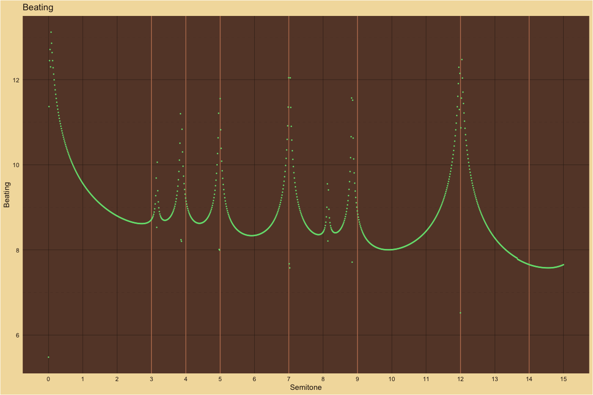
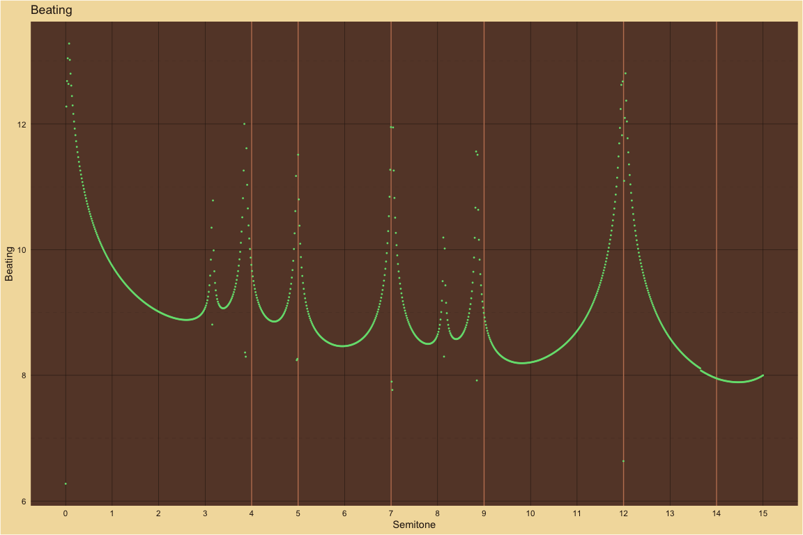

MaMi.CoDi: A Spatiotemporal Periodicity Model of Consonance Perception
================

## How MaMi.CoDi Works

### The Basilar Membrane

When a chord is sounded, pressure waves travel through the air. Those
pressure waves enter the ear canal where they vibrate the ear drum. The
ear drum transfers the energy of the pressure waves through a series of
bones in the fluid of the middle ear to an oval window on the
shell-shaped cochlea of the inner ear. Within the fluid of the cochlea,
the sound energy is converted into a traveling surface wave along the
basilar membrane.  

Human basilar membranes are around 33 mm long. Thousands of
evenly-spaced hair cells are arranged in a line on the basilar membrane.
The hair cells transduce mechanical vibrations into electrical activity
that is sent along the auditory nerve to the central auditory system.
When a sound wave travels along the basilar membrane, the hair cells
positioned near the wavelength of that sound will send electrical
activity along the auditory nerve.  

The fundamental tone of middle C is over a meter long in room
temperature air at sea level. But the basilar membrane is only 33mm
long. How can the hair cells positioned along the basilar membrane
detect wavelengths that are longer than the entire basilar membrane?  

The traveling sound waves shorten as they travel around the spiral
cochlea. Middle C’s fundamental wavelength of 1.31 meters in air shrinks
to 26 mm along the basilar membrane. So, when the fundamental tone of
middle C is sounded, the hair cells positioned 26 mm (81%) from the base
of the cochlea send electrical activity along the auditory nerve.  

When a musical chord comprised of many fundamental tones and harmonics
is sounded, the hair cells at each shortened wavelength position send
signals along the auditory nerve. This spatial or rate-place arrangement
of hair cell positions and wavelengths of tones is known as tonotopy.  

### The Core Idea of MaMi.CoDi

If we play a chord, freeze time and observe which hair cells are
displaced, what are we observing? Are we observing frequencies? Periods?
No. Time is frozen. Frequency (1/s) and period (s) are temporal
observations. We are making a purely spatial observation about
wavelengths (m). We will come back to temporal observations shortly.  

When we combine all the component parts of a chord together into a
whole, we can estimate the overall wavelength for the whole chord. A
technique used in digital signal processing and bricklaying is to
estimate ratios (within an acceptable precision) between each of the
parts and a selected reference part. The least common denominator (LCD)
of those part ratios will be a measure of the periodicity of the whole
relative to the selected reference part.  

The overall chord wavelength will be as long as or longer than the
longest component wavelength of the chord. Chords with short wavelengths
relative to the component wavelengths sound pleasant. And chords with
long wavelengths relative to component wavelengthsound unpleasant.
MaMi.CoDi uses this measure of relative wavelength to predict the
perceived spatial consonance of a chord.  

Let us unfreeze time and start counting how often a hair cell moves due
to a pure tone of our sounded chord. If we count the number of movements
relative to a certain amount of time, we will be observing the frequency
of the partial. This would be a temporal observation. The auditory
system has a property called phase locking which allows it to encode the
time intervals, periods, between spikes from sound waves.  

When we combine the period components of a chord together, we can
estimate the overall period for the whole chord. That chord period will
be as long as or longer than the longest component period of the chord.
Short relative periods sound pleasant. Long relative periods sound
unpleasant. MaMi.CoDi uses this measure of chord period to predict the
perceived temporal consonance of a chord.  

MaMi.CoDi sums the spatial and temporal consonance predictions to create
an overall consonance-dissonance prediction. MaMi.CoDi subtracts the
spatial consonance from the temporal consonance to create a major-minor
polarity prediction. Positive values will sound major, negative values
minor and values around zero will sound neutral.  

Because wavelength and frequency are inverse of each other one might
imagine that the spatial and temporal signals would have the same
values. However, for complex pitches that is not the case. The pattern
of the two sets of components are different. See the example of the
major triad with 5 harmonics, below.

# `{r, child=c('man/Spatiotemporal_Periodicity.Rmd')} #`

### Finding the precision Values

“One difficulty with distinguishing between place and temporal (or
place-time) models of pitch is that spectral and temporal
representations of a signal are mathematically equivalent: any change in
the spectral representation is reflected by a change in the temporal
representation, and vice versa . Discovering what the auditory system
does means focusing on the physiological limits imposed by the cochlea
and auditory nerve.  

“For instance, the place theory can be tested using known limits of
frequency selectivity: if pitch can be heard when only unresolved
harmonics are presented (eliminating place information), then place
information is not necessary for pitch. Similarly, if all the
frequencies within a stimulus are above the upper limits of phase
locking, and the temporal envelope information is somehow suppressed,
then temporal information is not necessary for pitch perception.”  

from “Revisiting place and temporal theories of pitch”, Andrew J.
Oxenham, 2014.  

The MaMi.CoDi model, based on Stolzenburg (2015), has one one parameter:
precision. precision is used by the Stern-Brocot algorithm to find tone
ratios as rational fractions that are then used to estimate the relative
periodicity of chords. precision acts as the physiological limits
mentioned by Oxenham, above.  

Considering that the spatial and temporal signals had two different
physiological origins, we searched a two-dimensional precision space in
order to match model predictions with the large-scale behavioral
results. It turned out that the values that best matched large-scale
behavioral results were always the same for temporal and spatial
precision. This might indicate that the physiological limitations are
not specific to place signals or time signals separetely. But instead
the limitation is higher in the auditory system after the signals have
been passed along.  

That is to say, the limits that creates differences between temporal and
spatial signals might not be frequency selectivity or phase locking but
instead a limit of higher-level perception or pattern recognition, where
estimates of the period of a complex signal is made from components.  

MaMi.CoDi uses the Stern-Brocot tree to find rational fractions for the
ratios within a given precision. How do we find the best precision
values? For the MaMi.CoDi model we ran thousands of computations with
various precision values and compared the predictions with results from
six of the large-scale behavioral experiments.  

Because the spatial signal and the temporal signal have different
origins we initially did a two-dimensional precision search. However the
closest fits to the behavioral data came from spatial and precision
values being the same. Insofar as this model represents processing in
the auditory cortex, it would seem that estimating the cyclicity of the
two signals happens higher up in the auditoray system after the spatial
and temporal signals have been processed.  

## Theoretical predictions compared to large-scale behavioral results

The large-scale behavioral data in the plots below are from [Timbral
effects on consonance disentangle psychoacoustic mechanisms and suggest
perceptual origins for musical
scales](https://www.nature.com/articles/s41467-024-45812-z) by Raja
Marjieh, Peter M. C. Harrison, Harin Lee, Fotini Deligiannaki & Nori
Jacoby.

### Manipulating harmonic frequencies

#### Dyads spanning 15 semitones

##### Pure ~ Partials: 1

For pure tones, the behavioral results and the theoretical predictions
mostly agree. Only P5 and P8 have pronounced two-sided peaks. The
behavioral results show subtle variations in consonance height across
the 15 semitones but the overall peak structure agrees with MaMi.CoDi
predictions. For futher comparison, the theoretical predictions for
major-minor versus the behavioral results are included in a plot below.

| min_amplitude | spatial_precision | temporal_precision | smoothing_sigma |
|:--------------|:------------------|:-------------------|----------------:|
| 0             | 0.0375            | 0.0375             |             0.2 |

<!-- -->  
<!-- -->

##### Bonang ~ Partials: 4

For gamalan dyads with a harmonic bass pitch and bonang upper pitch,
behavioral results and theoretical predictions mostly agree. MaMi.CoDi
predicts a dissonance trough with minor polarity at P4 that is not in
the behavioral results. MaMi.CoDi predicts P5 to have minor polarity and
be relatively higher than the behavioral results.

| min_amplitude | spatial_precision | temporal_precision | smoothing_sigma |
|:--------------|:------------------|:-------------------|----------------:|
| 0             | 0.0375            | 0.0375             |             0.2 |

<!-- -->  
<!-- -->

##### 5Partials ~ Partials: 5

For 5 harmonics, behavioral results and theoretical predictions agree.
For comparison with the study below (5 partils with the third partial
deleted), notice that the m3 peak is only slightly lower than the M3
peak.

| min_amplitude | spatial_precision | temporal_precision | smoothing_sigma |
|:--------------|:------------------|:-------------------|----------------:|
| 0             | 0.075             | 0.075              |             0.2 |

<!-- -->  
<!-- -->

##### 5PartialsNo3 ~ Partials: 5

For 5 harmonics with the 3rd partial deleted, behavioral results and
theoretical predictions mostly agree. As expected, the m3 peak without
the third partial is now lower than the m3 peak with all 5 harmonics
while the M3 peak is slightly higher without the 3rd partial.

| min_amplitude | spatial_precision | temporal_precision | smoothing_sigma |
|:--------------|:------------------|:-------------------|----------------:|
| 0             | 0.075             | 0.075              |             0.2 |

<!-- -->  
<!-- -->

##### Harmonic ~ Partials: 10

For 10 harmonics, behavioral results and theoretical predictions agree.

| min_amplitude | spatial_precision | temporal_precision | smoothing_sigma |
|:--------------|:------------------|:-------------------|----------------:|
| 0             | 0.075             | 0.075              |             0.2 |

<!-- -->  
<!-- -->

##### Stretched ~ Partials: 10

For stretched harmonics, behavioral results and theoretical predictions
mostly agree. MaMi.Codi predicts peaks with minor polarity just above m3
and m7 that do not exist in the behavioral results.

| min_amplitude | spatial_precision | temporal_precision | smoothing_sigma |
|:--------------|:------------------|:-------------------|----------------:|
| 0             | 0.0375            | 0.0375             |             0.2 |

<!-- -->  
<!-- -->

##### Compressed ~ Partials: 10

For compressed harmonics, the pronounced behavioral peaks mostly agree
with the theoretical peaks.

| min_amplitude | spatial_precision | temporal_precision | smoothing_sigma |
|:--------------|:------------------|:-------------------|----------------:|
| 0             | 0.01875           | 0.01875            |             0.2 |

<!-- -->  
<!-- -->

#### Dyads spanning 1 quarter tone

##### M3 ~ Partials: 10

Description is below.

| min_amplitude | spatial_precision | temporal_precision | smoothing_sigma |
|:--------------|:------------------|:-------------------|----------------:|
| 0             | 5e-05             | 5e-05              |           0.035 |

<!-- -->  
<!-- -->

##### M6 ~ Partials: 10

Description is below.

| min_amplitude | spatial_precision | temporal_precision | smoothing_sigma |
|:--------------|:------------------|:-------------------|----------------:|
| 0             | 5e-05             | 5e-05              |           0.035 |

<!-- -->  
<!-- -->

##### P8 ~ Partials: 10

Description is below.

| min_amplitude | spatial_precision | temporal_precision | smoothing_sigma |
|:--------------|:------------------|:-------------------|----------------:|
| 0             | 5e-05             | 5e-05              |           0.035 |

<!-- -->  
<!-- -->

### TODO: run the in-depth precision searches again for M3, M6 and P8

# `{r, child=c('man/M3_M6_P8.Rmd')} #`

#### Notes on plots:

In the plots above:

- The cream lines are smoothed experimental data from Marjieh, Harrison
  et al.

- The multi-colored points are MaMi.CoDi computational predictions

- The multi-colored lines are smoothed MaMi.CoDi computational
  predictions

- The colors represent MaMi.CoDi computational predictions for
  major-minor polarity:

- Gold is major

- Red is neutral

- Blue is minor

- The vertical axis is z-scored consonance-dissonance

- The horizontal axis is the width of the dyad from 0 to 15 semitones

- For example, the data at 4 represents the equal tempered major third,
  M3

- While the data at 8 represents the equal tempered minor sixth, m6
