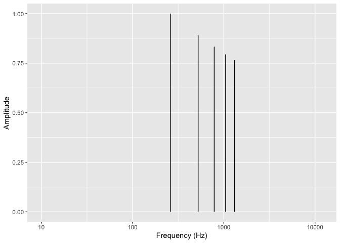

MaMi.CoDi: A Spatiotemporal Periodicity Model of Consonance Perception
================

## How MaMi.CoDi Works

### Estimating Spatiotemporal Periodicity

To estimate the periodicity of a chord, the MaMi.CoDi model uses a
signal processing technique. It finds ratios, within a given tolerance,
for every tone in the chord (fundamental, harmonics, noise, etc.)
relative to a reference tone. The least common multiple of those ratios
is a measure of the cycle length, relative to the reference tone
[(Stolzenburg,
2015)](https://www.tandfonline.com/doi/abs/10.1080/17459737.2015.1033024).

Short relative cycles are predicted to sound pleasant and long relative
cycles are predicted to sound unpleasant.  

MaMi.CoDi creates two estimates of the chord’s period: a temporal
estimate and a spatial estimate.  

For the temporal (i.e. phase-locking or frequency) estimate the
reference tone is the smallest frequency. Small frequencies are low
tones and are detected by the inner ear hair cells closest to the apex
of the cochlea, which is the end furthest from the source of the wave.  

For the spatial (i.e. rate-place or wavelength) estimate, the reference
tone is the smallest wavelength. Small wavelengths are high tones and
are detected by the inner ear hair cells closest to the base of the
cochlea, which is the end closest to the middle ear, the source of the
wave.  

MaMi.CoDi adds the two relative cycle estimates together to predict the
perceived consonance-dissonance. MaMi.CoDi subtracts the spatial
estimate from the temporal estimate to predict the major-minor polarity;
positve estimates are predicted to sound major and negative estimates
are predicted to sound minor.

#### Chord

Below, we estimate the periodicity of the C4, E4 and G4 major triad with
5 harmonics per pitch.

- Fundamental Frequencies: 261.6255653, 329.6275569, 391.995436  

- Fundamental Wavelengths: 1.311034, 1.0405683, 0.8750102  

- MIDI: 60, 64, 67  

- Number of Harmonics: 5

#### Temporal Estimate

| chord_Hz |  chord_m |   chord_s | chord_Sz | tol |
|---------:|---------:|----------:|---------:|----:|
| 43.60426 | 7.866204 | 0.0229335 |        6 |   1 |

##### Periods

<!-- -->

##### Relative Periodicity

<!-- -->

#### Frequency Ratios

| index | num | den |    ratio |      tone | reference_tone |
|------:|----:|----:|---------:|----------:|---------------:|
|     1 |   1 |   1 | 1.000000 |  261.6256 |       261.6256 |
|     2 |   4 |   3 | 1.259921 |  329.6276 |       261.6256 |
|     3 |   3 |   2 | 1.498307 |  391.9954 |       261.6256 |
|     4 |   2 |   1 | 2.000000 |  523.2511 |       261.6256 |
|     5 |   5 |   2 | 2.519842 |  659.2551 |       261.6256 |
|     6 |   3 |   1 | 2.996614 |  783.9909 |       261.6256 |
|     7 |   3 |   1 | 3.000000 |  784.8767 |       261.6256 |
|     8 |   4 |   1 | 3.779763 |  988.8827 |       261.6256 |
|     9 |   4 |   1 | 4.000000 | 1046.5023 |       261.6256 |
|    10 |   9 |   2 | 4.494921 | 1175.9863 |       261.6256 |
|    11 |   5 |   1 | 5.000000 | 1308.1278 |       261.6256 |
|    12 |   5 |   1 | 5.039684 | 1318.5102 |       261.6256 |
|    13 |   6 |   1 | 5.993228 | 1567.9817 |       261.6256 |
|    14 |   6 |   1 | 6.299605 | 1648.1378 |       261.6256 |
|    15 |  15 |   2 | 7.491535 | 1959.9772 |       261.6256 |

#### Spatial Estimate

|  chord_Hz |  chord_m |  chord_s | chord_Sz | tol |
|----------:|---------:|---------:|---------:|----:|
| 0.0029167 | 15697.53 | 342.8531 |       60 |   1 |

##### Wavenumbers

<!-- -->

##### Relative Spatial Frequency

<!-- -->

##### Wavelength Ratios

| index | num | den |    ratio |      tone | reference_tone |
|------:|----:|----:|---------:|----------:|---------------:|
|    15 |   1 |   1 | 1.000000 |  261.6256 |       261.6256 |
|    14 |   5 |   4 | 1.189207 |  311.1270 |       261.6256 |
|    13 |   5 |   4 | 1.250000 |  327.0320 |       261.6256 |
|    12 |   3 |   2 | 1.486509 |  388.9087 |       261.6256 |
|    11 |   3 |   2 | 1.498307 |  391.9954 |       261.6256 |
|    10 |   5 |   3 | 1.666667 |  436.0426 |       261.6256 |
|     9 |   9 |   5 | 1.872884 |  489.9943 |       261.6256 |
|     8 |   2 |   1 | 1.982012 |  518.5450 |       261.6256 |
|     7 |   5 |   2 | 2.497178 |  653.3257 |       261.6256 |
|     6 |   5 |   2 | 2.500000 |  654.0639 |       261.6256 |
|     5 |   3 |   1 | 2.973018 |  777.8175 |       261.6256 |
|     4 |  11 |   3 | 3.745768 |  979.9886 |       261.6256 |
|     3 |   5 |   1 | 5.000000 | 1308.1278 |       261.6256 |
|     2 |   6 |   1 | 5.946035 | 1555.6349 |       261.6256 |
|     1 |  15 |   2 | 7.491535 | 1959.9772 |       261.6256 |

### Finding the Tolerance Values

MaMi.CoDi uses the Stern-Brocot tree to find rational fractions for the
ratios within a given tolerance. How do we find the best tolerance
values? For the MaMi.CoDi model we ran thousands of computations with
various tolerance values and compared the predictions with results from
the large-scale behavioral experiments.  

The best fits across the experiments were given by a tolerance of 1.  

The just-noticeable difference is defined as delta I / I = k.

    #> # A tibble: 1 × 7
    #>     tol    C4    E4  r_hi  r_lo E4_up E4_down
    #>   <dbl> <dbl> <dbl> <dbl> <dbl> <dbl>   <dbl>
    #> 1     1  262.  330.  2.26 0.260  591.    68.0

## Theoretical predictions compared to large-scale behavioral results

The large-scale behavioral data in the plots below are from [Timbral
effects on consonance disentangle psychoacoustic mechanisms and suggest
perceptual origins for musical
scales](https://www.nature.com/articles/s41467-024-45812-z) by Raja
Marjieh, Peter M. C. Harrison, Harin Lee, Fotini Deligiannaki & Nori
Jacoby.

### Manipulating harmonic frequencies

#### Dyads spanning 15 semitones

##### Harmonic ~ Partials: 10

For 10 harmonics, behavioral results and theoretical predictions agree.

| detected_pseudo_octave | ignore_amplitudes_below | tolerance | smoothing_sigma |
|:-----------------------|:------------------------|:----------|----------------:|
| 2                      | 0.03                    | 1         |             0.2 |

<!-- -->

##### 5Partials ~ Partials: 5

For 5 harmonics, behavioral results and theoretical predictions agree.
For comparison with the study below (5 partils with the third partial
deleted), notice that the m3 peak is only slightly lower than the M3
peak.

| detected_pseudo_octave | ignore_amplitudes_below | tolerance | smoothing_sigma |
|:-----------------------|:------------------------|:----------|----------------:|
| 2                      | 0.03                    | 1         |             0.2 |

<!-- -->

##### 5PartialsNo3 ~ Partials: 5

For 5 harmonics with the 3rd partial deleted, behavioral results and
theoretical predictions mostly agree. As expected, the m3 peak without
the third partial is now lower than the m3 peak with all 5 harmonics
while the M3 peak is slightly higher without the 3rd partial.

| detected_pseudo_octave | ignore_amplitudes_below | tolerance | smoothing_sigma |
|:-----------------------|:------------------------|:----------|----------------:|
| 2                      | 0.03                    | 1         |             0.2 |

<!-- -->

##### Pure ~ Partials: 1

For pure tones, the behavioral results and the theoretical predictions
mostly agree. Only P5 and P8 have pronounced two-sided peaks. The
behavioral results show subtle variations in consonance height across
the 15 semitones but the overall peak structure agrees with MaMi.CoDi
predictions. For futher comparison, the theoretical predictions for
major-minor versus the behavioral results are included in a plot below.

| detected_pseudo_octave | ignore_amplitudes_below | tolerance | smoothing_sigma |
|:-----------------------|:------------------------|:----------|----------------:|
| 2                      | 0.03                    | 1         |             0.2 |

<!-- -->

##### Stretched ~ Partials: 10

For stretched harmonics, behavioral results and theoretical predictions
mostly agree. MaMi.Codi predicts peaks with minor polarity just above m3
and m7 that do not exist in the behavioral results.

| detected_pseudo_octave | ignore_amplitudes_below | tolerance | smoothing_sigma |
|:-----------------------|:------------------------|:----------|----------------:|
| 2.1                    | 0.03                    | 1         |             0.2 |

<!-- -->

##### Compressed ~ Partials: 10

For compressed harmonics, the pronounced behavioral peaks mostly agree
with the theoretical peaks.

| detected_pseudo_octave | ignore_amplitudes_below | tolerance | smoothing_sigma |
|:-----------------------|:------------------------|:----------|----------------:|
| 1.9                    | 0.03                    | 1         |             0.2 |

<!-- -->

##### Bonang ~ Partials: 4

For gamalan dyads with a harmonic bass pitch and bonang upper pitch,
behavioral results and theoretical predictions mostly agree. MaMi.CoDi
predicts a dissonance trough with minor polarity at P4 that is not in
the behavioral results. MaMi.CoDi predicts P5 to have minor polarity and
be relatively higher than the behavioral results.

| detected_pseudo_octave | ignore_amplitudes_below | tolerance | smoothing_sigma |
|:-----------------------|:------------------------|:----------|----------------:|
| 2                      | 0.03                    | 1         |             0.2 |

<!-- -->

#### Dyads spanning 1 quarter tone

##### M3 ~ Partials: 10

Description is below.

| detected_pseudo_octave | ignore_amplitudes_below | tolerance | smoothing_sigma |
|:-----------------------|:------------------------|:----------|----------------:|
| 2                      | 0.03                    | 0.00694   |           0.035 |

<!-- -->

##### M6 ~ Partials: 10

Description is below.

| detected_pseudo_octave | ignore_amplitudes_below | tolerance | smoothing_sigma |
|:-----------------------|:------------------------|:----------|----------------:|
| 2                      | 0.03                    | 0.00694   |           0.035 |

<!-- -->

##### P8 ~ Partials: 10

Description is below.

| detected_pseudo_octave | ignore_amplitudes_below | tolerance | smoothing_sigma |
|:-----------------------|:------------------------|:----------|----------------:|
| 2                      | 0.03                    | 0.00694   |           0.035 |

<!-- -->

### TODO: run the in-depth tolerance searches again for M3, M6 and P8

### Consonance peaks in dissonance troughs

For the high-resolution dyads centered on M3, M6 and P8, the large-scale
behavioral results and the MaMi.CoDi theoretical predictions both show
dissonance troughs centered on the JT dyads.  

MaMi.CoDi, though, predicts a local maximum consonance peak at the
center of each dissonance trough.  

Secondary maximums occur at the Pythagorean third and grave major sixth.
Those secondary peaks are also surrounded by dissonance troughs. There
are also tertiary troughs near the ET intervals.  

### Theoretical consonance peak at P1 in octave-wide dissonance trough

| multicolored_line_sigma | green_line_sigma | pseudo_octave | tolerance |
|------------------------:|-----------------:|:--------------|:----------|
|                     0.2 |                2 | 2             | 1         |

<!-- -->

Performers of instruments with quantized semitones like keyboards and
fretted strings–especially beginners and their audiences–are aware that
the globally maximum consonant peak at the unison, P1, has dissonant
neighbors on both sides, M7 and m2. Consonance increases with each
semitone step out of the trough: downward from M7 to P4 below and upward
from m2 to P5 above.  

The green line in the plot above was generated using a smoothing sigma
an order of magnitude broader than the default soothing sigma, 2.0
versus 0.2. At the broader resolution, the green line highlights the
dissonance trough and ignore the consonance peak at P1.

That is, at the resolution of an octave, MaMi.CoDi predicts a global
maximum consonance peak in the center of a smoothed dissonance trough.  

At other resolutions, for example stringed instruments without frets,
the nearest playable neighbors to P1 are not necessarily dissonant.

In the harmonic study with the narrow resolution, above, the behavioral
results shows dissonance troughs and MaMi.CoDi predicts consonance peaks
in the center of those dissonance troughs.

### MaMi.CoDi resolution correlates with dissonance troughs and consonance peaks

As the tolerance value of the MaMi.CoDi model varies from very small to
very large the consonance peaks expand their width until they overcome
the dissonance troughs. See plot sets, below, for M3, M6 and P8.  

MaMi.CoDi’s tolerance value is the only parameter in the model and
indicates the resolution for turning irrational ratios into rational
fractions. Those fractions are then used to estimate wavelength
periodicity and frequency periodicity.  

- Small tolerances give more accurate fractions which give longer
  periods.
- Large tolerances give less accurate fractions which give shorter
  period estimates.

#### M3 ~ Major Third

Plot of M3 with MaMi.CoDi tolerance values varying from 1e-08 to 0.1:

- JT: 5/4
- ET: 2^(4/12)

<!-- -->

    #> # A tibble: 1 × 4
    #>   just_M3_freq just_M3_midi M3_freq M3_midi
    #>          <dbl>        <dbl>   <dbl>   <dbl>
    #> 1         327.         63.9    330.      64

##### Intervals near the major third ranked by consonance

    #> # A tibble: 1,000 × 2
    #>    semitone consonance_dissonance
    #>       <dbl>                 <dbl>
    #>  1     63.9                  88.0
    #>  2     64.1                  84.2
    #>  3     64.0                  83.5
    #>  4     63.7                  83.2
    #>  5     64.0                  83.0
    #>  6     63.7                  82.7
    #>  7     64.1                  82.6
    #>  8     64.0                  81.8
    #>  9     63.7                  81.5
    #> 10     64.0                  81.5
    #> # ℹ 990 more rows

###### The JT M3 has the highest consonance

    #> [1] 63.86321

    #> # A tibble: 1 × 2
    #>   semitone consonance_dissonance
    #>      <dbl>                 <dbl>
    #> 1     63.9                  88.0

###### Frequency ratios of the JT M3

    #>    index num den     ratio pseudo_ratio      tone reference_tone
    #> 1      1   1   1  1.000000     1.000000  261.6256       261.6256
    #> 2      2   5   4  1.250005     1.250005  327.0334       261.6256
    #> 3      3   2   1  2.000000     2.000000  523.2511       261.6256
    #> 4      4   5   2  2.500011     2.500011  654.0668       261.6256
    #> 5      5   3   1  3.000000     3.000000  784.8767       261.6256
    #> 6      6  15   4  3.750016     3.750016  981.1002       261.6256
    #> 7      7   4   1  4.000000     4.000000 1046.5023       261.6256
    #> 8      8   5   1  5.000000     5.000000 1308.1278       261.6256
    #> 9      9   5   1  5.000022     5.000022 1308.1336       261.6256
    #> 10    10   6   1  6.000000     6.000000 1569.7534       261.6256
    #> 11    11  25   4  6.250027     6.250027 1635.1669       261.6256
    #> 12    12   7   1  7.000000     7.000000 1831.3790       261.6256
    #> 13    13  15   2  7.500033     7.500033 1962.2003       261.6256
    #> 14    14   8   1  8.000000     8.000000 2093.0045       261.6256
    #> 15    15  35   4  8.750038     8.750038 2289.2337       261.6256
    #> 16    16   9   1  9.000000     9.000000 2354.6301       261.6256
    #> 17    17  10   1 10.000000    10.000000 2616.2556       261.6256
    #> 18    18  10   1 10.000044    10.000044 2616.2671       261.6256
    #> 19    19  45   4 11.250049    11.250049 2943.3005       261.6256
    #> 20    20  25   2 12.500055    12.500055 3270.3339       261.6256

##### Intervals near the major third ranked by lowest consonance

    #> # A tibble: 1,000 × 2
    #>    semitone consonance_dissonance
    #>       <dbl>                 <dbl>
    #>  1     63.7             4.45e-308
    #>  2     63.7             4.45e-308
    #>  3     63.7             4.45e-308
    #>  4     63.8             4.45e-308
    #>  5     63.8             4.45e-308
    #>  6     63.8             4.45e-308
    #>  7     63.9             4.45e-308
    #>  8     63.9             4.45e-308
    #>  9     63.9             4.45e-308
    #> 10     63.9             4.45e-308
    #> # ℹ 990 more rows

###### The lowest consonance

    #> [1] 63.65801

    #> # A tibble: 1 × 2
    #>   semitone consonance_dissonance
    #>      <dbl>                 <dbl>
    #> 1     63.7             4.45e-308

###### The lowest consonance ratios

    #>    index  num  den     ratio pseudo_ratio      tone reference_tone
    #> 1      1    1    1  1.000000     1.000000  261.6256       261.6256
    #> 2      2 2284 1849  1.235276     1.235276  323.1799       261.6256
    #> 3      3    2    1  2.000000     2.000000  523.2511       261.6256
    #> 4      4 2305  933  2.470553     2.470553  646.3598       261.6256
    #> 5      5    3    1  3.000000     3.000000  784.8767       261.6256
    #> 6      6 2305  622  3.705829     3.705829  969.5397       261.6256
    #> 7      7    4    1  4.000000     4.000000 1046.5023       261.6256
    #> 8      8 2347  475  4.941106     4.941106 1292.7196       261.6256
    #> 9      9    5    1  5.000000     5.000000 1308.1278       261.6256
    #> 10    10    6    1  6.000000     6.000000 1569.7534       261.6256
    #> 11    11 2347  380  6.176382     6.176382 1615.8995       261.6256
    #> 12    12    7    1  7.000000     7.000000 1831.3790       261.6256
    #> 13    13 2305  311  7.411659     7.411659 1939.0795       261.6256
    #> 14    14    8    1  8.000000     8.000000 2093.0045       261.6256
    #> 15    15 2326  269  8.646935     8.646935 2262.2594       261.6256
    #> 16    16    9    1  9.000000     9.000000 2354.6301       261.6256
    #> 17    17 2431  246  9.882212     9.882212 2585.4393       261.6256
    #> 18    18   10    1 10.000000    10.000000 2616.2556       261.6256
    #> 19    19 2368  213 11.117488    11.117488 2908.6192       261.6256
    #> 20    20 2347  190 12.352765    12.352765 3231.7991       261.6256

###### The Pythagorean third is the second highest consonance

MIDI:

    #> [1] 64.09244

Cents:

    #> [1] 409.2442

Consonance:

    #> # A tibble: 1 × 2
    #>   semitone consonance_dissonance
    #>      <dbl>                 <dbl>
    #> 1     64.1                  84.2

###### Frequency ratios of the second highest consonance

    #>    index num den     ratio pseudo_ratio      tone reference_tone
    #> 1      1   1   1  1.000000     1.000000  261.6256       261.6256
    #> 2      2  19  15  1.266667     1.266667  331.3924       261.6256
    #> 3      3   2   1  2.000000     2.000000  523.2511       261.6256
    #> 4      4  38  15  2.533333     2.533333  662.7847       261.6256
    #> 5      5   3   1  3.000000     3.000000  784.8767       261.6256
    #> 6      6  19   5  3.800000     3.800000  994.1771       261.6256
    #> 7      7   4   1  4.000000     4.000000 1046.5023       261.6256
    #> 8      8   5   1  5.000000     5.000000 1308.1278       261.6256
    #> 9      9  76  15  5.066666     5.066666 1325.5695       261.6256
    #> 10    10   6   1  6.000000     6.000000 1569.7534       261.6256
    #> 11    11  19   3  6.333333     6.333333 1656.9619       261.6256
    #> 12    12   7   1  7.000000     7.000000 1831.3790       261.6256
    #> 13    13  38   5  7.600000     7.600000 1988.3542       261.6256
    #> 14    14   8   1  8.000000     8.000000 2093.0045       261.6256
    #> 15    15 133  15  8.866667     8.866667 2319.7467       261.6256
    #> 16    16   9   1  9.000000     9.000000 2354.6301       261.6256
    #> 17    17  10   1 10.000000    10.000000 2616.2556       261.6256
    #> 18    18 152  15 10.133333    10.133333 2651.1389       261.6256
    #> 19    19  57   5 11.399999    11.399999 2982.5313       261.6256
    #> 20    20  38   3 12.666667    12.666667 3313.9238       261.6256

###### References for the Pythagorean third

- “19/15 409.2443014 (good approximation of Pythagorean 3rd)”
  - from [M3 in the Encyclopedia of Microtonal Music
    Theory](http://www.tonalsoft.com/enc/m/major-3rd.aspx)
- [Pythagorean ditone](https://en.wikipedia.org/wiki/Ditone)

#### M6 ~ Major Sixth

Plot of M6 with MaMi.CoDi tolerance values varying from 1e-08 to 0.1:

- JT: 5/3
- ET: 2^(9/12)

<!-- -->

    #> # A tibble: 1 × 4
    #>   just_M6_freq just_M6_midi M6_freq M6_midi
    #>          <dbl>        <dbl>   <dbl>   <dbl>
    #> 1         436.         68.8     440      69

##### Intervals near the major sixth ranked by consonance

    #> # A tibble: 1,000 × 2
    #>    semitone consonance_dissonance
    #>       <dbl>                 <dbl>
    #>  1     68.8                  88.9
    #>  2     69.1                  84.6
    #>  3     69.0                  83.5
    #>  4     68.7                  83.4
    #>  5     69.0                  83.1
    #>  6     69.1                  83.0
    #>  7     68.7                  82.6
    #>  8     69.0                  82.4
    #>  9     69.0                  82.1
    #> 10     68.7                  82.0
    #> # ℹ 990 more rows

###### The JT M6 has the highest consonance

    #> [1] 68.84369

    #> # A tibble: 1 × 2
    #>   semitone consonance_dissonance
    #>      <dbl>                 <dbl>
    #> 1     68.8                  88.9

###### Frequency ratios of the JT M6

    #>    index num den     ratio pseudo_ratio      tone reference_tone
    #> 1      1   1   1  1.000000     1.000000  261.6256       261.6256
    #> 2      2   5   3  1.666677     1.666677  436.0453       261.6256
    #> 3      3   2   1  2.000000     2.000000  523.2511       261.6256
    #> 4      4   3   1  3.000000     3.000000  784.8767       261.6256
    #> 5      5  10   3  3.333354     3.333354  872.0906       261.6256
    #> 6      6   4   1  4.000000     4.000000 1046.5023       261.6256
    #> 7      7   5   1  5.000000     5.000000 1308.1278       261.6256
    #> 8      8   5   1  5.000031     5.000031 1308.1359       261.6256
    #> 9      9   6   1  6.000000     6.000000 1569.7534       261.6256
    #> 10    10  20   3  6.666708     6.666708 1744.1812       261.6256
    #> 11    11   7   1  7.000000     7.000000 1831.3790       261.6256
    #> 12    12   8   1  8.000000     8.000000 2093.0045       261.6256
    #> 13    13  25   3  8.333385     8.333385 2180.2265       261.6256
    #> 14    14   9   1  9.000000     9.000000 2354.6301       261.6256
    #> 15    15  10   1 10.000000    10.000000 2616.2556       261.6256
    #> 16    16  10   1 10.000062    10.000062 2616.2718       261.6256
    #> 17    17  35   3 11.666739    11.666739 3052.3171       261.6256
    #> 18    18  40   3 13.333416    13.333416 3488.3624       261.6256
    #> 19    19  15   1 15.000093    15.000093 3924.4077       261.6256
    #> 20    20  50   3 16.666769    16.666769 4360.4530       261.6256

##### Intervals near the major sixth ranked by lowest consonance

    #> # A tibble: 1,000 × 2
    #>    semitone consonance_dissonance
    #>       <dbl>                 <dbl>
    #>  1     68.7             4.45e-308
    #>  2     68.7             4.45e-308
    #>  3     68.7             4.45e-308
    #>  4     68.8             4.45e-308
    #>  5     68.8             4.45e-308
    #>  6     68.8             4.45e-308
    #>  7     68.8             4.45e-308
    #>  8     68.8             4.45e-308
    #>  9     68.8             4.45e-308
    #> 10     68.8             4.45e-308
    #> # ℹ 990 more rows

###### The lowest consonance

    #> [1] 68.66902

    #> # A tibble: 1 × 2
    #>   semitone consonance_dissonance
    #>      <dbl>                 <dbl>
    #> 1     68.7             4.45e-308

###### The lowest consonance ratios

    #>    index   num den     ratio pseudo_ratio      tone reference_tone
    #> 1      1     1   1  1.000000     1.000000  261.6256       261.6256
    #> 2      2  1150 697  1.649945     1.649945  431.6679       261.6256
    #> 3      3     2   1  2.000000     2.000000  523.2511       261.6256
    #> 4      4     3   1  3.000000     3.000000  784.8767       261.6256
    #> 5      5  2267 687  3.299891     3.299891  863.3358       261.6256
    #> 6      6     4   1  4.000000     4.000000 1046.5023       261.6256
    #> 7      7  1183 239  4.949836     4.949836 1295.0037       261.6256
    #> 8      8     5   1  5.000000     5.000000 1308.1278       261.6256
    #> 9      9     6   1  6.000000     6.000000 1569.7534       261.6256
    #> 10    10  4501 682  6.599781     6.599781 1726.6716       261.6256
    #> 11    11     7   1  7.000000     7.000000 1831.3790       261.6256
    #> 12    12     8   1  8.000000     8.000000 2093.0045       261.6256
    #> 13    13  5618 681  8.249727     8.249727 2158.3394       261.6256
    #> 14    14     9   1  9.000000     9.000000 2354.6301       261.6256
    #> 15    15  2267 229  9.899672     9.899672 2590.0073       261.6256
    #> 16    16    10   1 10.000000    10.000000 2616.2556       261.6256
    #> 17    17  1282 111 11.549617    11.549617 3021.6752       261.6256
    #> 18    18  4501 341 13.199563    13.199563 3453.3431       261.6256
    #> 19    19  1381  93 14.849508    14.849508 3885.0110       261.6256
    #> 20    20 11203 679 16.499453    16.499453 4316.6788       261.6256

###### The grave major sixth is the second highest consonance

MIDI:

    #> [1] 69.10796

Cents:

    #> [1] 910.7958

Consonance:

    #> # A tibble: 1 × 2
    #>   semitone consonance_dissonance
    #>      <dbl>                 <dbl>
    #> 1     69.1                  84.6

###### Frequency ratios of the second highest consonance

    #>    index num den     ratio pseudo_ratio      tone reference_tone
    #> 1      1   1   1  1.000000     1.000000  261.6256       261.6256
    #> 2      2  22  13  1.692313     1.692313  442.7524       261.6256
    #> 3      3   2   1  2.000000     2.000000  523.2511       261.6256
    #> 4      4   3   1  3.000000     3.000000  784.8767       261.6256
    #> 5      5  44  13  3.384626     3.384626  885.5047       261.6256
    #> 6      6   4   1  4.000000     4.000000 1046.5023       261.6256
    #> 7      7   5   1  5.000000     5.000000 1308.1278       261.6256
    #> 8      8  66  13  5.076939     5.076939 1328.2571       261.6256
    #> 9      9   6   1  6.000000     6.000000 1569.7534       261.6256
    #> 10    10  88  13  6.769252     6.769252 1771.0095       261.6256
    #> 11    11   7   1  7.000000     7.000000 1831.3790       261.6256
    #> 12    12   8   1  8.000000     8.000000 2093.0045       261.6256
    #> 13    13 110  13  8.461565     8.461565 2213.7618       261.6256
    #> 14    14   9   1  9.000000     9.000000 2354.6301       261.6256
    #> 15    15  10   1 10.000000    10.000000 2616.2556       261.6256
    #> 16    16 132  13 10.153879    10.153879 2656.5142       261.6256
    #> 17    17 154  13 11.846192    11.846192 3099.2666       261.6256
    #> 18    18 176  13 13.538505    13.538505 3542.0189       261.6256
    #> 19    19 198  13 15.230818    15.230818 3984.7713       261.6256
    #> 20    20 220  13 16.923131    16.923131 4427.5236       261.6256

###### References for the grave major sixth

- [List of Pitch
  Intervals](https://en.wikipedia.org/wiki/List_of_pitch_intervals)
- [Grave major sixth on
  C](https://en.m.wikipedia.org/wiki/File:Grave_major_sixth_on_C.png)

#### P8 Octave

Plot of P8 with MaMi.CoDi tolerance values varying from 1e-08 to 0.1:

#### Notes on plots:

In the plots above:

- The cream lines are smoothed experimental data from Marjieh, Harrison
  et al.

- The multi-colored points are MaMi.CoDi computational predictions

- The multi-colored lines are smoothed MaMi.CoDi computational
  predictions

- The colors represent MaMi.CoDi computational predictions for
  major-minor polarity:

- Gold is major

- Red is neutral

- Blue is minor

- The vertical axis is z-scored consonance-dissonance

- The horizontal axis is the width of the dyad from 0 to 15 semitones

- For example, the data at 4 represents the equal tempered major third,
  M3

- While the data at 8 represents the equal tempered minor sixth, m6
