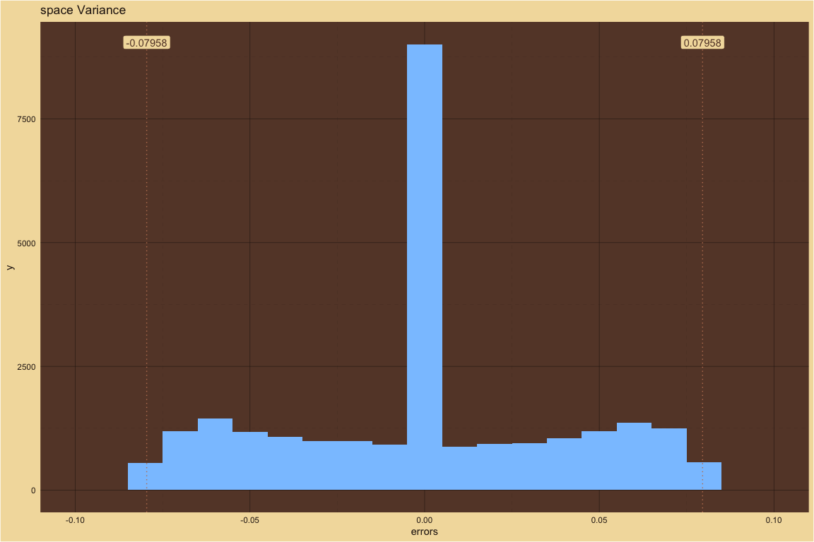
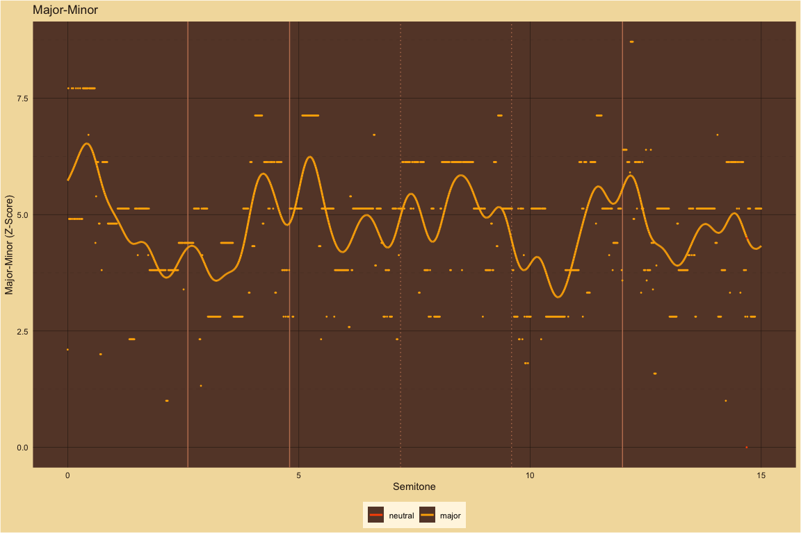
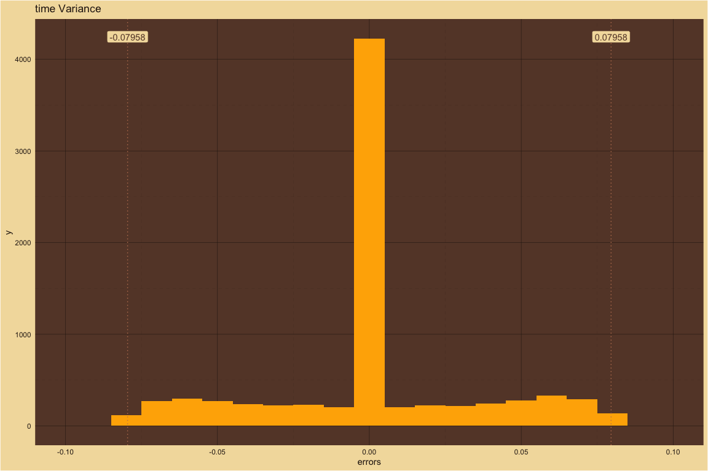
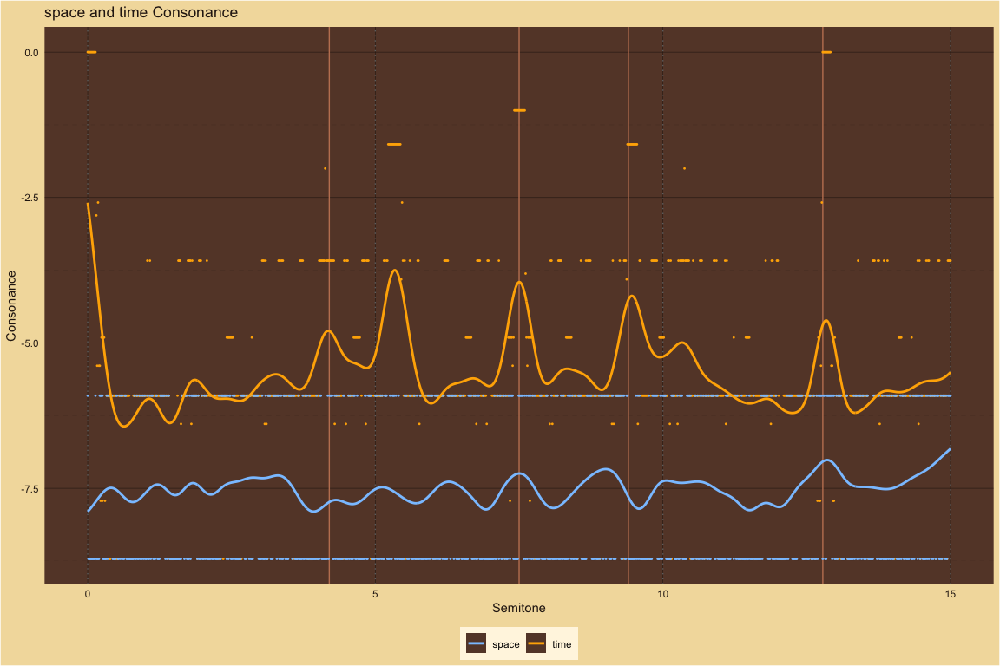
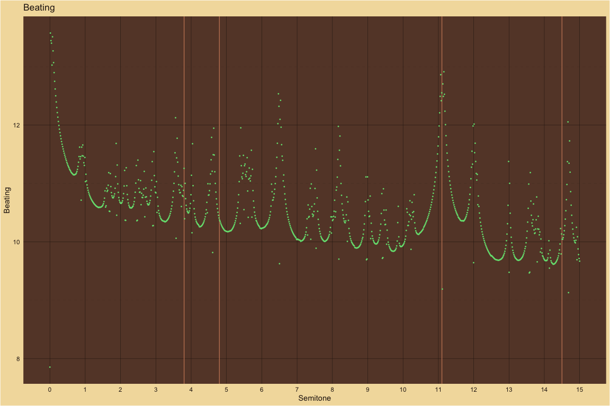
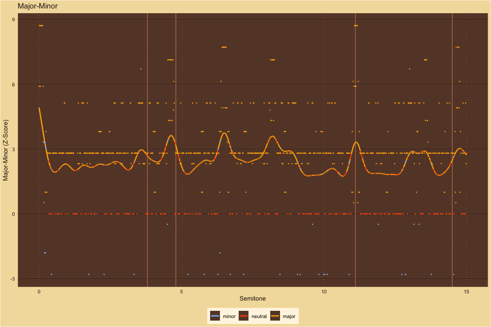
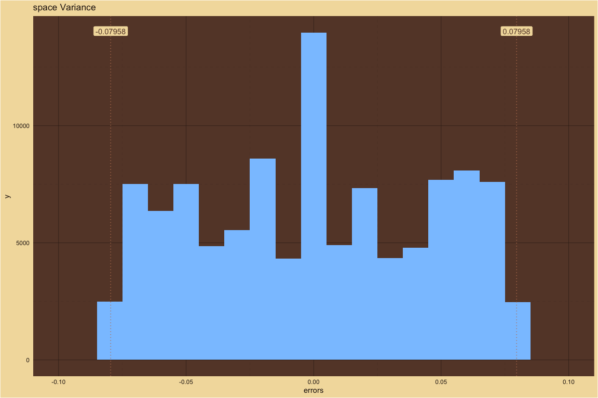
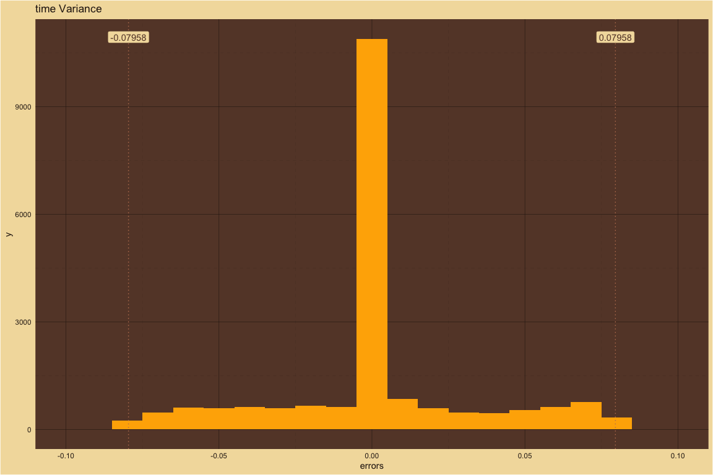
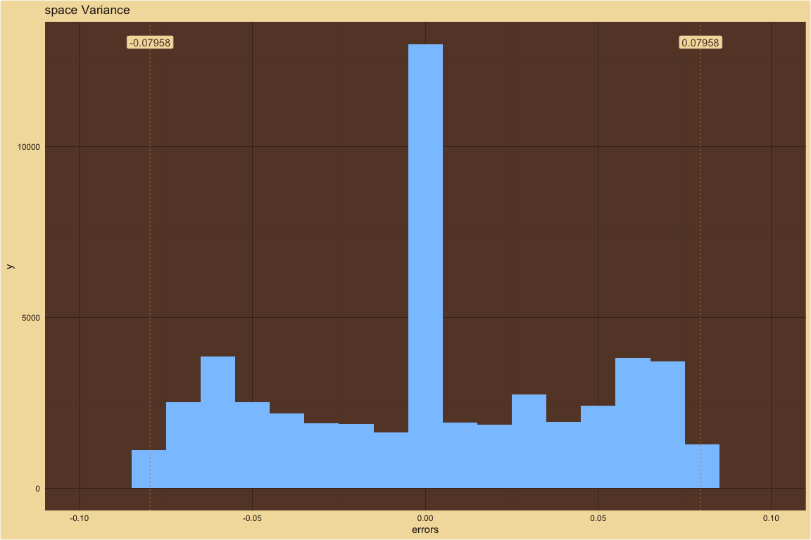
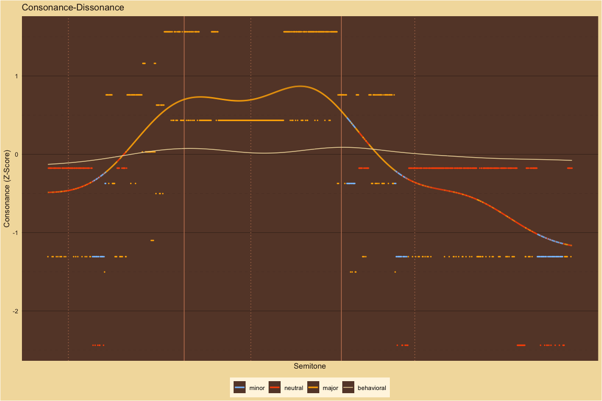

MaMi.CoDi: A Spatiotemporal Periodicity Model of Consonance Perception
================

## How MaMi.CoDi Works

### Finding the Tolerance Values

MaMi.CoDi uses the Stern-Brocot tree to find rational fractions for the
ratios within a given tolerance. How do we find the best tolerance
values? For the MaMi.CoDi model we ran thousands of computations with
various tolerance values and compared the predictions with results from
six of the large-scale behavioral experiments.  

The best fits across the experiments were given by a tolerance of
0.08.  

The frequency tolerance is half the size of the wavelength tolerance.
Does that mean that the perception mechanism for frequency.  

## Theoretical predictions compared to large-scale behavioral results

The large-scale behavioral data in the plots below are from [Timbral
effects on consonance disentangle psychoacoustic mechanisms and suggest
perceptual origins for musical
scales](https://www.nature.com/articles/s41467-024-45812-z) by Raja
Marjieh, Peter M. C. Harrison, Harin Lee, Fotini Deligiannaki & Nori
Jacoby.

### Manipulating harmonic frequencies

#### Dyads spanning 15 semitones

##### Harmonic ~ Partials: 10

For 10 harmonics, behavioral results and theoretical predictions agree.

| detected_pseudo_octave | ignore_amplitudes_below | spatial_tolerance | temporal_tolerance | smoothing_sigma |
|:-----------------------|:------------------------|:------------------|:-------------------|----------------:|
| 2                      | 0.03                    | 0.05              | 0.08               |             0.2 |

<!-- -->  
<!-- -->  
<!-- -->  
<!-- -->  
<!-- -->

##### 5Partials ~ Partials: 5

For 5 harmonics, behavioral results and theoretical predictions agree.
For comparison with the study below (5 partils with the third partial
deleted), notice that the m3 peak is only slightly lower than the M3
peak.

| detected_pseudo_octave | ignore_amplitudes_below | spatial_tolerance | temporal_tolerance | smoothing_sigma |
|:-----------------------|:------------------------|:------------------|:-------------------|----------------:|
| 2                      | 0.03                    | 0.05              | 0.08               |             0.2 |

<!-- -->  
<!-- -->  
<!-- -->  
<!-- -->  
<!-- -->

##### 5PartialsNo3 ~ Partials: 5

For 5 harmonics with the 3rd partial deleted, behavioral results and
theoretical predictions mostly agree. As expected, the m3 peak without
the third partial is now lower than the m3 peak with all 5 harmonics
while the M3 peak is slightly higher without the 3rd partial.

| detected_pseudo_octave | ignore_amplitudes_below | spatial_tolerance | temporal_tolerance | smoothing_sigma |
|:-----------------------|:------------------------|:------------------|:-------------------|----------------:|
| 2                      | 0.03                    | 0.05              | 0.08               |             0.2 |

<!-- -->  
<!-- -->  
<!-- -->  
<!-- -->  
<!-- -->

##### Pure ~ Partials: 1

For pure tones, the behavioral results and the theoretical predictions
mostly agree. Only P5 and P8 have pronounced two-sided peaks. The
behavioral results show subtle variations in consonance height across
the 15 semitones but the overall peak structure agrees with MaMi.CoDi
predictions. For futher comparison, the theoretical predictions for
major-minor versus the behavioral results are included in a plot below.

| detected_pseudo_octave | ignore_amplitudes_below | spatial_tolerance | temporal_tolerance | smoothing_sigma |
|:-----------------------|:------------------------|:------------------|:-------------------|----------------:|
| 2                      | 0.03                    | 0.05              | 0.08               |             0.2 |

<!-- -->  
<!-- -->  
<!-- -->  
<!-- -->  
<!-- -->

##### Stretched ~ Partials: 10

For stretched harmonics, behavioral results and theoretical predictions
mostly agree. MaMi.Codi predicts peaks with minor polarity just above m3
and m7 that do not exist in the behavioral results.

| detected_pseudo_octave | ignore_amplitudes_below | spatial_tolerance | temporal_tolerance | smoothing_sigma |
|:-----------------------|:------------------------|:------------------|:-------------------|----------------:|
| 2.1                    | 0.03                    | 0.05              | 0.08               |             0.2 |

<!-- -->  
<!-- -->  
<!-- -->  
<!-- -->  
<!-- -->

##### Compressed ~ Partials: 10

For compressed harmonics, the pronounced behavioral peaks mostly agree
with the theoretical peaks.

| detected_pseudo_octave | ignore_amplitudes_below | spatial_tolerance | temporal_tolerance | smoothing_sigma |
|:-----------------------|:------------------------|:------------------|:-------------------|----------------:|
| 1.9                    | 0.03                    | 0.05              | 0.08               |             0.2 |

<!-- -->  
<!-- -->  
<!-- -->  
<!-- -->  
<!-- -->

##### Bonang ~ Partials: 4

For gamalan dyads with a harmonic bass pitch and bonang upper pitch,
behavioral results and theoretical predictions mostly agree. MaMi.CoDi
predicts a dissonance trough with minor polarity at P4 that is not in
the behavioral results. MaMi.CoDi predicts P5 to have minor polarity and
be relatively higher than the behavioral results.

| detected_pseudo_octave | ignore_amplitudes_below | spatial_tolerance | temporal_tolerance | smoothing_sigma |
|:-----------------------|:------------------------|:------------------|:-------------------|----------------:|
| 2                      | 0.03                    | 0.05              | 0.08               |             0.2 |

<!-- -->  
<!-- -->  
<!-- -->  
<!-- -->  
<!-- -->

#### Dyads spanning 1 quarter tone

##### M3 ~ Partials: 10

Description is below.

| detected_pseudo_octave | ignore_amplitudes_below | spatial_tolerance | temporal_tolerance | smoothing_sigma |
|:-----------------------|:------------------------|:------------------|:-------------------|----------------:|
| 2                      | 0.03                    | 1e-04             | 1e-04              |           0.035 |

<!-- -->  
<!-- -->  
<!-- -->  
<!-- -->  
<!-- -->

##### M6 ~ Partials: 10

Description is below.

| detected_pseudo_octave | ignore_amplitudes_below | spatial_tolerance | temporal_tolerance | smoothing_sigma |
|:-----------------------|:------------------------|:------------------|:-------------------|----------------:|
| 2                      | 0.03                    | 1e-04             | 1e-04              |           0.035 |

<!-- -->  
<!-- -->  
<!-- -->  
<!-- -->  
<!-- -->

##### P8 ~ Partials: 10

Description is below.

| detected_pseudo_octave | ignore_amplitudes_below | spatial_tolerance | temporal_tolerance | smoothing_sigma |
|:-----------------------|:------------------------|:------------------|:-------------------|----------------:|
| 2                      | 0.03                    | 1e-04             | 1e-04              |           0.035 |

<!-- -->  
<!-- -->  
<!-- -->  
<!-- -->  
<!-- -->

### TODO: run the in-depth tolerance searches again for M3, M6 and P8

#### Notes on plots:

In the plots above:

- The cream lines are smoothed experimental data from Marjieh, Harrison
  et al.

- The multi-colored points are MaMi.CoDi computational predictions

- The multi-colored lines are smoothed MaMi.CoDi computational
  predictions

- The colors represent MaMi.CoDi computational predictions for
  major-minor polarity:

- Gold is major

- Red is neutral

- Blue is minor

- The vertical axis is z-scored consonance-dissonance

- The horizontal axis is the width of the dyad from 0 to 15 semitones

- For example, the data at 4 represents the equal tempered major third,
  M3

- While the data at 8 represents the equal tempered minor sixth, m6
