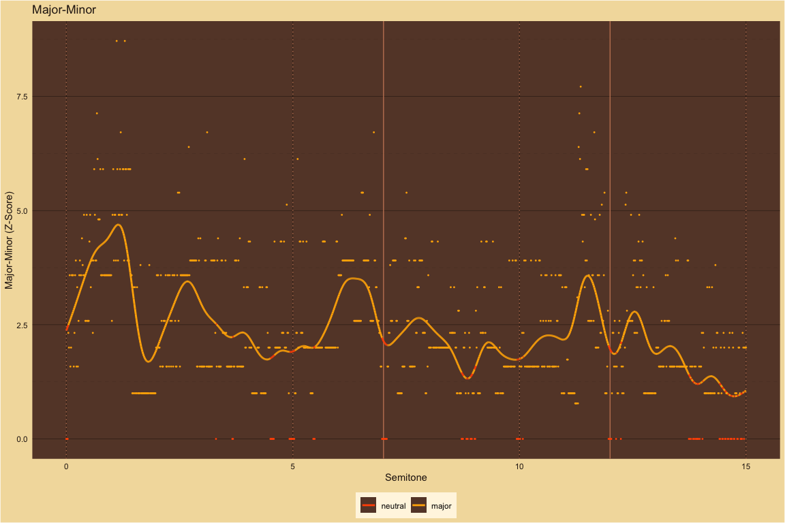

MaMi.CoDi: A Spatiotemporal Periodicity Model of Consonance Perception
================

# Theoretical predictions compared to large-scale behavioral results

The large-scale behavioral data in the plots below are from [Timbral
effects on consonance disentangle psychoacoustic mechanisms and suggest
perceptual origins for musical
scales](https://www.nature.com/articles/s41467-024-45812-z) by Raja
Marjieh, Peter M. C. Harrison, Harin Lee, Fotini Deligiannaki & Nori
Jacoby.

# Manipulating harmonic frequencies

## Dyads spanning 15 semitones

### Harmonic ~ Partials: 10

For 10 harmonics, behavioral results and theoretical predictions agree.
With the broad smoothing parameter from the large-scale behavioral
study, used in this plot, the smoothed theoretical peaks at M2 and P8
are relatively lower than the theoretical predictions plotted as points.
In a plot below, we narrow the smoothing parameter by an order of
magnitude to see how the theoretical curve changes with respect to the
theoretical predictions.

| detected_pseudo_octave | ignore_amplitudes_below | wavelength_tolerance | frequency_tolerance | smoothing_sigma |
|:-----------------------|:------------------------|:---------------------|:--------------------|----------------:|
| 2                      | 0.03                    | 0.1                  | 0.05                |             0.2 |

<!-- -->

### Harmonic ~ Narrow Smoothing Variation ~ Sigma: 0.02

With a narrow smoothing parameter (0.02 versus 0.2), the smoothed
theoretical peaks at M2 and P8 more closely align with the raw
theoretical predictions plotted as points. At this resolution, where
MaMi.CoDi predicts consonance peaks, the behavioral results shows
dissonance troughs. See the zoomed-in quarter tone spans at M3, M6 and
P8, below, for more discussion about consonance peaks in dissonance
troughs.

| detected_pseudo_octave | ignore_amplitudes_below | wavelength_tolerance | frequency_tolerance | smoothing_sigma |
|:-----------------------|:------------------------|:---------------------|:--------------------|----------------:|
| 2                      | 0.03                    | 0.1                  | 0.05                |            0.02 |

<!-- -->

### 5Partials ~ Partials: 5

For 5 harmonics, behavioral results and theoretical predictions agree.
For comparison with the study below with the third partial deleted,
notice that the m3 peak is only slightly lower than the M3 peak. Near
M2, the theoretical smoothed curve is relatively lower than the
theoretical predictions plotted as points.

| detected_pseudo_octave | ignore_amplitudes_below | wavelength_tolerance | frequency_tolerance | smoothing_sigma |
|:-----------------------|:------------------------|:---------------------|:--------------------|----------------:|
| 2                      | 0.03                    | 0.1                  | 0.05                |             0.2 |

<!-- -->

### 5PartialsNo3 ~ Partials: 5

For 5 harmonics with the 3rd partial deleted, behavioral results and
theoretical predictions largely agree. As expected, the m3 peak without
the third partial is now lower than the m3 peak with all 5 harmonics
while the M3 peak is mostly the same for both sets of harmonics.
MaMi.CoDi predicts a peak with minor polarity just below the tritone
that does not exist in the behavioral data. Near M2, the theoretical
smoothed curve is relatively lower than the theoretical predictions
plotted as points.

| detected_pseudo_octave | ignore_amplitudes_below | wavelength_tolerance | frequency_tolerance | smoothing_sigma |
|:-----------------------|:------------------------|:---------------------|:--------------------|----------------:|
| 2                      | 0.03                    | 0.1                  | 0.05                |             0.2 |

<!-- -->

### Pure ~ Partials: 1

For pure tones, the behavioral results and the theoretical predictions
agree. Only P5 and P8 have pronounced two-sided peaks. The behavioral
results show subtle variations in consonance height across the 15
semitones but the overall shape agrees with MaMi.CoDi predictions.

| detected_pseudo_octave | ignore_amplitudes_below | wavelength_tolerance | frequency_tolerance | smoothing_sigma |
|:-----------------------|:------------------------|:---------------------|:--------------------|----------------:|
| 2                      | 0.03                    | 0.1                  | 0.05                |             0.2 |

<!-- -->

### Stretched ~ Partials: 10

For stretched harmonics, behavioral results and theoretical predictions
mostly agree. MaMi.CoDi predicts a relatively higher consonance peak
just above P4 than the behavioral results. MaMi.Codi predicts peaks with
minor polarity just above m3 and m7 that do not exist in the behavioral
results. Near M2, the theoretical smoothed curve is relatively lower
than the theoretical predictions plotted as points.

| detected_pseudo_octave | ignore_amplitudes_below | wavelength_tolerance | frequency_tolerance | smoothing_sigma |
|:-----------------------|:------------------------|:---------------------|:--------------------|----------------:|
| 2.1                    | 0.03                    | 0.1                  | 0.05                |             0.2 |

<!-- -->

### Compressed ~ Partials: 10

For compressed harmonics, the pronounced behavioral peaks mostly agree
with the theoretical peaks. However, for the behavioral peak between the
14th and 15th semitones, the MaMi.CoDi model predicts a trough. For some
of the non-peak dyads there are differences. MaMi.Codi predicts peaks
with mostly minor polarity just above m2, at m3, just above P4 and
halfway between M6 and m7 that do not exist in the behavioral results.

| detected_pseudo_octave | ignore_amplitudes_below | wavelength_tolerance | frequency_tolerance | smoothing_sigma |
|:-----------------------|:------------------------|:---------------------|:--------------------|----------------:|
| 1.9                    | 0.03                    | 0.1                  | 0.05                |             0.2 |

<!-- -->

### Bonang ~ Partials: 4

For gamalan dyads with a harmonic bass pitch and bonang upper pitch,
behavioral results and theoretical predictions mostly agree. MaMi.CoDi’s
predicted peak at P5 is relatively higher than the behavioral results.
The predicted peak at P4 is shifted slightly lower than the behavioral
results. MaMi.CoDi predicts a peak between m3 and M3 that does not
appear in the behavioral results.

| detected_pseudo_octave | ignore_amplitudes_below | wavelength_tolerance | frequency_tolerance | smoothing_sigma |
|:-----------------------|:------------------------|:---------------------|:--------------------|----------------:|
| 2                      | 0.03                    | 0.1                  | 0.05                |             0.2 |

<!-- -->

## Dyads spanning 1 quarter tone

### M3 ~ Partials: 10

Description is below.

| detected_pseudo_octave | ignore_amplitudes_below | wavelength_tolerance | frequency_tolerance | smoothing_sigma |
|:-----------------------|:------------------------|:---------------------|:--------------------|----------------:|
| 2                      | 0.03                    | 3e-04                | 0.00015             |           0.035 |

<!-- -->

### M6 ~ Partials: 10

Description is below.

| detected_pseudo_octave | ignore_amplitudes_below | wavelength_tolerance | frequency_tolerance | smoothing_sigma |
|:-----------------------|:------------------------|:---------------------|:--------------------|----------------:|
| 2                      | 0.03                    | 3e-04                | 0.00015             |           0.035 |

<!-- -->

### P8 ~ Partials: 10

Description is below.

| detected_pseudo_octave | ignore_amplitudes_below | wavelength_tolerance | frequency_tolerance | smoothing_sigma |
|:-----------------------|:------------------------|:---------------------|:--------------------|----------------:|
| 2                      | 0.03                    | 3e-04                | 0.00015             |           0.035 |

<!-- -->

### Consonance peaks in dissonance troughs

For the high-resolution dyads centered on M3, M6 and P8, the large-scale
behavioral results and the MaMi.CoDi theoretical predictions both show
dissonance troughs centered on the JT dyads.  

MaMi.CoDi, though, predicts a local maximum consonance peak at the
center of each dissonance trough.  

Secondary maximums occur at the Pythagorean third and grave major sixth.
Those secondary peaks are also surrounded by dissonance troughs. There
are also tertiary troughs near the ET intervals.  

##### Consonance peak at P1 in octave-wide dissonance trough

<!-- -->

Performers of instruments with quantized semitones like keyboards and
fretted strings–especially beginners and their audiences–are aware that
the globally maximum consonant peak at the unison, P1, has dissonant
neighbors on both sides, M7 and m2. Consonance increases with each
semitone step out of the trough: downward from M7 to P4 below and upward
from m2 to P5 above.  

That is, at the resolution of an octave, the tonic pitch is the maximum
consonance peak in the center of a dissonance trough.  

At other resolutions, for example stringed instruments without frets,
the nearest playable neighbors to P1 are not necessarily dissonant.

In the harmonic study with the narrow resolution, above, the behavioral
results shows dissonance troughs and MaMi.CoDi predicts consonance peaks
in the center of those dissonance troughs.

### MaMi.CoDi resolution correlates with dissonance troughs and consonance peaks

As the tolerance value of the MaMi.CoDi model varies from very small to
very large the consonance peaks expand their width until they overcome
the dissonance troughs. See plot sets, below, for M3, M6 and P8.  

MaMi.CoDi’s tolerance value is the only parameter in the model and
indicates the resolution for turning irrational ratios into rational
fractions. Those fractions are then used to estimate wavelength
periodicity and frequency periodicity.  

- Small tolerances give more accurate fractions which give longer
  periods.
- Large tolerances give less accurate fractions which give shorter
  period estimates.

#### M3 ~ Major Third

Plot of M3 with MaMi.CoDi tolerance values varying from 1e-08 to 0.1:

- JT: 5/4
- ET: 2^(4/12)

<!-- -->

    #> # A tibble: 1 × 4
    #>   just_M3_freq just_M3_midi M3_freq M3_midi
    #>          <dbl>        <dbl>   <dbl>   <dbl>
    #> 1         327.         63.9    330.      64

##### Intervals near the major third ranked by consonance

    #> # A tibble: 1,000 × 2
    #>    semitone consonance_dissonance
    #>       <dbl>                 <dbl>
    #>  1     63.9                  90.8
    #>  2     64.1                  88.1
    #>  3     63.7                  87.9
    #>  4     63.7                  87.9
    #>  5     63.7                  87.1
    #>  6     64.0                  86.4
    #>  7     63.8                  85.9
    #>  8     63.9                  85.1
    #>  9     64.0                  84.4
    #> 10     64.1                  84.4
    #> # ℹ 990 more rows

###### The JT M3 has the highest consonance

    #> [1] 63.86321

    #> # A tibble: 1 × 2
    #>   semitone consonance_dissonance
    #>      <dbl>                 <dbl>
    #> 1     63.9                  90.8

###### Frequency ratios of the JT M3

    #>    num den     ratio pseudo_ratio      tone reference_tone
    #> 1    1   2 0.5000000    0.5000000  261.6256       261.6256
    #> 2    5   8 0.6250027    0.6250027  327.0334       261.6256
    #> 3    1   1 1.0000000    1.0000000  523.2511       261.6256
    #> 4    5   4 1.2500055    1.2500055  654.0668       261.6256
    #> 5    3   2 1.5000000    1.5000000  784.8767       261.6256
    #> 6   15   8 1.8750082    1.8750082  981.1002       261.6256
    #> 7    2   1 2.0000000    2.0000000 1046.5023       261.6256
    #> 8    5   2 2.5000000    2.5000000 1308.1278       261.6256
    #> 9    5   2 2.5000110    2.5000110 1308.1336       261.6256
    #> 10   3   1 3.0000000    3.0000000 1569.7534       261.6256
    #> 11  25   8 3.1250137    3.1250137 1635.1669       261.6256
    #> 12   7   2 3.5000000    3.5000000 1831.3790       261.6256
    #> 13  15   4 3.7500164    3.7500164 1962.2003       261.6256
    #> 14   4   1 4.0000000    4.0000000 2093.0045       261.6256
    #> 15  35   8 4.3750192    4.3750192 2289.2337       261.6256
    #> 16   9   2 4.5000000    4.5000000 2354.6301       261.6256
    #> 17   5   1 5.0000000    5.0000000 2616.2556       261.6256
    #> 18   5   1 5.0000219    5.0000219 2616.2671       261.6256
    #> 19  45   8 5.6250246    5.6250246 2943.3005       261.6256
    #> 20  25   4 6.2500273    6.2500273 3270.3339       261.6256

##### Intervals near the major third ranked by lowest consonance

    #> # A tibble: 1,000 × 2
    #>    semitone consonance_dissonance
    #>       <dbl>                 <dbl>
    #>  1     63.9                  6.33
    #>  2     63.9                  9.24
    #>  3     63.9                  9.28
    #>  4     64.1                  9.36
    #>  5     63.9                 10.5 
    #>  6     63.9                 11.2 
    #>  7     63.9                 11.3 
    #>  8     63.9                 11.3 
    #>  9     63.9                 11.6 
    #> 10     64.1                 13.2 
    #> # ℹ 990 more rows

###### The lowest consonance

    #> [1] 63.86672

    #> # A tibble: 1 × 2
    #>   semitone consonance_dissonance
    #>      <dbl>                 <dbl>
    #> 1     63.9                  6.33

###### The lowest consonance ratios

    #>     num den     ratio pseudo_ratio      tone reference_tone
    #> 1     1   2 0.5000000    0.5000000  261.6256       261.6256
    #> 2     5   8 0.6251293    0.6251293  327.0996       261.6256
    #> 3     1   1 1.0000000    1.0000000  523.2511       261.6256
    #> 4   684 547 1.2502585    1.2502585  654.1992       261.6256
    #> 5     3   2 1.5000000    1.5000000  784.8767       261.6256
    #> 6   407 217 1.8753878    1.8753878  981.2988       261.6256
    #> 7     2   1 2.0000000    2.0000000 1046.5023       261.6256
    #> 8     5   2 2.5000000    2.5000000 1308.1278       261.6256
    #> 9  1748 699 2.5005170    2.5005170 1308.3984       261.6256
    #> 10    3   1 3.0000000    3.0000000 1569.7534       261.6256
    #> 11  472 151 3.1256462    3.1256462 1635.4979       261.6256
    #> 12    7   2 3.5000000    3.5000000 1831.3790       261.6256
    #> 13  964 257 3.7507755    3.7507755 1962.5975       261.6256
    #> 14    4   1 4.0000000    4.0000000 2093.0045       261.6256
    #> 15  512 117 4.3759047    4.3759047 2289.6971       261.6256
    #> 16    9   2 4.5000000    4.5000000 2354.6301       261.6256
    #> 17    5   1 5.0000000    5.0000000 2616.2556       261.6256
    #> 18 4056 811 5.0010340    5.0010340 2616.7967       261.6256
    #> 19  557  99 5.6261633    5.6261633 2943.8963       261.6256
    #> 20 1069 171 6.2512925    6.2512925 3270.9958       261.6256

###### The Pythagorean third is the second highest consonance

MIDI:

    #> [1] 64.09244

Cents:

    #> [1] 409.2442

Consonance:

    #> # A tibble: 1 × 2
    #>   semitone consonance_dissonance
    #>      <dbl>                 <dbl>
    #> 1     64.1                  88.1

###### Frequency ratios of the second highest consonance

    #>    num den     ratio pseudo_ratio      tone reference_tone
    #> 1    1   2 0.5000000    0.5000000  261.6256       261.6256
    #> 2   19  30 0.6333333    0.6333333  331.3924       261.6256
    #> 3    1   1 1.0000000    1.0000000  523.2511       261.6256
    #> 4   19  15 1.2666666    1.2666666  662.7847       261.6256
    #> 5    3   2 1.5000000    1.5000000  784.8767       261.6256
    #> 6   19  10 1.8999999    1.8999999  994.1771       261.6256
    #> 7    2   1 2.0000000    2.0000000 1046.5023       261.6256
    #> 8    5   2 2.5000000    2.5000000 1308.1278       261.6256
    #> 9   38  15 2.5333332    2.5333332 1325.5695       261.6256
    #> 10   3   1 3.0000000    3.0000000 1569.7534       261.6256
    #> 11  19   6 3.1666666    3.1666666 1656.9619       261.6256
    #> 12   7   2 3.5000000    3.5000000 1831.3790       261.6256
    #> 13  19   5 3.7999998    3.7999998 1988.3542       261.6256
    #> 14   4   1 4.0000000    4.0000000 2093.0045       261.6256
    #> 15 133  30 4.4333333    4.4333333 2319.7467       261.6256
    #> 16   9   2 4.5000000    4.5000000 2354.6301       261.6256
    #> 17   5   1 5.0000000    5.0000000 2616.2556       261.6256
    #> 18  76  15 5.0666664    5.0666664 2651.1389       261.6256
    #> 19  57  10 5.6999997    5.6999997 2982.5313       261.6256
    #> 20  19   3 6.3333333    6.3333333 3313.9238       261.6256

###### References for the Pythagorean third

- “19/15 409.2443014 (good approximation of Pythagorean 3rd)”
  - from [M3 in the Encyclopedia of Microtonal Music
    Theory](http://www.tonalsoft.com/enc/m/major-3rd.aspx)
- [Pythagorean ditone](https://en.wikipedia.org/wiki/Ditone)

#### M6 ~ Major Sixth

Plot of M6 with MaMi.CoDi tolerance values varying from 1e-08 to 0.1:

- JT: 5/3
- ET: 2^(9/12)

<!-- -->

    #> # A tibble: 1 × 4
    #>   just_M6_freq just_M6_midi M6_freq M6_midi
    #>          <dbl>        <dbl>   <dbl>   <dbl>
    #> 1         436.         68.8     440      69

##### Intervals near the major sixth ranked by consonance

    #> # A tibble: 1,000 × 2
    #>    semitone consonance_dissonance
    #>       <dbl>                 <dbl>
    #>  1     68.8                  91.4
    #>  2     68.7                  87.5
    #>  3     69.0                  87.1
    #>  4     69.0                  86.4
    #>  5     68.8                  85.6
    #>  6     68.7                  84.7
    #>  7     69.0                  83.2
    #>  8     68.9                  83.1
    #>  9     68.7                  82.9
    #> 10     69.1                  82.6
    #> # ℹ 990 more rows

###### The JT M6 has the highest consonance

    #> [1] 68.84369

    #> # A tibble: 1 × 2
    #>   semitone consonance_dissonance
    #>      <dbl>                 <dbl>
    #> 1     68.8                  91.4

###### Frequency ratios of the JT M6

    #>    num den     ratio pseudo_ratio      tone reference_tone
    #> 1    1   2 0.5000000    0.5000000  261.6256       261.6256
    #> 2    5   6 0.8333385    0.8333385  436.0453       261.6256
    #> 3    1   1 1.0000000    1.0000000  523.2511       261.6256
    #> 4    3   2 1.5000000    1.5000000  784.8767       261.6256
    #> 5    5   3 1.6666770    1.6666770  872.0906       261.6256
    #> 6    2   1 2.0000000    2.0000000 1046.5023       261.6256
    #> 7    5   2 2.5000000    2.5000000 1308.1278       261.6256
    #> 8    5   2 2.5000154    2.5000154 1308.1359       261.6256
    #> 9    3   1 3.0000000    3.0000000 1569.7534       261.6256
    #> 10  10   3 3.3333539    3.3333539 1744.1812       261.6256
    #> 11   7   2 3.5000000    3.5000000 1831.3790       261.6256
    #> 12   4   1 4.0000000    4.0000000 2093.0045       261.6256
    #> 13  25   6 4.1666924    4.1666924 2180.2265       261.6256
    #> 14   9   2 4.5000000    4.5000000 2354.6301       261.6256
    #> 15   5   1 5.0000000    5.0000000 2616.2556       261.6256
    #> 16   5   1 5.0000309    5.0000309 2616.2718       261.6256
    #> 17  35   6 5.8333693    5.8333693 3052.3171       261.6256
    #> 18  20   3 6.6667078    6.6667078 3488.3624       261.6256
    #> 19  15   2 7.5000463    7.5000463 3924.4077       261.6256
    #> 20  25   3 8.3333847    8.3333847 4360.4530       261.6256

##### Intervals near the major sixth ranked by lowest consonance

    #> # A tibble: 1,000 × 2
    #>    semitone consonance_dissonance
    #>       <dbl>                 <dbl>
    #>  1     68.8                  6.59
    #>  2     68.8                  6.80
    #>  3     68.8                  7.07
    #>  4     68.8                  9.35
    #>  5     68.8                  9.75
    #>  6     68.8                 10.2 
    #>  7     68.8                 11.4 
    #>  8     68.8                 12.8 
    #>  9     68.7                 13.3 
    #> 10     68.8                 13.9 
    #> # ℹ 990 more rows

###### The lowest consonance

    #> [1] 68.8457

    #> # A tibble: 1 × 2
    #>   semitone consonance_dissonance
    #>      <dbl>                 <dbl>
    #> 1     68.8                  6.59

###### The lowest consonance ratios

    #>     num  den     ratio pseudo_ratio      tone reference_tone
    #> 1     1    2 0.5000000    0.5000000  261.6256       261.6256
    #> 2     5    6 0.8334349    0.8334349  436.0957       261.6256
    #> 3     1    1 1.0000000    1.0000000  523.2511       261.6256
    #> 4     3    2 1.5000000    1.5000000  784.8767       261.6256
    #> 5  1382  829 1.6668697    1.6668697  872.1915       261.6256
    #> 6     2    1 2.0000000    2.0000000 1046.5023       261.6256
    #> 7     5    2 2.5000000    2.5000000 1308.1278       261.6256
    #> 8  2478  991 2.5003046    2.5003046 1308.2872       261.6256
    #> 9     3    1 3.0000000    3.0000000 1569.7534       261.6256
    #> 10 1837  551 3.3337394    3.3337394 1744.3829       261.6256
    #> 11    7    2 3.5000000    3.5000000 1831.3790       261.6256
    #> 12    4    1 4.0000000    4.0000000 2093.0045       261.6256
    #> 13  996  239 4.1671742    4.1671742 2180.4786       261.6256
    #> 14    9    2 4.5000000    4.5000000 2354.6301       261.6256
    #> 15    5    1 5.0000000    5.0000000 2616.2556       261.6256
    #> 16 6181 1236 5.0006091    5.0006091 2616.5744       261.6256
    #> 17 1091  187 5.8340439    5.8340439 3052.6701       261.6256
    #> 18 2207  331 6.6674788    6.6674788 3488.7658       261.6256
    #> 19 3368  449 7.5009136    7.5009136 3924.8615       261.6256
    #> 20 2292  275 8.3343484    8.3343484 4360.9572       261.6256

###### The grave major sixth is the second highest consonance

MIDI:

    #> [1] 68.66952

Cents:

    #> [1] 866.952

Consonance:

    #> # A tibble: 1 × 2
    #>   semitone consonance_dissonance
    #>      <dbl>                 <dbl>
    #> 1     68.7                  87.5

###### Frequency ratios of the second highest consonance

    #>    num den     ratio pseudo_ratio      tone reference_tone
    #> 1    1   2 0.5000000    0.5000000  261.6256       261.6256
    #> 2   33  40 0.8249966    0.8249966  431.6804       261.6256
    #> 3    1   1 1.0000000    1.0000000  523.2511       261.6256
    #> 4    3   2 1.5000000    1.5000000  784.8767       261.6256
    #> 5   33  20 1.6499931    1.6499931  863.3608       261.6256
    #> 6    2   1 2.0000000    2.0000000 1046.5023       261.6256
    #> 7   99  40 2.4749897    2.4749897 1295.0411       261.6256
    #> 8    5   2 2.5000000    2.5000000 1308.1278       261.6256
    #> 9    3   1 3.0000000    3.0000000 1569.7534       261.6256
    #> 10  33  10 3.2999862    3.2999862 1726.7215       261.6256
    #> 11   7   2 3.5000000    3.5000000 1831.3790       261.6256
    #> 12   4   1 4.0000000    4.0000000 2093.0045       261.6256
    #> 13  33   8 4.1249827    4.1249827 2158.4019       261.6256
    #> 14   9   2 4.5000000    4.5000000 2354.6301       261.6256
    #> 15  99  20 4.9499793    4.9499793 2590.0823       261.6256
    #> 16   5   1 5.0000000    5.0000000 2616.2556       261.6256
    #> 17 231  40 5.7749759    5.7749759 3021.7626       261.6256
    #> 18  33   5 6.5999724    6.5999724 3453.4430       261.6256
    #> 19 297  40 7.4249690    7.4249690 3885.1234       261.6256
    #> 20  33   4 8.2499655    8.2499655 4316.8038       261.6256

###### References for the grave major sixth

- [List of Pitch
  Intervals](https://en.wikipedia.org/wiki/List_of_pitch_intervals)
- [Grave major sixth on
  C](https://en.m.wikipedia.org/wiki/File:Grave_major_sixth_on_C.png)

#### P8 Octave

Plot of P8 with MaMi.CoDi tolerance values varying from 1e-08 to 0.1:

# Manipulating harmonic amplitudes

### Harmonic ~ Roll Off: 12

| detected_pseudo_octave | ignore_amplitudes_below | wavelength_tolerance | frequency_tolerance | smoothing_sigma |
|:-----------------------|:------------------------|:---------------------|:--------------------|----------------:|
| 2                      | 0.03                    | 0.1                  | 0.05                |             0.2 |

<!-- -->

### Harmonic ~ Roll Off: 7

| detected_pseudo_octave | ignore_amplitudes_below | wavelength_tolerance | frequency_tolerance | smoothing_sigma |
|:-----------------------|:------------------------|:---------------------|:--------------------|----------------:|
| 2                      | 0.03                    | 0.1                  | 0.05                |             0.2 |

<!-- -->

### Harmonic ~ Roll Off: 2

| detected_pseudo_octave | ignore_amplitudes_below | wavelength_tolerance | frequency_tolerance | smoothing_sigma |
|:-----------------------|:------------------------|:---------------------|:--------------------|----------------:|
| 2                      | 0.03                    | 0.1                  | 0.05                |             0.2 |

<!-- -->

#### Notes on plots:

In the plots above:

- The cream lines are smoothed experimental data from Marjieh, Harrison
  et al.

- The multi-colored points are MaMi.CoDi computational predictions

- The multi-colored lines are smoothed MaMi.CoDi computational
  predictions

- The colors represent MaMi.CoDi computational predictions for
  major-minor polarity:

- Gold is major

- Red is neutral

- Blue is minor

- The vertical axis is z-scored consonance-dissonance

- The horizontal axis is the width of the dyad from 0 to 15 semitones

- For example, the data at 4 represents the equal tempered major third,
  M3

- While the data at 8 represents the equal tempered minor sixth, m6
