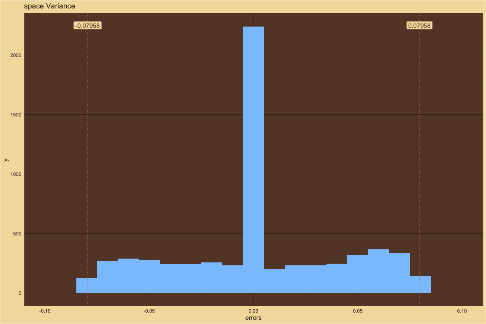
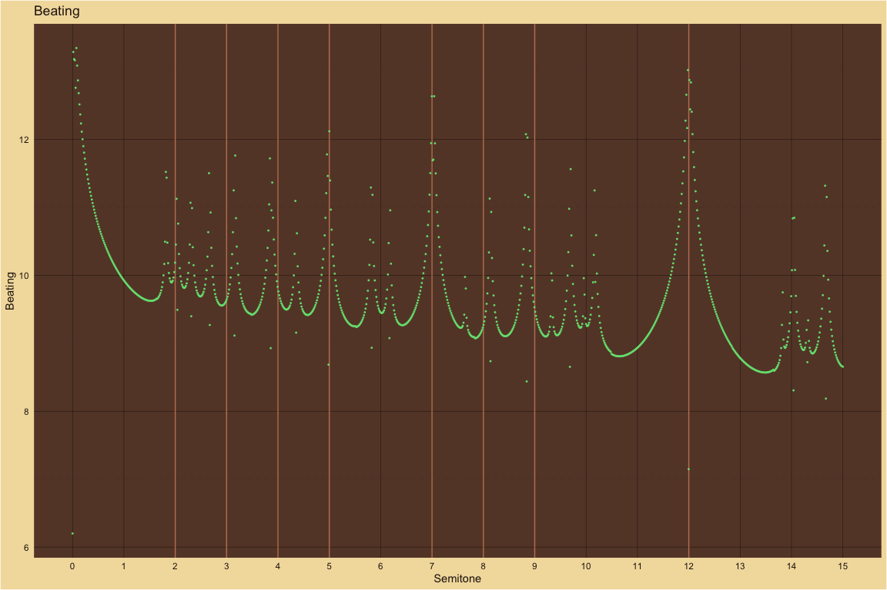

Major-Minor and Consonance-Dissonance Perception
================

## Timbre: Consonance-Dissonance and Major-Minor ~ Semitones

This section is based on [Timbral effects on consonance disentangle
psychoacoustic mechanisms and suggest perceptual origins for musical
scales](https://www.nature.com/articles/s41467-024-45812-z) by Raja
Marjieh, Peter M. C. Harrison, Harin Lee, Fotini Deligiannaki & Nori
Jacoby.

#### Notes on Plots:

In the plots below:

- The cream lines are smoothed experimental data from Marjieh, Harrison
  et al.

- The multi-colored points are MaMi.CoDi computational predictions

- The multi-colored lines are smoothed MaMi.CoDi computational
  predictions

- The colors represent MaMi.CoDi computational predictions for
  major-minor polarity:

  - Gold is major
  - Red is neutral
  - Blue is minor

- The vertical axis is z-scored consonance-dissonance

- The horizontal axis is the width of the dyad from 0 to 15 semitones

  - For example, the data at 4 represents the equal tempered major
    third, M3
  - While the data at 8 represents the equal tempered minor sixth, m6

#### Notes on Dyads:

- The dyads immediately below, from the timbre study, are true two-pitch
  dyads. True major thirds like C4 and E4, for example, only include C4
  and E4.

- The intervals in the last few sections, further below, are actually
  three-pitch chords with the high and low pitches one octave apart,
  framing the interval. For example: C4, E4 and C5.

- Two-pitch dyads versus octave-framed, three-pitch chords, might have
  different major-minor polarities

- Consider two chords containing C4 and E4:

  - C4, E4, C5 (a framed major third) is predicted to sound major and
  - E3, C4, E4 (a framed minor sixth) is predicted to sound minor

## Frequencies

### Harmonic ~ Partials: 10

| detected_pseudo_octave | ignore_amplitudes_below | frequency_tolerance | wavelength_tolerance |
|:-----------------------|:------------------------|:--------------------|:---------------------|
| 2                      | 0.03                    | 0.05                | 0.1                  |

<!-- -->

### 5Partials ~ Partials: 5

| detected_pseudo_octave | ignore_amplitudes_below | frequency_tolerance | wavelength_tolerance |
|:-----------------------|:------------------------|:--------------------|:---------------------|
| 2                      | 0.03                    | 0.05                | 0.1                  |

<!-- -->

### 5PartialsNo3 ~ Partials: 5

| detected_pseudo_octave | ignore_amplitudes_below | frequency_tolerance | wavelength_tolerance |
|:-----------------------|:------------------------|:--------------------|:---------------------|
| 2                      | 0.03                    | 0.05                | 0.1                  |

<!-- -->

### Pure ~ Partials: 1

| detected_pseudo_octave | ignore_amplitudes_below | frequency_tolerance | wavelength_tolerance |
|:-----------------------|:------------------------|:--------------------|:---------------------|
| 2                      | 0.03                    | 0.05                | 0.1                  |

<!-- -->

### Stretched ~ Partials: 10

| detected_pseudo_octave | ignore_amplitudes_below | frequency_tolerance | wavelength_tolerance |
|:-----------------------|:------------------------|:--------------------|:---------------------|
| 2.1                    | 0.03                    | 0.05                | 0.1                  |

<!-- -->

### Compressed ~ Partials: 10

| detected_pseudo_octave | ignore_amplitudes_below | frequency_tolerance | wavelength_tolerance |
|:-----------------------|:------------------------|:--------------------|:---------------------|
| 1.9                    | 0.03                    | 0.05                | 0.1                  |

<!-- -->

### Bonang ~ Partials: 4

| detected_pseudo_octave | ignore_amplitudes_below | frequency_tolerance | wavelength_tolerance |
|:-----------------------|:------------------------|:--------------------|:---------------------|
| 2                      | 0.03                    | 0.05                | 0.1                  |

<!-- -->

### M3 ~ Partials: 10

| detected_pseudo_octave | ignore_amplitudes_below | frequency_tolerance | wavelength_tolerance |
|:-----------------------|:------------------------|:--------------------|:---------------------|
| 2                      | 0.03                    | 0.05                | 0.1                  |

<!-- -->

### M6 ~ Partials: 10

| detected_pseudo_octave | ignore_amplitudes_below | frequency_tolerance | wavelength_tolerance |
|:-----------------------|:------------------------|:--------------------|:---------------------|
| 2                      | 0.03                    | 0.05                | 0.1                  |

<!-- -->

### P8 ~ Partials: 10

| detected_pseudo_octave | ignore_amplitudes_below | frequency_tolerance | wavelength_tolerance |
|:-----------------------|:------------------------|:--------------------|:---------------------|
| 2                      | 0.03                    | 0.05                | 0.1                  |

<!-- -->

## Amplitudes

### Harmonic ~ Roll Off: 12

| detected_pseudo_octave | ignore_amplitudes_below | frequency_tolerance | wavelength_tolerance |
|:-----------------------|:------------------------|:--------------------|:---------------------|
| 2                      | 0.03                    | 0.045               | 0.09                 |

<!-- -->

### Harmonic ~ Roll Off: 7

| detected_pseudo_octave | ignore_amplitudes_below | frequency_tolerance | wavelength_tolerance |
|:-----------------------|:------------------------|:--------------------|:---------------------|
| 2                      | 0.03                    | 0.045               | 0.09                 |

<!-- -->

### Harmonic ~ Roll Off: 2

| detected_pseudo_octave | ignore_amplitudes_below | frequency_tolerance | wavelength_tolerance |
|:-----------------------|:------------------------|:--------------------|:---------------------|
| 2                      | 0.03                    | 0.045               | 0.09                 |

<!-- -->
