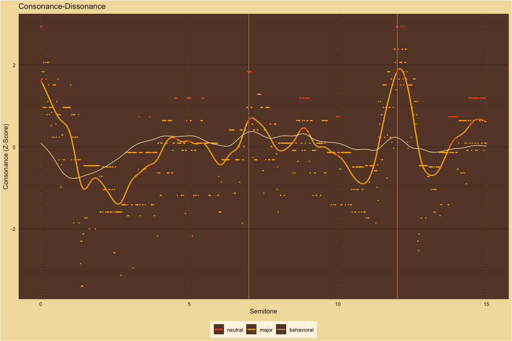
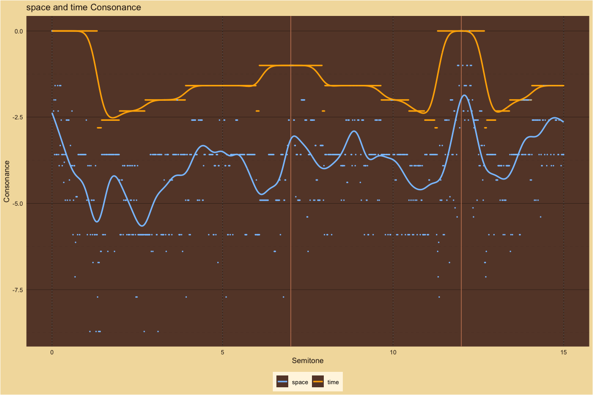
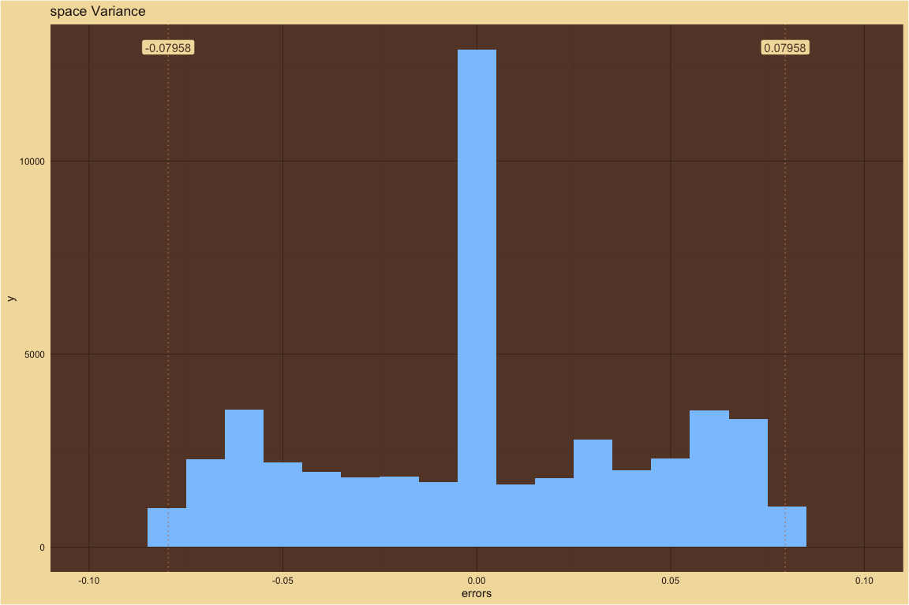

Major-Minor and Consonance-Dissonance Perception
================

# MaMi CoDi Plots

## Chords: Consonance-Dissonance ~ Major-Minor

### Dyads

<!-- --><!-- --><!-- -->

### Triads

<!-- --><!-- --><!-- -->

### Major Triad Progressions

<!-- --><!-- --><!-- -->

### Minor Triad Progressions

<!-- --><!-- --><!-- -->

### Scales

<!-- --><!-- --><!-- -->
