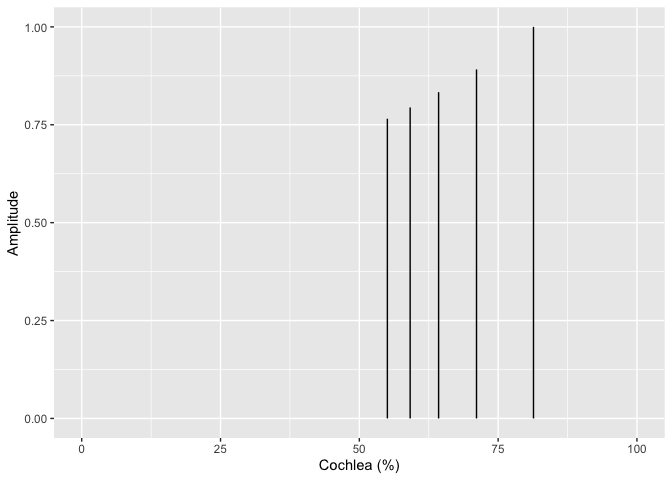
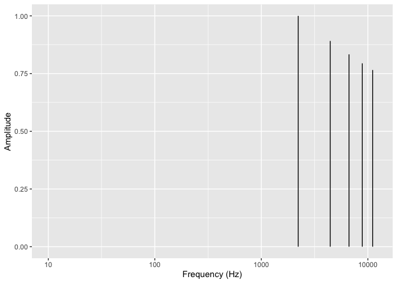

MaMi.CoDi: A Spatiotemporal Periodicity Model of Consonance Perception
================

## How MaMi.CoDi Works

### Estimating Spatiotemporal Periodicity

To estimate the periodicity of a chord, the MaMi.CoDi model uses a
signal processing technique. It finds ratios, within a given tolerance,
for every tone in the chord (fundamental, harmonics, noise, etc.)
relative to a reference tone. The least common multiple of those ratios
is a measure of the cycle length, relative to the reference tone. Long
relative cycles are predicted to sound unpleasant and short relative
cycles are predicted to sound pleasant.  

MaMi.CoDi creates two estimates of the chord’s period: a temporal
estimate and a spatial estimate.  

For the frequency (i.e. phase-locking or temporal) estimate the
reference tone is the smallest frequency. Small frequencies are low
tones and are detected by the inner ear hair cells closest to the apex
of the cochlea, which is the end furthest from the source of the wave.  

For the wavelength (i.e. rate-place or spatial) estimate, the reference
tone is the smallest wavelength. Small wavelengths are high tones and
are detected by the inner ear hair cells closest to the base of the
cochlea, which is the end closest to the middle ear, the source of the
wave.  

MaMi.CoDi combines the two cycle estimates into a two-dimensional space
with consonance-dissonance along one dimension and major-minor on the
orthogonal dimension.

#### Chord

Below, we estimate the periodicity of the C4, E4 and G4 major triad with
5 harmonics per pitch.

- Fundamental Frequencies: 261.6255653, 329.6275569, 391.995436  

- Fundamental Wavelengths: 1.311034, 1.0405683, 0.8750102  

- MIDI: 60, 64, 67  

- Number of Harmonics: 5

#### Temporal Estimate

| chord_Hz |  chord_m |   chord_s | chord_Sz | tol |
|---------:|---------:|----------:|---------:|----:|
| 21.80213 | 15.73241 | 0.0458671 |       12 | 0.1 |

##### Periods

<!-- -->

##### Relative Periodicity

<!-- -->

#### Frequency Ratios

| index | num | den |    ratio |      tone | reference_tone |
|------:|----:|----:|---------:|----------:|---------------:|
|     1 |   1 |   1 | 1.000000 |  261.6256 |       261.6256 |
|     2 |   4 |   3 | 1.259921 |  329.6276 |       261.6256 |
|     3 |   3 |   2 | 1.498307 |  391.9954 |       261.6256 |
|     4 |   2 |   1 | 2.000000 |  523.2511 |       261.6256 |
|     5 |   5 |   2 | 2.519842 |  659.2551 |       261.6256 |
|     6 |   3 |   1 | 2.996614 |  783.9909 |       261.6256 |
|     7 |   3 |   1 | 3.000000 |  784.8767 |       261.6256 |
|     8 |  15 |   4 | 3.779763 |  988.8827 |       261.6256 |
|     9 |   4 |   1 | 4.000000 | 1046.5023 |       261.6256 |
|    10 |   9 |   2 | 4.494921 | 1175.9863 |       261.6256 |
|    11 |   5 |   1 | 5.000000 | 1308.1278 |       261.6256 |
|    12 |   5 |   1 | 5.039684 | 1318.5102 |       261.6256 |
|    13 |   6 |   1 | 5.993228 | 1567.9817 |       261.6256 |
|    14 |  19 |   3 | 6.299605 | 1648.1378 |       261.6256 |
|    15 |  15 |   2 | 7.491535 | 1959.9772 |       261.6256 |

#### Spatial Estimate

|  chord_Hz |  chord_m |  chord_s | chord_Sz | tol |
|----------:|---------:|---------:|---------:|----:|
| 0.0029167 | 15697.53 | 342.8531 |       60 | 0.1 |

##### Wavenumbers

<!-- -->

##### Relative Spatial Frequency

<!-- -->

##### Wavelength Ratios

| index | num | den |    ratio |      tone | reference_tone |
|------:|----:|----:|---------:|----------:|---------------:|
|    15 |   1 |   1 | 1.000000 |  261.6256 |       261.6256 |
|    14 |   5 |   4 | 1.189207 |  311.1270 |       261.6256 |
|    13 |   4 |   3 | 1.250000 |  327.0320 |       261.6256 |
|    12 |   3 |   2 | 1.486509 |  388.9087 |       261.6256 |
|    11 |   3 |   2 | 1.498307 |  391.9954 |       261.6256 |
|    10 |   5 |   3 | 1.666667 |  436.0426 |       261.6256 |
|     9 |   9 |   5 | 1.872884 |  489.9943 |       261.6256 |
|     8 |   2 |   1 | 1.982012 |  518.5450 |       261.6256 |
|     7 |   5 |   2 | 2.497178 |  653.3257 |       261.6256 |
|     6 |   5 |   2 | 2.500000 |  654.0639 |       261.6256 |
|     5 |   3 |   1 | 2.973018 |  777.8175 |       261.6256 |
|     4 |  11 |   3 | 3.745768 |  979.9886 |       261.6256 |
|     3 |   5 |   1 | 5.000000 | 1308.1278 |       261.6256 |
|     2 |   6 |   1 | 5.946035 | 1555.6349 |       261.6256 |
|     1 |  15 |   2 | 7.491535 | 1959.9772 |       261.6256 |

### Finding the Tolerance Values

MaMi.CoDi uses the Stern-Brocot tree to find rational fractions for the
ratios within a given tolerance. How do we find the best tolerance
values? For the MaMi.CoDi model we ran thousands of computations with
various tolerance values and compared the predictions with results from
six of the large-scale behavioral experiments.  

Because spatial and temporal information is encoded via different
mechanisms by the cochlea, we assumed that the wavelength and frequency
tolerances would have different values.  

So, our tolerance searches were two-dimensional. We searched for
combinations of frequency tolerance and wavelength tolerance. The image
below is a sample of a 2D tolerance search using the harmonic experiment
from large-scale behavioral study.  

Click here, for the [full 2D tolerance
search](https://github.com/homeymusic/mami.codi.R/blob/2D_tolerance/man/tolerance_search_plots/Harmonic2D.jpg)
image for the harmonics experiment. Click here, for the [2D_tolerance
branch on
GitHub](https://github.com/homeymusic/mami.codi.R/tree/2D_tolerance) to
recreate all the 2D searches.  

The best fits across the experiments were given by a frequency tolerance
of 0.06 and a wavelength tolerance of 0.06. The frequency tolerance is
half the size of the wavelength tolerance. Does that mean that the
perception mechanism for frequency is twice as discriminating as the
wavelength mechanism? “At 1 kHz information contained in temporal
discharges was an order of magnitude better than that obtained by a
rate–place mechanism. Heinz et al. (2001)” from Winter (2005).  

## Theoretical predictions compared to large-scale behavioral results

The large-scale behavioral data in the plots below are from [Timbral
effects on consonance disentangle psychoacoustic mechanisms and suggest
perceptual origins for musical
scales](https://www.nature.com/articles/s41467-024-45812-z) by Raja
Marjieh, Peter M. C. Harrison, Harin Lee, Fotini Deligiannaki & Nori
Jacoby.

### Manipulating harmonic frequencies

#### Dyads spanning 15 semitones

##### Harmonic ~ Partials: 10

For 10 harmonics, behavioral results and theoretical predictions agree.

| detected_pseudo_octave | ignore_amplitudes_below | wavelength_tolerance | frequency_tolerance | smoothing_sigma |
|:-----------------------|:------------------------|:---------------------|:--------------------|----------------:|
| 2                      | 0.03                    | 0.06                 | 0.06                |             0.2 |

<!-- -->  
<!-- -->  
<!-- -->

##### 5Partials ~ Partials: 5

For 5 harmonics, behavioral results and theoretical predictions agree.
For comparison with the study below (5 partils with the third partial
deleted), notice that the m3 peak is only slightly lower than the M3
peak.

| detected_pseudo_octave | ignore_amplitudes_below | wavelength_tolerance | frequency_tolerance | smoothing_sigma |
|:-----------------------|:------------------------|:---------------------|:--------------------|----------------:|
| 2                      | 0.03                    | 0.06                 | 0.06                |             0.2 |

<!-- -->  
<!-- -->  
<!-- -->

##### 5PartialsNo3 ~ Partials: 5

For 5 harmonics with the 3rd partial deleted, behavioral results and
theoretical predictions mostly agree. As expected, the m3 peak without
the third partial is now lower than the m3 peak with all 5 harmonics
while the M3 peak is slightly higher without the 3rd partial.

| detected_pseudo_octave | ignore_amplitudes_below | wavelength_tolerance | frequency_tolerance | smoothing_sigma |
|:-----------------------|:------------------------|:---------------------|:--------------------|----------------:|
| 2                      | 0.03                    | 0.06                 | 0.06                |             0.2 |

<!-- -->  
<!-- -->  
<!-- -->

##### Pure ~ Partials: 1

For pure tones, the behavioral results and the theoretical predictions
mostly agree. Only P5 and P8 have pronounced two-sided peaks. The
behavioral results show subtle variations in consonance height across
the 15 semitones but the overall peak structure agrees with MaMi.CoDi
predictions. For futher comparison, the theoretical predictions for
major-minor versus the behavioral results are included in a plot below.

| detected_pseudo_octave | ignore_amplitudes_below | wavelength_tolerance | frequency_tolerance | smoothing_sigma |
|:-----------------------|:------------------------|:---------------------|:--------------------|----------------:|
| 2                      | 0.03                    | 0.06                 | 0.06                |             0.2 |

<!-- -->  
<!-- -->  
<!-- -->

##### Stretched ~ Partials: 10

For stretched harmonics, behavioral results and theoretical predictions
mostly agree. MaMi.Codi predicts peaks with minor polarity just above m3
and m7 that do not exist in the behavioral results.

| detected_pseudo_octave | ignore_amplitudes_below | wavelength_tolerance | frequency_tolerance | smoothing_sigma |
|:-----------------------|:------------------------|:---------------------|:--------------------|----------------:|
| 2.1                    | 0.03                    | 0.06                 | 0.06                |             0.2 |

<!-- -->  
<!-- -->  
<!-- -->

##### Compressed ~ Partials: 10

For compressed harmonics, the pronounced behavioral peaks mostly agree
with the theoretical peaks.

| detected_pseudo_octave | ignore_amplitudes_below | wavelength_tolerance | frequency_tolerance | smoothing_sigma |
|:-----------------------|:------------------------|:---------------------|:--------------------|----------------:|
| 1.9                    | 0.03                    | 0.06                 | 0.06                |             0.2 |

<!-- -->  
<!-- -->  
<!-- -->

##### Bonang ~ Partials: 4

For gamalan dyads with a harmonic bass pitch and bonang upper pitch,
behavioral results and theoretical predictions mostly agree. MaMi.CoDi
predicts a dissonance trough with minor polarity at P4 that is not in
the behavioral results. MaMi.CoDi predicts P5 to have minor polarity and
be relatively higher than the behavioral results.

| detected_pseudo_octave | ignore_amplitudes_below | wavelength_tolerance | frequency_tolerance | smoothing_sigma |
|:-----------------------|:------------------------|:---------------------|:--------------------|----------------:|
| 2                      | 0.03                    | 0.06                 | 0.06                |             0.2 |

<!-- -->  
<!-- -->  
<!-- -->

#### Dyads spanning 1 quarter tone

##### M3 ~ Partials: 10

Description is below.

| detected_pseudo_octave | ignore_amplitudes_below | wavelength_tolerance | frequency_tolerance | smoothing_sigma |
|:-----------------------|:------------------------|:---------------------|:--------------------|----------------:|
| 2                      | 0.03                    | 3e-04                | 0.00015             |           0.035 |

<!-- -->  
<!-- -->  
<!-- -->

##### M6 ~ Partials: 10

Description is below.

| detected_pseudo_octave | ignore_amplitudes_below | wavelength_tolerance | frequency_tolerance | smoothing_sigma |
|:-----------------------|:------------------------|:---------------------|:--------------------|----------------:|
| 2                      | 0.03                    | 3e-04                | 0.00015             |           0.035 |

<!-- -->  
<!-- -->  
<!-- -->

##### P8 ~ Partials: 10

Description is below.

| detected_pseudo_octave | ignore_amplitudes_below | wavelength_tolerance | frequency_tolerance | smoothing_sigma |
|:-----------------------|:------------------------|:---------------------|:--------------------|----------------:|
| 2                      | 0.03                    | 3e-04                | 0.00015             |           0.035 |

<!-- -->  
<!-- -->  
<!-- -->

# `{r, child=c('man/M3_M6_P8.Rmd')} #`

#### Notes on plots:

In the plots above:

- The cream lines are smoothed experimental data from Marjieh, Harrison
  et al.

- The multi-colored points are MaMi.CoDi computational predictions

- The multi-colored lines are smoothed MaMi.CoDi computational
  predictions

- The colors represent MaMi.CoDi computational predictions for
  major-minor polarity:

- Gold is major

- Red is neutral

- Blue is minor

- The vertical axis is z-scored consonance-dissonance

- The horizontal axis is the width of the dyad from 0 to 15 semitones

- For example, the data at 4 represents the equal tempered major third,
  M3

- While the data at 8 represents the equal tempered minor sixth, m6
