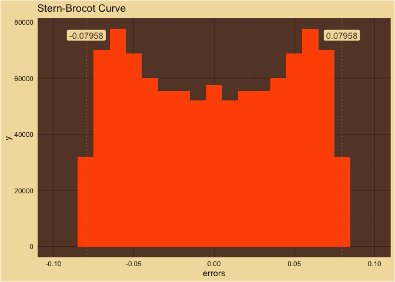

MaMi.CoDi: A Quantum Model of Consonance Perception at the Heisenberg
Uncertainty Limit
================

## Quantum Consonance Perception

### Temporal

$$\psi(\omega, t) = \int \phi(k) e^{-i \left( \omega t - k x \right) } dk$$

### Spatial

$$\phi(k, t) = \int \psi(\omega, t) e^{-i \left( k x \right) } d\omega$$

### Uncertainty

The model is quantized and the uncertainty is introduced when
transforming wavelength and frequency ratios to rational fractions using
the Stern-Brocot tree with variance $\sigma^2$.

$$\Delta \omega \Delta k \ge \frac{1} {2}$$

$${\sigma_f}^2 {\sigma_\lambda}^2 \ge \frac{1} {16 \pi^2}$$

#### Some Thoughts on Uncertainty

Uncertainty in our model is not the time duration and frequency
uncertainty $\Delta t \Delta f$ of Gabor (or Wiener’s famous quantum
physics and music analogy). It is frequency and wavelength (space)
uncertainty $\Delta f \Delta \lambda$, closer to the original ideas of
Heisenberg and de Broglie $\Delta x \Delta p$.  

$$\lambda=\frac{2 \pi}{k}=\frac{h}{p}$$

$$f=\frac{\omega}{2 \pi}=\frac{E}{h}$$

#### Computing the Fundamental Wavelength and Frequency of a Chord

Consider a $100$ Hz wave with $3$ harmonics:

$f_i=100.00, 200.00, 300.00$ Hz  

If we put those waves in a medium with a wave speed of

$c = max(f) * min(f) = 3\times 10^{4}$

for an infinitely long time then the range of values for the wavelengths
$\lambda = \frac{c}{f}$ will be the same as the range for the
frequencies:

$\lambda_i=300.00, 150.00, 100.00$ m  

We will calculate the overall period of the combined wave twice using a
traditional signal processing technique. We will find the frequency and
wavelength ratios as rational numbers at the Heisenberg limit and then
compute the least common denominator (LCD) for each. With the LCD we
will find the overall period. But a quick glance at the normalized
wavelength and frequency values, above, will show us that we are headed
for a problem: the denominators of those ratios will not be the same
(even with complete precision) and ultimately we will have two different
values for the overall period.  

Frequency Ratios

| num | den |
|----:|----:|
|   1 |   1 |
|   2 |   1 |
|   3 |   1 |

Wavelength Ratios

| num | den |
|----:|----:|
|   1 |   1 |
|   3 |   2 |
|   3 |   1 |

And the period(s) is (are?):

| frequency_lcd | f_whole | T_from_f | wavelength_lcd | l_whole | T_from_l |
|--------------:|--------:|---------:|---------------:|--------:|---------:|
|             1 |     100 |     0.01 |              2 |     600 |     0.02 |

From the frequency perspective, the period of the whole wave is $0.01$
s.  

From the wavelength (space) perspective, the period of the whole wave is
$0.02$ s.  

The periods disagree. The disagreement is not due to a lack of precision
in the sensors or the time duration that the waves were in the medium or
even the rational fraction approximation ($3/2$ is precisely $150/100$).
The disagreement seems to be a fundamental uncertainty.  

## How MaMi.CoDi is Implemented

\### The Math

#### Traveling Waves

$$s_{i}(x, t) = \sin \left( \frac{2\pi x}{\lambda_{i}} - 2 \pi f_{i} t \right)$$
$N$ is the number of traveling waves in the chord.

$$i=1...N$$

#### Fundamental Wavelength

$$\lambda_{0} = \lambda_{max} { ALCD}\left(r_{\lambda 1},..., r_{\lambda N}\right)$$
$ALCD()$ is an approximate least common denominator.  

#### Wavelength Ratios 

$$r_{\lambda i} = \frac{\lambda_{i}}{\lambda_{min}} \pm \sigma_{\lambda}^{2} = \frac{a_{i}}{b_{i}}$$

$${ GCD}(a_{i}, b_{i}) = 1$$ $GCD()$ is the greatest common divisor.  

#### Fundamental Frequency

$$f_{0} = f_{min} / { ALCD}\left(r_{f 1},..., r_{f N}\right)$$ Frequency
Ratios

$$r_{f i} = \frac{f_{i}}{f_{min}} \pm \sigma_{f}^{2} = \frac{c_{i}}{d_{i}}$$

$${GCD}(c_{i}, d_{i}) = 1$$

#### Heisenberg Uncertainty

$$\sigma_{\lambda}^{2} \sigma_{f}^{2} = \frac{1}{16\pi^{2}}$$

The Stern-Brocot approximation is 0 outside $\pm\sigma^{2}$ which
satisfies the exponential decay constraint and so we can presume
equality.

#### Consonance Perception

Spatial Consonance

$$C_{\lambda} = 50- \log_{2}\left({ ALCD}\left(r_{\lambda 1},..., r_{\lambda N}\right)\right)$$
Temporal Consonance

$$C_{f} = 50 - \log_{2}\left({ ALCD}\left(r_{f 1},..., r_{f N}\right)\right)$$

Total Consonance

$$C_{\lambda f} = C_{\lambda} + C_{f}$$

Pure tone will have a total consonance $C_{\lambda f}$ of 100.

Major-Minor

$$M_{\lambda f} = C_{f} - C_{\lambda}$$ Neutral chords will have a
major-minor value $M_{\lambda f}$ of 0.

### The Basilar Membrane

When a chord is sounded, pressure waves travel through the air. Those
pressure waves enter the ear canal where they vibrate the ear drum. The
ear drum transfers the energy of the pressure waves through a series of
bones in the fluid of the middle ear to an oval window on the
shell-shaped cochlea of the inner ear. Within the fluid of the cochlea,
the sound energy is converted into a traveling surface wave along the
basilar membrane.  

Human basilar membranes are around 33 mm long. Thousands of
evenly-spaced hair cells are arranged in a line on the basilar membrane.
The hair cells transduce mechanical vibrations into electrical activity
that is sent along the auditory nerve to the central auditory system.
When a sound wave travels along the basilar membrane, the hair cells
positioned near the wavelength of that sound will send electrical
activity along the auditory nerve.  

The fundamental tone of middle C is over a meter long in room
temperature air at sea level. But the basilar membrane is only 33mm
long. How can the hair cells positioned along the basilar membrane
detect wavelengths that are longer than the entire basilar membrane?  

The traveling sound waves shorten as they travel around the spiral
cochlea. Middle C’s fundamental wavelength of 1.31 meters in air shrinks
to 26 mm along the basilar membrane. So, when the fundamental tone of
middle C is sounded, the hair cells positioned 26 mm (81%) from the base
of the cochlea send electrical activity along the auditory nerve.  

When a musical chord comprised of many fundamental tones and harmonics
is sounded, the hair cells at each shortened wavelength position send
signals along the auditory nerve. This spatial or rate-place arrangement
of hair cell positions and wavelengths of tones is known as tonotopy.  

### The Core Idea of MaMi.CoDi

If we play a chord, freeze time and observe which hair cells are
displaced, what are we observing? Are we observing frequencies? Periods?
No. Time is frozen. Frequency (1/s) and period (s) are temporal
observations. We are making a purely spatial observation about
wavelengths (m). We will come back to temporal observations shortly.  

When we combine all the component parts of a chord together into a
whole, we can estimate the overall wavelength for the whole chord. A
technique used in digital signal processing and bricklaying is to
estimate ratios (within an acceptable variance) between each of the
parts and a selected reference part. The greatest common divisor (LCD)
of those part ratios will be a measure of the periodicity of the
whole.  

Chords with short wavelengths relative to the component wavelengths
sound pleasant. And chords with long wavelengths relative to component
wavelengths sound unpleasant. MaMi.CoDi uses this measure of relative
wavelengths to predict the perceived spatial consonance of a chord.  

Let us unfreeze time and start counting how often a hair cell moves due
to a pure tone of our sounded chord. If we count the number of movements
relative to a certain amount of time, we will be observing the frequency
of the partial. This would be a temporal observation. The auditory
system has a property called phase locking which allows it to encode the
time intervals, periods, between spikes from sound waves.  

When we combine the period components of a chord together, we can
estimate the overall period for the whole chord. That chord period will
be as long as or longer than the longest component period of the chord.
Short relative periods sound pleasant. Long relative periods sound
unpleasant. MaMi.CoDi uses this measure of chord period to predict the
perceived temporal consonance of a chord.  

MaMi.CoDi sums the spatial and temporal consonance predictions to create
an overall consonance-dissonance prediction. MaMi.CoDi subtracts the
spatial consonance from the temporal consonance to create a major-minor
polarity prediction. Positive values will sound major, negative values
minor and values around zero will sound neutral.  

Because wavelength and frequency are inverse of each other one might
imagine that the spatial and temporal signals would have the same
values. However, for complex pitches that is not the case. The pattern
of the two sets of components are different. See the example of the
major triad with 5 harmonics, below.

### Estimating Spatiotemporal Periodicity

To estimate the periodicity of a chord, the MaMi.CoDi model uses a
signal processing technique. It finds fractions, within a given
variance, for every tone in the chord (fundamental, harmonics, noise,
etc.) relative to a reference tone. The least common denominator of
those fractions is a measure of the cycle length, relative to the
reference tone. Long relative cycles are predicted to sound unpleasant
and short relative cycles are predicted to sound pleasant.  

MaMi.CoDi creates two estimates of the chord’s period: a temporal
estimate and a spatial estimate.  

For the temporal (i.e. phase-locking or frequency) estimate the
reference tone is the smallest frequency. Small frequencies are low
tones and are detected by the inner ear hair cells closest to the apex
of the cochlea, which is the end furthest from the source of the wave.  

For the spatial (i.e. rate-place or wavelength) estimate, the reference
tone is the smallest wavelength. Small wavelengths are high tones and
are detected by the inner ear hair cells closest to the base of the
cochlea, which is the end closest to the middle ear, the source of the
wave.  

MaMi.CoDi combines the two cycle estimates into a two-dimensional space
with consonance-dissonance along one dimension and major-minor on the
orthogonal dimension.

#### Example Dyad: Major Third

Below, we estimate the periodicity of the C4, E4 major third with 1, 10
and 20 harmonics per pitch. The MaMi.CoDi model is based on fractions of
tones - both frequency and wavelength fractions. The input to the model
is a sparse frequency spectrum. We convert frequencies to wavelengths by
dividing a speed of sound constant by the frequency.  

For tone ratios, the value of the speed of sound constant does not
impact the mathematics. We could choose any media for the speed of
sound: room temperature air at sea level, cochlear fluid, the basilar
membrane, etc.

We chose the speed of sound in room temperature air.

#### 1 Harmonic

- Fundamentals in MIDI: 60, 64  

- Number of Harmonics: 1

- Frequencies: 261.626, 329.628  

- Wavelengths: 1.311, 1.041  

- Speed of Sound: 343.000

- f0: 87.209

- l0: 3.933

- Quantum Speed of Sound: 343.000

###### MaMi.CoDi Predictions

| consonance_dissonance | major_minor | temporal_consonance | spatial_consonance |
|----------------------:|------------:|--------------------:|-------------------:|
|              96.83007 |           0 |            48.41504 |           48.41504 |

#### Temporal Periodicity

| lcd | chord_Sz | chord_Hz | c_sound |  chord_m |   chord_s |
|----:|---------:|---------:|--------:|---------:|----------:|
|   3 | 1.584963 | 87.20852 |     343 | 3.933102 | 0.0114668 |

##### Partial Periods

<!-- -->

##### Chord Period

<!-- -->

##### Frequency fractions

| index | num | den |  tone_hz |     freq | midi | pseudo_rational_number |
|------:|----:|----:|---------:|---------:|-----:|-----------------------:|
|     1 |   1 |   1 | 261.6256 | 261.6256 |   60 |               1.000000 |
|     2 |   4 |   3 | 329.6276 | 329.6276 |   64 |               1.259921 |

#### Spatial Periodicity

| lcd | chord_Sz | chord_Hz | c_sound |  chord_m |   chord_s |
|----:|---------:|---------:|--------:|---------:|----------:|
|   3 | 1.584963 | 87.20852 |     343 | 3.933102 | 0.0114668 |

##### Partial Wavelengths

<!-- -->

##### Chord Wavelength

<!-- -->

##### Wavelength fractions

| index | num | den |   tone_m |     freq | midi | pseudo_rational_number |
|------:|----:|----:|---------:|---------:|-----:|-----------------------:|
|     1 |   4 |   3 | 1.311034 | 261.6256 |   60 |               1.259921 |
|     2 |   1 |   1 | 1.040568 | 329.6276 |   64 |               1.000000 |

#### 10 Harmonics

- Fundamentals in MIDI: 60, 64  

- Number of Harmonics: 10

- Frequencies: 261.626, 329.628, 523.251, 659.255, 784.877, 988.883,
  1046.502, 1308.128, 1318.510, 1569.753, 1648.138, 1831.379, 1977.765,
  2093.005, 2307.393, 2354.630, 2616.256, 2637.020, 2966.648, 3296.276  

- Wavelengths: 1.311, 1.041, 0.656, 0.520, 0.437, 0.347, 0.328, 0.262,
  0.260, 0.219, 0.208, 0.187, 0.173, 0.164, 0.149, 0.146, 0.131, 0.130,
  0.116, 0.104  

- Speed of Sound: 343.000

- f0: 21.802

- l0: 78.662

- Quantum Speed of Sound: 1715.000

###### MaMi.CoDi Predictions

| consonance_dissonance | major_minor | temporal_consonance | spatial_consonance |
|----------------------:|------------:|--------------------:|-------------------:|
|              90.50815 |    2.321928 |            46.41504 |           44.09311 |

#### Temporal Periodicity

| lcd | chord_Sz | chord_Hz | c_sound |  chord_m |   chord_s |
|----:|---------:|---------:|--------:|---------:|----------:|
|  12 | 3.584963 | 21.80213 |     343 | 15.73241 | 0.0458671 |

##### Partial Periods

<!-- -->

##### Chord Period

<!-- -->

##### Frequency fractions

| index | num | den |   tone_hz |      freq |      midi | pseudo_rational_number |
|------:|----:|----:|----------:|----------:|----------:|-----------------------:|
|     1 |   1 |   1 |  261.6256 |  261.6256 |  60.00000 |               1.000000 |
|     2 |   4 |   3 |  329.6276 |  329.6276 |  64.00000 |               1.259921 |
|     3 |   2 |   1 |  523.2511 |  523.2511 |  72.00000 |               2.000000 |
|     4 |   5 |   2 |  659.2551 |  659.2551 |  76.00000 |               2.519842 |
|     5 |   3 |   1 |  784.8767 |  784.8767 |  79.01955 |               3.000000 |
|     6 |  15 |   4 |  988.8827 |  988.8827 |  83.01955 |               3.779763 |
|     7 |   4 |   1 | 1046.5023 | 1046.5023 |  84.00000 |               4.000000 |
|     8 |   5 |   1 | 1308.1278 | 1308.1278 |  87.86314 |               5.000000 |
|     9 |   5 |   1 | 1318.5102 | 1318.5102 |  88.00000 |               5.039684 |
|    10 |   6 |   1 | 1569.7534 | 1569.7534 |  91.01955 |               6.000000 |
|    11 |  19 |   3 | 1648.1378 | 1648.1378 |  91.86314 |               6.299605 |
|    12 |   7 |   1 | 1831.3790 | 1831.3790 |  93.68826 |               7.000000 |
|    13 |  15 |   2 | 1977.7653 | 1977.7653 |  95.01955 |               7.559526 |
|    14 |   8 |   1 | 2093.0045 | 2093.0045 |  96.00000 |               8.000000 |
|    15 |  35 |   4 | 2307.3929 | 2307.3929 |  97.68826 |               8.819447 |
|    16 |   9 |   1 | 2354.6301 | 2354.6301 |  98.03910 |               9.000000 |
|    17 |  10 |   1 | 2616.2556 | 2616.2556 |  99.86314 |              10.000000 |
|    18 |  10 |   1 | 2637.0205 | 2637.0205 | 100.00000 |              10.079368 |
|    19 |  34 |   3 | 2966.6480 | 2966.6480 | 102.03910 |              11.339289 |
|    20 |  38 |   3 | 3296.2755 | 3296.2755 | 103.86314 |              12.599210 |

#### Spatial Periodicity

| lcd | chord_Sz | chord_Hz | c_sound |  chord_m |   chord_s |
|----:|---------:|---------:|--------:|---------:|----------:|
|  60 | 5.906891 | 4.360426 |     343 | 78.66204 | 0.2293354 |

##### Partial Wavelengths

<!-- -->

##### Chord Wavelength

<!-- -->

##### Wavelength fractions

| index | num | den |    tone_m |      freq |      midi | pseudo_rational_number |
|------:|----:|----:|----------:|----------:|----------:|-----------------------:|
|     1 |  38 |   3 | 1.3110340 |  261.6256 |  60.00000 |              12.599210 |
|     2 |  10 |   1 | 1.0405683 |  329.6276 |  64.00000 |              10.000000 |
|     3 |  19 |   3 | 0.6555170 |  523.2511 |  72.00000 |               6.299605 |
|     4 |   5 |   1 | 0.5202842 |  659.2551 |  76.00000 |               5.000000 |
|     5 |  17 |   4 | 0.4370113 |  784.8767 |  79.01955 |               4.199737 |
|     6 |  10 |   3 | 0.3468561 |  988.8827 |  83.01955 |               3.333333 |
|     7 |  16 |   5 | 0.3277585 | 1046.5023 |  84.00000 |               3.149803 |
|     8 |   5 |   2 | 0.2622068 | 1308.1278 |  87.86314 |               2.519842 |
|     9 |   5 |   2 | 0.2601421 | 1318.5102 |  88.00000 |               2.500000 |
|    10 |  13 |   6 | 0.2185057 | 1569.7534 |  91.01955 |               2.099868 |
|    11 |   2 |   1 | 0.2081137 | 1648.1378 |  91.86314 |               2.000000 |
|    12 |   7 |   4 | 0.1872906 | 1831.3790 |  93.68826 |               1.799887 |
|    13 |   5 |   3 | 0.1734281 | 1977.7653 |  95.01955 |               1.666667 |
|    14 |   3 |   2 | 0.1638792 | 2093.0045 |  96.00000 |               1.574901 |
|    15 |   3 |   2 | 0.1486526 | 2307.3929 |  97.68826 |               1.428571 |
|    16 |   4 |   3 | 0.1456704 | 2354.6301 |  98.03910 |               1.399912 |
|    17 |   4 |   3 | 0.1311034 | 2616.2556 |  99.86314 |               1.259921 |
|    18 |   5 |   4 | 0.1300710 | 2637.0205 | 100.00000 |               1.250000 |
|    19 |   7 |   6 | 0.1156187 | 2966.6480 | 102.03910 |               1.111111 |
|    20 |   1 |   1 | 0.1040568 | 3296.2755 | 103.86314 |               1.000000 |

#### 20 Harmonics

- Fundamentals in MIDI: 60, 64  

- Number of Harmonics: 20

- Frequencies: 261.626, 329.628, 523.251, 659.255, 784.877, 988.883,
  1046.502, 1308.128, 1318.510, 1569.753, 1648.138, 1831.379, 1977.765,
  2093.005, 2307.393, 2354.630, 2616.256, 2637.020, 2877.881, 2966.648,
  3139.507, 3296.276, 3401.132, 3625.903, 3662.758, 3924.383, 3955.531,
  4186.009, 4285.158, 4447.635, 4614.786, 4709.260, 4944.413, 4970.886,
  5232.511, 5274.041, 5603.668, 5933.296, 6262.924, 6592.551  

- Wavelengths: 1.311, 1.041, 0.656, 0.520, 0.437, 0.347, 0.328, 0.262,
  0.260, 0.219, 0.208, 0.187, 0.173, 0.164, 0.149, 0.146, 0.131, 0.130,
  0.119, 0.116, 0.109, 0.104, 0.101, 0.095, 0.094, 0.087, 0.087, 0.082,
  0.080, 0.077, 0.074, 0.073, 0.069, 0.069, 0.066, 0.065, 0.061, 0.058,
  0.055, 0.052  

- Speed of Sound: 343.000

- f0: 4.360

- l0: 78.662

- Quantum Speed of Sound: 343.000

###### MaMi.CoDi Predictions

| consonance_dissonance | major_minor | temporal_consonance | spatial_consonance |
|----------------------:|------------:|--------------------:|-------------------:|
|              88.18622 |           0 |            44.09311 |           44.09311 |

#### Temporal Periodicity

| lcd | chord_Sz | chord_Hz | c_sound |  chord_m |   chord_s |
|----:|---------:|---------:|--------:|---------:|----------:|
|  60 | 5.906891 | 4.360426 |     343 | 78.66204 | 0.2293354 |

##### Partial Periods

<!-- -->

##### Chord Period

<!-- -->

##### Frequency fractions

| index | num | den |   tone_hz |      freq |      midi | pseudo_rational_number |
|------:|----:|----:|----------:|----------:|----------:|-----------------------:|
|     1 |   1 |   1 |  261.6256 |  261.6256 |  60.00000 |               1.000000 |
|     2 |   4 |   3 |  329.6276 |  329.6276 |  64.00000 |               1.259921 |
|     3 |   2 |   1 |  523.2511 |  523.2511 |  72.00000 |               2.000000 |
|     4 |   5 |   2 |  659.2551 |  659.2551 |  76.00000 |               2.519842 |
|     5 |   3 |   1 |  784.8767 |  784.8767 |  79.01955 |               3.000000 |
|     6 |  15 |   4 |  988.8827 |  988.8827 |  83.01955 |               3.779763 |
|     7 |   4 |   1 | 1046.5023 | 1046.5023 |  84.00000 |               4.000000 |
|     8 |   5 |   1 | 1308.1278 | 1308.1278 |  87.86314 |               5.000000 |
|     9 |   5 |   1 | 1318.5102 | 1318.5102 |  88.00000 |               5.039684 |
|    10 |   6 |   1 | 1569.7534 | 1569.7534 |  91.01955 |               6.000000 |
|    11 |  19 |   3 | 1648.1378 | 1648.1378 |  91.86314 |               6.299605 |
|    12 |   7 |   1 | 1831.3790 | 1831.3790 |  93.68826 |               7.000000 |
|    13 |  15 |   2 | 1977.7653 | 1977.7653 |  95.01955 |               7.559526 |
|    14 |   8 |   1 | 2093.0045 | 2093.0045 |  96.00000 |               8.000000 |
|    15 |  35 |   4 | 2307.3929 | 2307.3929 |  97.68826 |               8.819447 |
|    16 |   9 |   1 | 2354.6301 | 2354.6301 |  98.03910 |               9.000000 |
|    17 |  10 |   1 | 2616.2556 | 2616.2556 |  99.86314 |              10.000000 |
|    18 |  10 |   1 | 2637.0205 | 2637.0205 | 100.00000 |              10.079368 |
|    19 |  11 |   1 | 2877.8811 | 2877.8811 | 101.51318 |              11.000000 |
|    20 |  34 |   3 | 2966.6480 | 2966.6480 | 102.03910 |              11.339289 |
|    21 |  12 |   1 | 3139.5068 | 3139.5068 | 103.01955 |              12.000000 |
|    22 |  38 |   3 | 3296.2755 | 3296.2755 | 103.86314 |              12.599210 |
|    23 |  13 |   1 | 3401.1324 | 3401.1324 | 104.40528 |              13.000000 |
|    24 |  69 |   5 | 3625.9030 | 3625.9030 | 105.51318 |              13.859131 |
|    25 |  14 |   1 | 3662.7579 | 3662.7579 | 105.68826 |              14.000000 |
|    26 |  15 |   1 | 3924.3834 | 3924.3834 | 106.88269 |              15.000000 |
|    27 |  91 |   6 | 3955.5307 | 3955.5307 | 107.01955 |              15.119053 |
|    28 |  16 |   1 | 4186.0090 | 4186.0090 | 108.00000 |              16.000000 |
|    29 |  49 |   3 | 4285.1583 | 4285.1583 | 108.40528 |              16.378974 |
|    30 |  17 |   1 | 4447.6346 | 4447.6346 | 109.04955 |              17.000000 |
|    31 |  53 |   3 | 4614.7858 | 4614.7858 | 109.68826 |              17.638895 |
|    32 |  18 |   1 | 4709.2602 | 4709.2602 | 110.03910 |              18.000000 |
|    33 | 113 |   6 | 4944.4133 | 4944.4133 | 110.88269 |              18.898816 |
|    34 |  19 |   1 | 4970.8857 | 4970.8857 | 110.97513 |              19.000000 |
|    35 |  20 |   1 | 5232.5113 | 5232.5113 | 111.86314 |              20.000000 |
|    36 | 101 |   5 | 5274.0409 | 5274.0409 | 112.00000 |              20.158737 |
|    37 | 107 |   5 | 5603.6684 | 5603.6684 | 113.04955 |              21.418658 |
|    38 |  68 |   3 | 5933.2960 | 5933.2960 | 114.03910 |              22.678579 |
|    39 |  24 |   1 | 6262.9235 | 6262.9235 | 114.97513 |              23.938500 |
|    40 | 101 |   4 | 6592.5511 | 6592.5511 | 115.86314 |              25.198421 |

#### Spatial Periodicity

| lcd | chord_Sz | chord_Hz | c_sound |  chord_m |   chord_s |
|----:|---------:|---------:|--------:|---------:|----------:|
|  60 | 5.906891 | 4.360426 |     343 | 78.66204 | 0.2293354 |

##### Partial Wavelengths

<!-- -->

##### Chord Wavelength

<!-- -->

##### Wavelength fractions

| index | num | den |    tone_m |      freq |      midi | pseudo_rational_number |
|------:|----:|----:|----------:|----------:|----------:|-----------------------:|
|     1 | 101 |   4 | 1.3110340 |  261.6256 |  60.00000 |              25.198421 |
|     2 |  20 |   1 | 1.0405683 |  329.6276 |  64.00000 |              20.000000 |
|     3 |  38 |   3 | 0.6555170 |  523.2511 |  72.00000 |              12.599210 |
|     4 |  10 |   1 | 0.5202842 |  659.2551 |  76.00000 |              10.000000 |
|     5 |  25 |   3 | 0.4370113 |  784.8767 |  79.01955 |               8.399474 |
|     6 |  20 |   3 | 0.3468561 |  988.8827 |  83.01955 |               6.666667 |
|     7 |  19 |   3 | 0.3277585 | 1046.5023 |  84.00000 |               6.299605 |
|     8 |   5 |   1 | 0.2622068 | 1308.1278 |  87.86314 |               5.039684 |
|     9 |   5 |   1 | 0.2601421 | 1318.5102 |  88.00000 |               5.000000 |
|    10 |  17 |   4 | 0.2185057 | 1569.7534 |  91.01955 |               4.199737 |
|    11 |   4 |   1 | 0.2081137 | 1648.1378 |  91.86314 |               4.000000 |
|    12 |  11 |   3 | 0.1872906 | 1831.3790 |  93.68826 |               3.599774 |
|    13 |  10 |   3 | 0.1734281 | 1977.7653 |  95.01955 |               3.333333 |
|    14 |  16 |   5 | 0.1638792 | 2093.0045 |  96.00000 |               3.149803 |
|    15 |  14 |   5 | 0.1486526 | 2307.3929 |  97.68826 |               2.857143 |
|    16 |  11 |   4 | 0.1456704 | 2354.6301 |  98.03910 |               2.799825 |
|    17 |   5 |   2 | 0.1311034 | 2616.2556 |  99.86314 |               2.519842 |
|    18 |   5 |   2 | 0.1300710 | 2637.0205 | 100.00000 |               2.500000 |
|    19 |   7 |   3 | 0.1191849 | 2877.8811 | 101.51318 |               2.290766 |
|    20 |   9 |   4 | 0.1156187 | 2966.6480 | 102.03910 |               2.222222 |
|    21 |  13 |   6 | 0.1092528 | 3139.5068 | 103.01955 |               2.099868 |
|    22 |   2 |   1 | 0.1040568 | 3296.2755 | 103.86314 |               2.000000 |
|    23 |   2 |   1 | 0.1008488 | 3401.1324 | 104.40528 |               1.938340 |
|    24 |   7 |   4 | 0.0945971 | 3625.9030 | 105.51318 |               1.818182 |
|    25 |   7 |   4 | 0.0936453 | 3662.7579 | 105.68826 |               1.799887 |
|    26 |   5 |   3 | 0.0874023 | 3924.3834 | 106.88269 |               1.679895 |
|    27 |   5 |   3 | 0.0867140 | 3955.5307 | 107.01955 |               1.666667 |
|    28 |   3 |   2 | 0.0819396 | 4186.0090 | 108.00000 |               1.574901 |
|    29 |   3 |   2 | 0.0800437 | 4285.1583 | 108.40528 |               1.538461 |
|    30 |   3 |   2 | 0.0771196 | 4447.6346 | 109.04955 |               1.482260 |
|    31 |   3 |   2 | 0.0743263 | 4614.7858 | 109.68826 |               1.428571 |
|    32 |   4 |   3 | 0.0728352 | 4709.2602 | 110.03910 |               1.399912 |
|    33 |   4 |   3 | 0.0693712 | 4944.4133 | 110.88269 |               1.333333 |
|    34 |   4 |   3 | 0.0690018 | 4970.8857 | 110.97513 |               1.326233 |
|    35 |   4 |   3 | 0.0655517 | 5232.5113 | 111.86314 |               1.259921 |
|    36 |   5 |   4 | 0.0650355 | 5274.0409 | 112.00000 |               1.250000 |
|    37 |   5 |   4 | 0.0612099 | 5603.6684 | 113.04955 |               1.176471 |
|    38 |   7 |   6 | 0.0578094 | 5933.2960 | 114.03910 |               1.111111 |
|    39 |   1 |   1 | 0.0547668 | 6262.9235 | 114.97513 |               1.052632 |
|    40 |   1 |   1 | 0.0520284 | 6592.5511 | 115.86314 |               1.000000 |

### Finding the variance Values

“One difficulty with distinguishing between place and temporal (or
place-time) models of pitch is that spectral and temporal
representations of a signal are mathematically equivalent: any change in
the spectral representation is reflected by a change in the temporal
representation, and vice versa . Discovering what the auditory system
does means focusing on the physiological limits imposed by the cochlea
and auditory nerve.  

“For instance, the place theory can be tested using known limits of
frequency selectivity: if pitch can be heard when only unresolved
harmonics are presented (eliminating place information), then place
information is not necessary for pitch. Similarly, if all the
frequencies within a stimulus are above the upper limits of phase
locking, and the temporal envelope information is somehow suppressed,
then temporal information is not necessary for pitch perception.”  

from “Revisiting place and temporal theories of pitch”, Andrew J.
Oxenham, 2014.  

The MaMi.CoDi model, based on Stolzenburg (2015), has one one parameter:
variance. Variance is used by the Stern-Brocot algorithm to find tone
ratios as rational fractions that are then used to estimate the relative
periodicity of chords. variance acts as the physiological limits
mentioned by Oxenham, above.  

Considering that the spatial and temporal signals had two different
physiological origins, we searched a two-dimensional variance space in
order to match model predictions with the large-scale behavioral
results. It turned out that the values that best matched large-scale
behavioral results were always the same for temporal and spatial
variance. This might indicate that the physiological limitations are not
specific to place signals or time signals separetely. But instead the
limitation is higher in the auditory system after the signals have been
passed along.  

That is to say, the limits that creates differences between temporal and
spatial signals might not be frequency selectivity or phase locking but
instead a limit of higher-level perception or pattern recognition, where
estimates of the period of a complex signal is made from components.  

MaMi.CoDi uses the Stern-Brocot tree to find rational fractions for the
ratios within a given variance. How do we find the best variance values?
For the MaMi.CoDi model we ran thousands of computations with various
variance values and compared the predictions with results from six of
the large-scale behavioral experiments.  

Because the spatial signal and the temporal signal have different
origins we initially did a two-dimensional variance search. However the
closest fits to the behavioral data came from spatial and variance
values being the same. Insofar as this model represents processing in
the auditory cortex, it would seem that estimating the cyclicity of the
two signals happens higher up in the auditoray system after the spatial
and temporal signals have been processed.  

### Difference between Stern-Brocot Rational Fraction Approximations and Floating Point Values

<!-- -->  
Number of Samples: 1,000,000  

[Additional Stern-Brocot Plots](/man/thoughts/SternBrocotCurve.md)

The Stern-Brocot curve is a repeatable, deterministic curve of where
rational fractions exist or do not exist within a given variance.  

However, the value is 0 outside $\pm \sigma^{2}$ and the area of the
curve equals one so that we can use it like a probability density
function. 

When I see the shape of this curve of rational numbers at the Heisenberg
limit I can’t help but think about the double-slit experiment and chance
versus determinism, in general.  

Perhaps things are quantized but not probabilistic?  

Maybe God does not play dice with the universe. Whatever game He plays,
He keeps score with rational fractions at the Heisenberg limit.  

## Theoretical predictions compared to large-scale behavioral results

The large-scale behavioral data in the plots below are from [Timbral
effects on consonance disentangle psychoacoustic mechanisms and suggest
perceptual origins for musical
scales](https://www.nature.com/articles/s41467-024-45812-z) by Raja
Marjieh, Peter M. C. Harrison, Harin Lee, Fotini Deligiannaki & Nori
Jacoby.

### Manipulating harmonic frequencies

#### Dyads spanning 15 semitones

##### Pure ~ Partials: 1

For pure tones, the behavioral results and the theoretical predictions
mostly agree. Only P5 and P8 have pronounced two-sided peaks. The
behavioral results show subtle variations in consonance height across
the 15 semitones but the overall peak structure agrees with MaMi.CoDi
predictions. For futher comparison, the theoretical predictions for
major-minor versus the behavioral results are included in a plot below.

| temporal_variance | spatial_variance | smoothing_sigma |
|:------------------|:-----------------|----------------:|
| 0.2               | 0.03166          |             0.2 |

<!-- -->  
<!-- -->  
<!-- -->  
<!-- -->  
<!-- -->

##### Harmonic ~ Partials: 10

For 10 harmonics, behavioral results and theoretical predictions agree.

| temporal_variance | spatial_variance | smoothing_sigma |
|:------------------|:-----------------|----------------:|
| 0.07958           | 0.07958          |             0.2 |

<!-- -->  
<!-- -->  
<!-- -->  
<!-- -->  
<!-- -->

##### 5Partials ~ Partials: 5

For 5 harmonics, behavioral results and theoretical predictions agree.
For comparison with the study below (5 partils with the third partial
deleted), notice that the m3 peak is only slightly lower than the M3
peak.

| temporal_variance | spatial_variance | smoothing_sigma |
|:------------------|:-----------------|----------------:|
| 0.07958           | 0.07958          |             0.2 |

<!-- -->  
<!-- -->  
<!-- -->  
<!-- -->  
<!-- -->

##### 5PartialsNo3 ~ Partials: 5

For 5 harmonics with the 3rd partial deleted, behavioral results and
theoretical predictions mostly agree. As expected, the m3 peak without
the third partial is now lower than the m3 peak with all 5 harmonics
while the M3 peak is slightly higher without the 3rd partial.

| temporal_variance | spatial_variance | smoothing_sigma |
|:------------------|:-----------------|----------------:|
| 0.07958           | 0.07958          |             0.2 |

<!-- -->  
<!-- -->  
<!-- -->  
<!-- -->  
<!-- -->

##### Bonang ~ Partials: 4

For gamalan dyads with a harmonic bass pitch and bonang upper pitch,
behavioral results and theoretical predictions mostly agree. MaMi.CoDi
predicts a dissonance trough with minor polarity at P4 that is not in
the behavioral results. MaMi.CoDi predicts P5 to have minor polarity and
be relatively higher than the behavioral results.

| temporal_variance | spatial_variance | smoothing_sigma |
|:------------------|:-----------------|----------------:|
| 0.03979           | 0.15915          |             0.2 |

<!-- -->  
<!-- -->  
<!-- -->  
<!-- -->  
<!-- -->

##### Stretched ~ Partials: 10

For stretched harmonics, behavioral results and theoretical predictions
mostly agree. MaMi.Codi predicts peaks with minor polarity just above m3
and m7 that do not exist in the behavioral results.

| temporal_variance | spatial_variance | smoothing_sigma |
|:------------------|:-----------------|----------------:|
| 0.07958           | 0.07958          |             0.2 |

<!-- -->  
<!-- -->  
<!-- -->  
<!-- -->  
<!-- -->

##### Compressed ~ Partials: 10

For compressed harmonics, the pronounced behavioral peaks mostly agree
with the theoretical peaks.

| temporal_variance | spatial_variance | smoothing_sigma |
|:------------------|:-----------------|----------------:|
| 0.07958           | 0.07958          |             0.2 |

<!-- -->  
<!-- -->  
<!-- -->  
<!-- -->  
<!-- -->

#### Dyads spanning 1 quarter tone

##### M3 ~ Partials: 10

Description is below.

| temporal_variance | spatial_variance | smoothing_sigma |
|:------------------|:-----------------|----------------:|
| 0.07958           | 0.07958          |           0.035 |

<!-- -->  
<!-- -->  
<!-- -->  
<!-- -->  
<!-- -->

##### M6 ~ Partials: 10

Description is below.

| temporal_variance | spatial_variance | smoothing_sigma |
|:------------------|:-----------------|----------------:|
| 0.07958           | 0.07958          |           0.035 |

<!-- -->  
<!-- -->  
<!-- -->  
<!-- -->  
<!-- -->

##### P8 ~ Partials: 10

Description is below.

| temporal_variance | spatial_variance | smoothing_sigma |
|:------------------|:-----------------|----------------:|
| 0.07958           | 0.07958          |           0.035 |

<!-- -->  
<!-- -->  
<!-- -->  
<!-- -->  
<!-- -->

##### P8ZoomedTemporal ~ Partials: 10

Due to the Heisenberg uncertainty principle, focusing on one signal
(temporal) is akin to shutting off the other (spatial).

| temporal_variance | spatial_variance | smoothing_sigma |
|:------------------|:-----------------|----------------:|
| 5e-05             | 126.65148        |           0.035 |

<!-- -->  
<!-- -->  
<!-- -->  
<!-- -->  
<!-- -->

##### P8ZoomedSpatial ~ Partials: 10

Due to the Heisenberg uncertainty principle, focusing on one signal
(spatial) is akin to shutting off the other (temporal).

| temporal_variance | spatial_variance | smoothing_sigma |
|:------------------|:-----------------|----------------:|
| 126.65148         | 5e-05            |           0.035 |

<!-- -->  
<!-- -->  
<!-- -->  
<!-- -->  
<!-- -->

### Manipulating amplitudes

##### Harmonic ~ Roll Off: 12

| temporal_variance | spatial_variance | min_amplitude | smoothing_sigma |
|:------------------|:-----------------|:--------------|----------------:|
| 0.07958           | 0.07958          | 0.013         |             0.2 |

<!-- -->  
<!-- -->

##### Harmonic ~ Roll Off: 7

| temporal_variance | spatial_variance | min_amplitude | smoothing_sigma |
|:------------------|:-----------------|:--------------|----------------:|
| 0.07958           | 0.07958          | 0.08          |             0.2 |

<!-- -->  
<!-- -->

##### Harmonic ~ Roll Off: 2

| temporal_variance | spatial_variance | min_amplitude | smoothing_sigma |
|:------------------|:-----------------|:--------------|----------------:|
| 0.07958           | 0.07958          | 0             |             0.2 |

<!-- -->  
<!-- -->

#### Notes on plots:

In the plots above:

- The cream lines are smoothed experimental data from Marjieh, Harrison
  et al.

- The multi-colored points are MaMi.CoDi computational predictions

- The multi-colored lines are smoothed MaMi.CoDi computational
  predictions

- The colors represent MaMi.CoDi computational predictions for
  major-minor polarity:

- Gold is major

- Red is neutral

- Blue is minor

- The vertical axis is z-scored consonance-dissonance

- The horizontal axis is the width of the dyad from 0 to 15 semitones

- For example, the data at 4 represents the equal tempered major third,
  M3

- While the data at 8 represents the equal tempered minor sixth, m6
