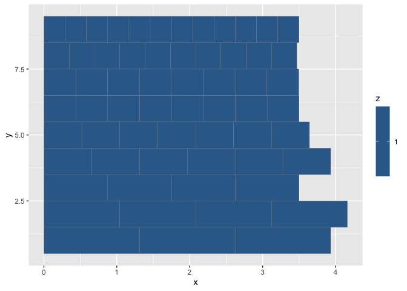
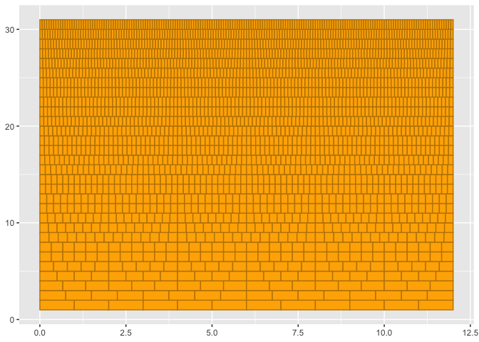

Frequency and Wavelength Relative Periodicity
================

## Chord

\[1\] 60 64 67

### Cycles Estimates

#### Spatial Estimate

| chord_Hz |  chord_m |  chord_s | chord_Sz | tol |
|---------:|---------:|---------:|---------:|----:|
| 65.40639 | 3.500041 | 0.015289 |        4 | 0.1 |

<!-- -->

##### Wavelength Ratios

| index | num | den |    ratio |      tone | reference_tone |
|------:|----:|----:|---------:|----------:|---------------:|
|     3 |   1 |   1 | 1.000000 | 0.8750102 |      0.8750102 |
|     2 |   5 |   4 | 1.189207 | 1.0405683 |      0.8750102 |
|     1 |   3 |   2 | 1.498307 | 1.3110340 |      0.8750102 |

#### Temporal Estimate

| chord_Hz |  chord_m |   chord_s | chord_Sz | tol |
|---------:|---------:|----------:|---------:|----:|
| 43.60426 | 7.866204 | 0.0229335 |        6 | 0.1 |

<!-- -->

#### Frequency Ratios

| index | num | den |    ratio |     tone | reference_tone |
|------:|----:|----:|---------:|---------:|---------------:|
|     1 |   1 |   1 | 1.000000 | 261.6256 |       261.6256 |
|     2 |   4 |   3 | 1.259921 | 329.6276 |       261.6256 |
|     3 |   3 |   2 | 1.498307 | 391.9954 |       261.6256 |

## References

[Periodic function from
Wikipedia](https://en.wikipedia.org/wiki/Periodic_Tunction)
