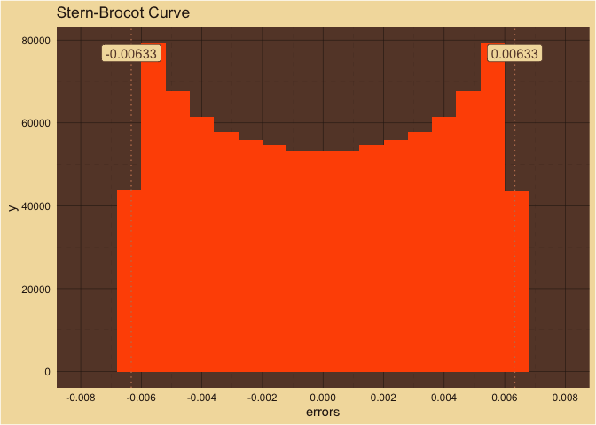
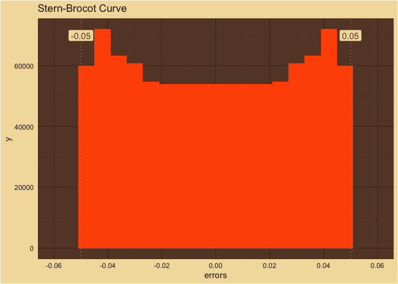
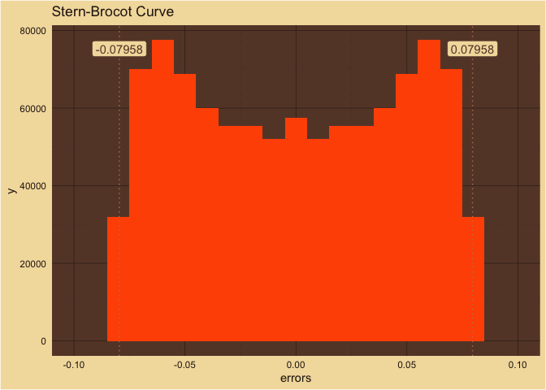
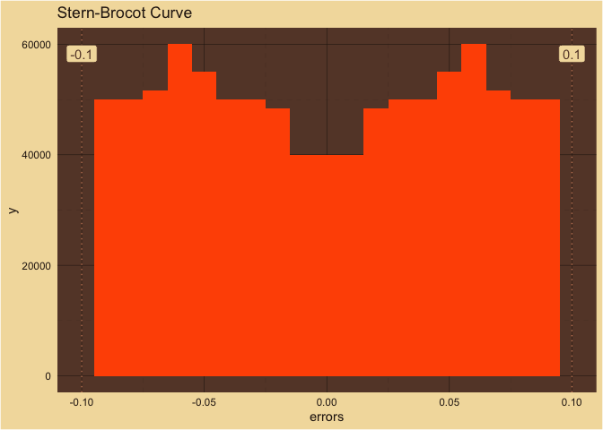
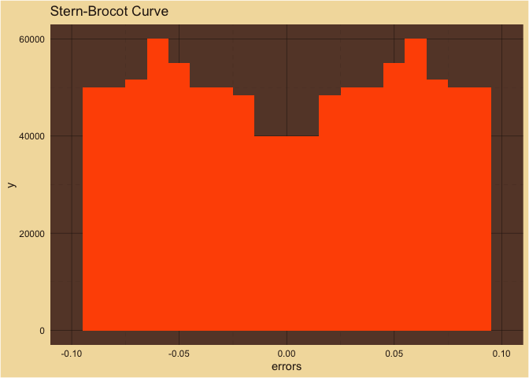

Stern-Brocot
================

<!-- -->  
Number of Samples: 999,674  
Number of Bins: 21  

<!-- -->  
Number of Samples: 1,000,000  
Number of Bins: 21  

<!-- -->  
Number of Samples: 999,998  
Number of Bins: 21  

<!-- -->  
Number of Samples: 1,000,000  
Number of Bins: 21  
A peak in a well?  

<!-- -->  
Number of Samples: 999,999  
Number of Bins: 21  

<!-- -->  
Number of Samples: 999,999  
Number of Bins: 21  
