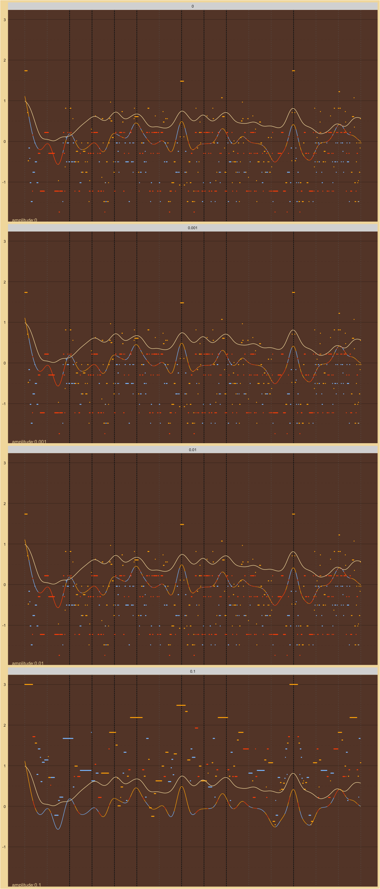

Amplitude Search
================

# Rolloff12

Sounded Amplitudes:

    #>  [1] 1.00000000 0.25118864 0.11194959 0.06309573 0.04044298 0.02812047
    #>  [7] 0.02068174 0.01584893 0.01253271 0.01015882

MaMi.CoDi Minimum Amplitudes:

    #>  [1] 0.25118864 0.11194959 0.06309573 0.04044298 0.02812047 0.02068174
    #>  [7] 0.01584893 0.01253271 0.01015882 0.00000000

Number of Harmonics:

    #> [1] 10

Octave Ratios:

    #> [1] 2

Roll Offs:

    #> [1] 12

Precisions:

    #> [1] 0.063

## CoDi

<!-- -->
