ICMPC 2023 Poster
================

## Primary MaMiCodi Data

``` r
chords <- chords %>% dplyr::filter(type == 'Dyads')

grid = tidyr::expand_grid(
  index         = seq_along(chords$pitches),
  num_harmonics = c(5)
)

plan(multisession, workers=parallelly::availableCores())

results = grid %>% furrr::future_pmap_dfr(\(index, num_harmonics) {
  
  chord_spectrum = hrep::sparse_fr_spectrum(chords$pitches[[index]],
                                            num_harmonics = num_harmonics)
  
  mami.codi.R::mami.codi(chord_spectrum,
            metadata=purrr::flatten(
              list(chords$metadata[[index]], num_harmonics=num_harmonics)
            ),
            verbose=T)
}, .progress=TRUE, .options = furrr::furrr_options(seed = T))

results <- results %>% dplyr::rowwise() %>% dplyr::mutate(
  label = metadata$label,
  type  = metadata$type, 
  num_harmonics=metadata$num_harmonics,
  .before=1
)
```

## Primary MaMiCoDi Plot

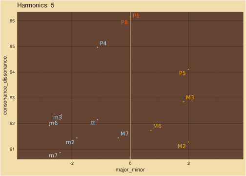<!-- -->

## Periods

### M3 Spectrum

### Pure Tones

``` r
M3 = mami.codi(c(60,64),num_harmonics=1,verbose=T)
plot(tibble::tibble(
  frequency = c(M3$reference_freq_low,
                M3$chord[[1]]$x,
                M3$reference_freq_high),
  amplitude = c(1.618,
                M3$chord[[1]]$y,
                1.618)
) %>% as.list %>% hrep::sparse_fr_spectrum(),
log = 'x'
)
```

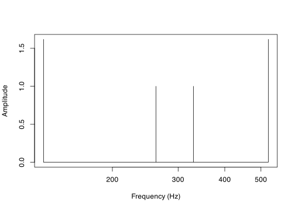<!-- -->

``` r
m3 = mami.codi(c(60,63),num_harmonics=1,verbose=T)
plot(tibble::tibble(
  frequency = c(m3$reference_freq_low,
                m3$chord[[1]]$x,
                m3$reference_freq_high),
  amplitude = c(1.618,
                m3$chord[[1]]$y,
                1.618)
) %>% as.list %>% hrep::sparse_fr_spectrum(),
log = 'x'
)
```

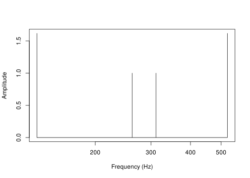<!-- -->

## M3 & m3 Period Ratios

## M3

``` r
M3$ratios_low[[1]]
#>   num den freq_ratio pseudo_ratio pitch_freq reference_freq
#> 1   2   1   2.000000     2.000000   261.6256       130.8128
#> 2   5   2   2.519842     2.519842   329.6276       130.8128
```

``` r
M3$ratios_high[[1]]
#>   num den freq_ratio pseudo_ratio pitch_freq reference_freq
#> 1   2   1   2.000000     2.000000   261.6256       523.2511
#> 2   8   5   1.587401     1.587401   329.6276       523.2511
```

``` r
M3$lcm_low
#> [1] 2
```

``` r
M3$lcm_high
#> [1] 5
```

``` r
rl=M3$ratios_low[[1]] %>% dplyr::filter(pitch_freq==hrep::midi_to_freq(60) |
                                       pitch_freq==hrep::midi_to_freq(64))
rl
#>   num den freq_ratio pseudo_ratio pitch_freq reference_freq
#> 1   2   1   2.000000     2.000000   261.6256       130.8128
#> 2   5   2   2.519842     2.519842   329.6276       130.8128
```

#### Below

``` r
ratios=tibble::tibble(
  name=c('C3',rl$pitch_freq),
  value=c(1,1/rl$freq_ratio)
)
ratios
#> # A tibble: 3 × 2
#>   name             value
#>   <chr>            <dbl>
#> 1 C3               1    
#> 2 261.625565300599 0.5  
#> 3 329.62755691287  0.397
```

``` r
ggplot2::ggplot(ratios, ggplot2::aes(x=name,y=value)) + 
  ggplot2::geom_bar(stat="identity")
```

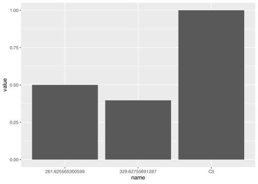<!-- -->

#### Above

``` r
ratios=tibble::tibble(
  name=c(M3$ratios_high[[1]]$pitch_freq,'C5'),
  value=c(M3$ratios_high[[1]]$freq_ratio,1)
)
ratios
#> # A tibble: 3 × 2
#>   name             value
#>   <chr>            <dbl>
#> 1 261.625565300599  2   
#> 2 329.62755691287   1.59
#> 3 C5                1
```

``` r
ggplot2::ggplot(ratios, ggplot2::aes(x=name,y=value)) + 
  ggplot2::geom_bar(stat="identity")
```

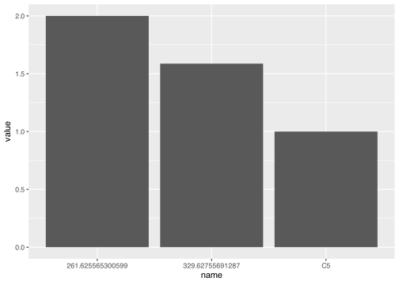<!-- -->

## m3

``` r
m3$ratios_low[[1]]
#>   num den freq_ratio pseudo_ratio pitch_freq reference_freq
#> 1  12   5   2.378414     2.378414   311.1270       130.8128
#> 2   2   1   2.000000     2.000000   261.6256       130.8128
```

``` r
m3$ratios_high[[1]]
#>   num den freq_ratio pseudo_ratio pitch_freq reference_freq
#> 1   5   3   1.681793     1.681793   311.1270       523.2511
#> 2   2   1   2.000000     2.000000   261.6256       523.2511
```

``` r
m3$lcm_low
#> [1] 5
```

``` r
m3$lcm_high
#> [1] 3
```

``` r
rl=m3$ratios_low[[1]] %>% dplyr::filter(pitch_freq==hrep::midi_to_freq(60) |
                                          pitch_freq==hrep::midi_to_freq(63))
rl
#>   num den freq_ratio pseudo_ratio pitch_freq reference_freq
#> 1  12   5   2.378414     2.378414   311.1270       130.8128
#> 2   2   1   2.000000     2.000000   261.6256       130.8128
```

#### Below

``` r
ratios=tibble::tibble(
  name=c('C3',rl$pitch_freq),
  value=c(1,1/rl$freq_ratio)
)
ratios
#> # A tibble: 3 × 2
#>   name             value
#>   <chr>            <dbl>
#> 1 C3               1    
#> 2 311.126983722081 0.420
#> 3 261.625565300599 0.5
```

``` r
ggplot2::ggplot(ratios, ggplot2::aes(x=name,y=value)) + 
  ggplot2::geom_bar(stat="identity")
```

<!-- -->

#### Above

``` r
ratios=tibble::tibble(
  name=c(m3$ratios_high[[1]]$pitch_freq,'C5'),
  value=c(m3$ratios_high[[1]]$freq_ratio,1)
)
ratios
#> # A tibble: 3 × 2
#>   name             value
#>   <chr>            <dbl>
#> 1 311.126983722081  1.68
#> 2 261.625565300599  2   
#> 3 C5                1
```

``` r
ggplot2::ggplot(ratios, ggplot2::aes(x=name,y=value)) + 
  ggplot2::geom_bar(stat="identity")
```

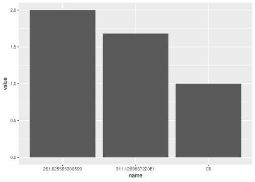<!-- -->

## Rotate Plot

### Math

Dissonance Definition

\$\$ d\_{f} = log_2(lcd(,…,))

\\

d\_{T} = log_2(lcd(,…,)) \$\$

Consonance Definition

$$
c_{f} = Z - d_{f} + d_{f}^{P1}
\\
c_{T} = Z - d_{T} + d_{T}^{P1}
\\
Z = 100/\sqrt{2}
$$

$$
\begin{bmatrix}
c \\
m
\end{bmatrix}
=
\begin{bmatrix}
cos(\theta) & sin(\theta) \\
-sin(\theta) & cos(\theta) \\
\end{bmatrix}
\begin{bmatrix}
c_T \\
c_f
\end{bmatrix}
-
\begin{bmatrix}
\delta \\
0
\end{bmatrix}
\\
\theta = \pi / 4, \ \
\delta = \sqrt{(d_{T}^{P1})^2+(d_{f}^{P1})^2}
$$

Definitions

\$\$ d\_{f} =  Frequency  Dissonance

\\

k_i / l_i = Frequency  Ratios  to  Low  Ref

\\

g_i / h_i = Period  Ratios  to  High  Ref

\\

d\_{T} =  Period  Dissonance

\\

c\_{f} =  Frequency  Consonance

\\

c\_{T} =  Period  Consonance

\\

d\_{f}^{P1} = Unison’s  Frequency  Dissonance

\\

d\_{T}^{P1} = Unison’s  Period  Dissonance

\\

c = Consonance-Dissonance

\\

m = Major-Minor

\\

= Rotation  Angle

\\

= Unison  Dissonance  vs. Pure

\$\$

### 1 Harmonic

    #> Warning in max(c(chords$dissonance_low, chords$dissonance_high)): no
    #> non-missing arguments to max; returning -Inf

<!-- -->

    #> Warning in min(c(chords$consonance_low, chords$consonance_high)): no
    #> non-missing arguments to min; returning Inf
    #> Warning in max(c(chords$consonance_low, chords$consonance_high)): no
    #> non-missing arguments to max; returning -Inf
    #> Warning: Removed 1 row containing missing values or values outside the scale range
    #> (`geom_abline()`).

<!-- -->

    #> Warning in max(abs(chords$major_minor)): no non-missing arguments to max;
    #> returning -Inf
    #> Warning in max(abs(chords$major_minor)): no non-missing arguments to max;
    #> returning -Inf
    #> Warning: Removed 1 row containing missing values or values outside the scale range
    #> (`geom_vline()`).

<!-- -->

## Results Plots

``` r
add_these = c('m2', 'M2','m3','M3',
              'tt',
              'P5', 'm6', 'M6','M7','P8')
ET_dyads = harmonics_5 %>% dplyr::filter(label %in% add_these)
ss = (1:12)[-c(5,10)]
ET_dyads$semitone = ss 
ET_dyads <- ET_dyads %>% dplyr::mutate(
  type         = '5Partials',
  octave_ratio = 2,
  scale        = 'macro',
  .before=1
)
```

``` r
dyads = dplyr::bind_rows(ET_dyads, behavior_dyads)
```

### Pure ~ Partials: 1

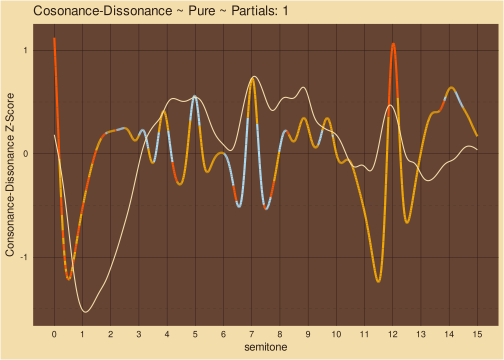<!-- -->

### 5Partials ~ Partials: 5

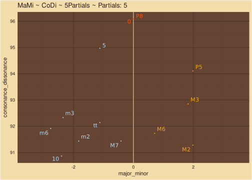<!-- -->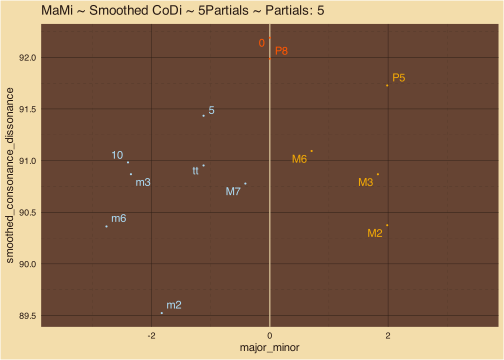<!-- -->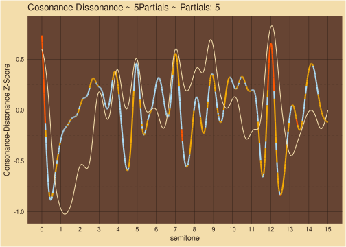<!-- -->

### Stretched ~ Partials: 10

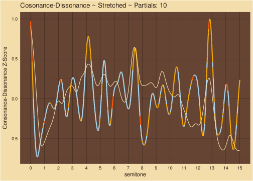<!-- -->

### Harmonic ~ Partials: 10

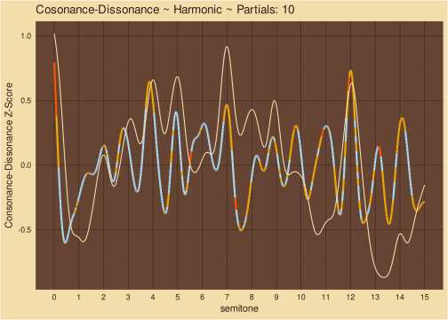<!-- -->

### Compressed ~ Partials: 10

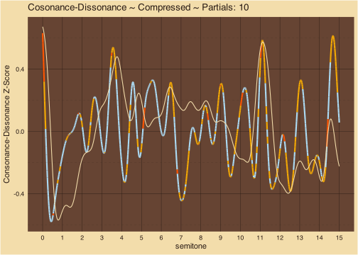<!-- -->  
\[\[1\]\] NULL

\[\[2\]\] NULL

\[\[3\]\] NULL

\[\[4\]\] NULL

\[\[5\]\] NULL

Timbral effects on consonance illuminate psychoacoustics of music
evolution Raja Marjieh, Peter M. C. Harrison, Harin Lee, Fotini
Deligiannaki, Nori Jacoby bioRxiv 2022.06.14.496070; doi:
<https://doi.org/10.1101/2022.06.14.496070>

Nemoto, I. & Kawakatsu, M. (2023) A two-dimensional representation of
musical chords using the simplicity of frequency and period ratios as
coordinates, Journal of Mathematics and Music, 17:1, 65-77.
<https://10.1080/17459737.2021.1924304>
