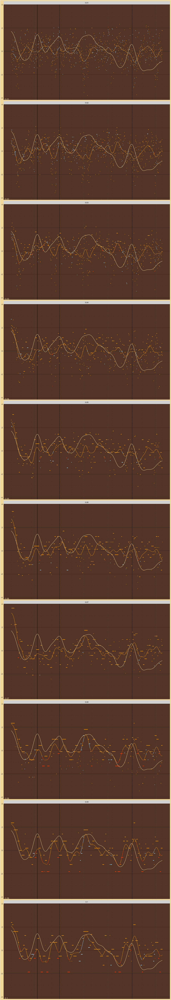

Tolerance 2D Search
================

Tolerances:

    #>  [1] 0.01 0.02 0.03 0.04 0.05 0.06 0.07 0.08 0.09 0.10

Number of Harmonics:

    #> [1] 10

Octave Ratios:

    #> [1] 2

## CoDi Wrap

<!-- -->
