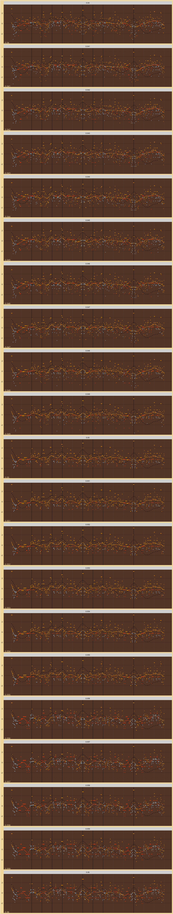

Tolerance Search
================

# 5PartialsNo3

Tolerances:

    #>  [1] 0.02000000 0.02100000 0.02200000 0.02300000 0.02400000 0.02500000
    #>  [7] 0.02600000 0.02700000 0.02800000 0.02900000 0.03000000 0.03100000
    #> [13] 0.03200000 0.03300000 0.03333333 0.03400000 0.03500000 0.03600000
    #> [19] 0.03700000 0.03800000 0.03900000 0.04000000 0.04100000 0.04200000
    #> [25] 0.04300000 0.04400000 0.04500000 0.04600000 0.04700000 0.04800000
    #> [31] 0.04900000 0.05000000 0.05100000 0.05200000 0.05300000 0.05400000
    #> [37] 0.05500000 0.05600000 0.05700000 0.05800000 0.05900000 0.06000000

Number of Harmonics:

    #> [1] 10

Octave Ratios:

    #> [1] 2

## CoDi Wrap

<!-- -->
