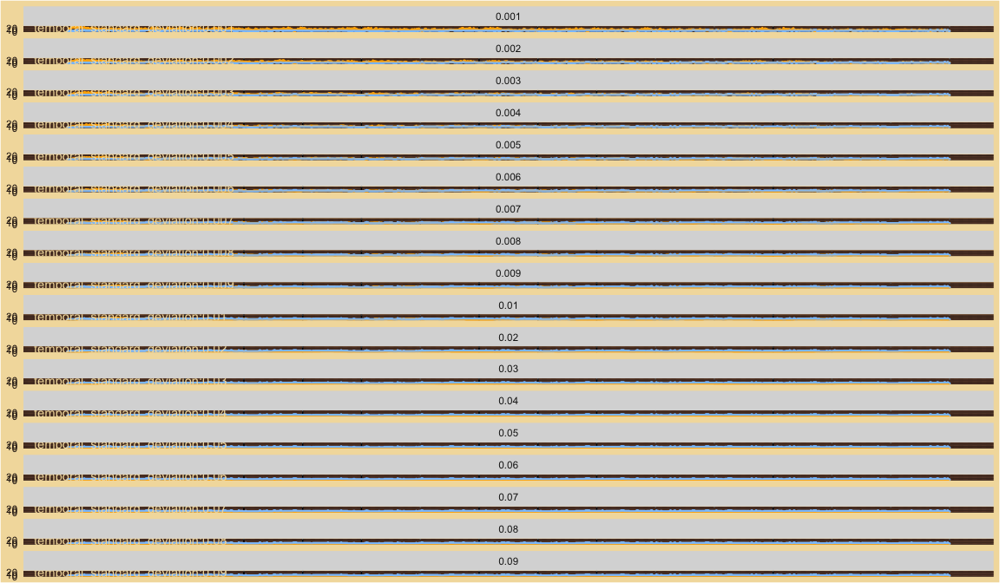

Standard Deviation Search
================

# Harmonic

Temporal Standard Deviations:

    #>  [1] 0.001 0.002 0.003 0.004 0.005 0.006 0.007 0.008 0.009 0.010 0.020 0.030
    #> [13] 0.040 0.050 0.060 0.070 0.080 0.090

Spatial Standard Deviations:

    #> [1] 0.07957747

Number of Harmonics:

    #> [1] 10

Octave Ratios:

    #> [1] 2

## CoDi

<!-- -->

## Spatiotemporal

<!-- -->
