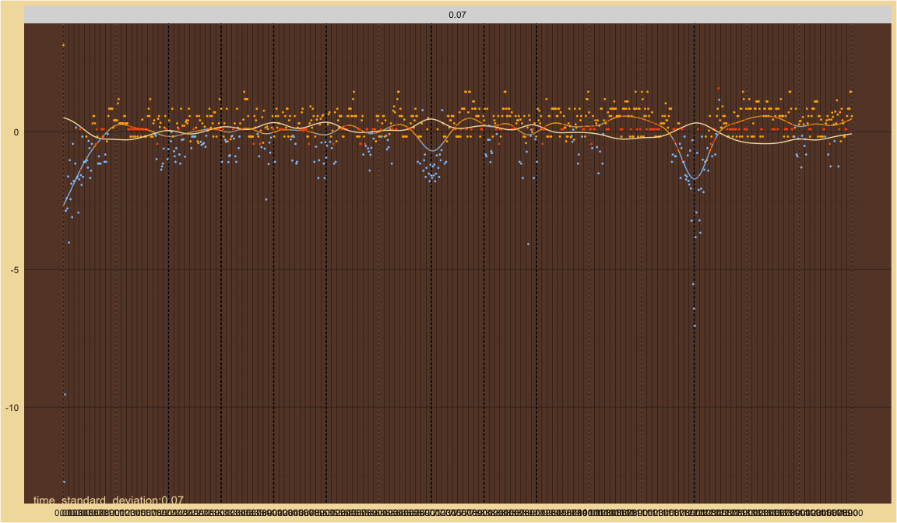
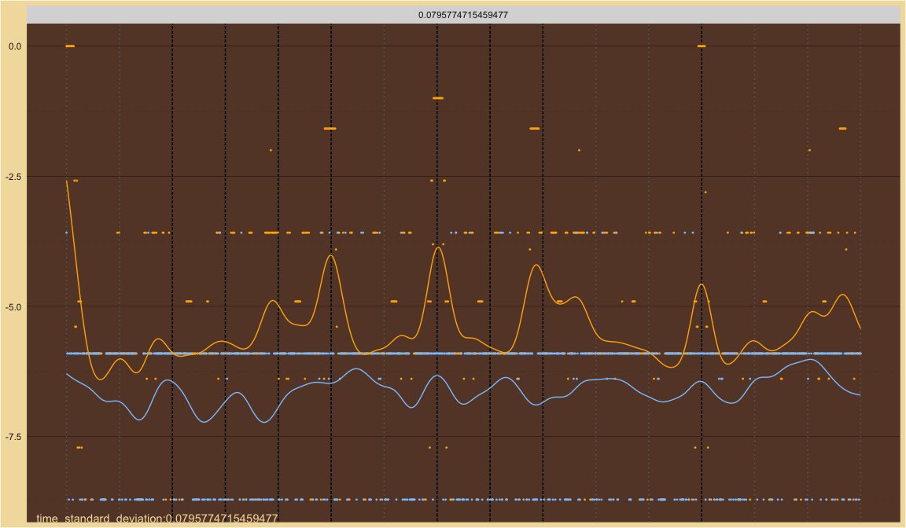

Standard Deviation Search
================

# Harmonic

time Standard Deviations:

    #> [1] 0.07957747

space Standard Deviations:

    #> [1] 0.01 0.02 0.03 0.04 0.05 0.06 0.07 0.08 0.09

include beats:

    #> [1] TRUE

Number of Harmonics:

    #> [1] 10

Octave Ratios:

    #> [1] 2

## CoDi

<!-- -->

## Space and Time

<!-- -->
