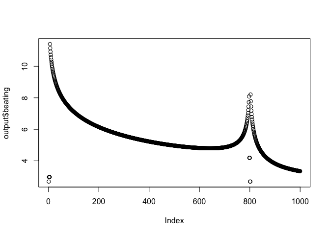
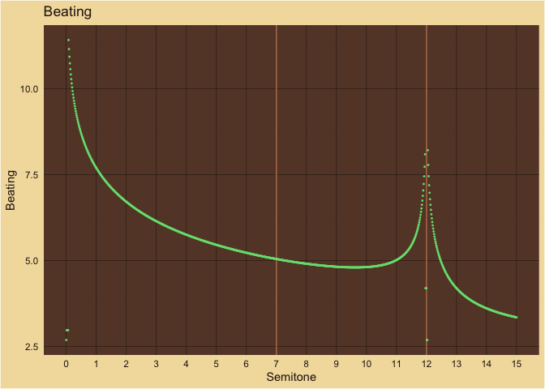

Beats
================

## At 0

    ## # A tibble: 3 × 4
    ##   interval  semitone beating wavelengths                                        
    ##   <chr>        <dbl>   <dbl> <chr>                                              
    ## 1 P1              12    7.45 41.9530866082944, 20.9765433041472                 
    ## 2 M2 skinny       12    7.82 47.4580893698917, 41.9530866082944, 37.59246776332…
    ## 3 M2 FAT          12   11.6  325.307488305485, 48.1646064061903, 41.95308660829…

## At 60

    ## # A tibble: 3 × 4
    ##   interval  semitone beating wavelengths                                        
    ##   <chr>        <dbl>   <dbl> <chr>                                              
    ## 1 P1              12    2.69 1.3110339565092, 0.6555169782546                   
    ## 2 M2 skinny       12    6.78 11.3022952702251, 1.48306529280911, 1.311033956509…
    ## 3 M2 FAT          12    6.64 10.1658590095464, 1.50514395019345, 1.311033956509…

<!-- -->

    ## [1] "2"

    ## [1] 2

<!-- -->
