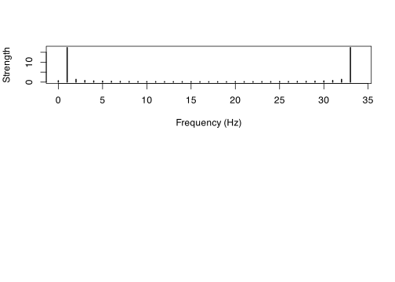

Benedetto
================

    #> # A tibble: 1 × 2
    #>   A0_10_harmonics_max_f A0_10_harmonics_min_f
    #>                   <dbl>                 <dbl>
    #> 1                  275.                  27.5

    #> # A tibble: 1 × 3
    #>    A0_f   A0_T Wiener_T
    #>   <dbl>  <dbl>    <dbl>
    #> 1  27.5 0.0364   0.0333

<!-- -->

<!-- -->
<!-- -->
<!-- -->
