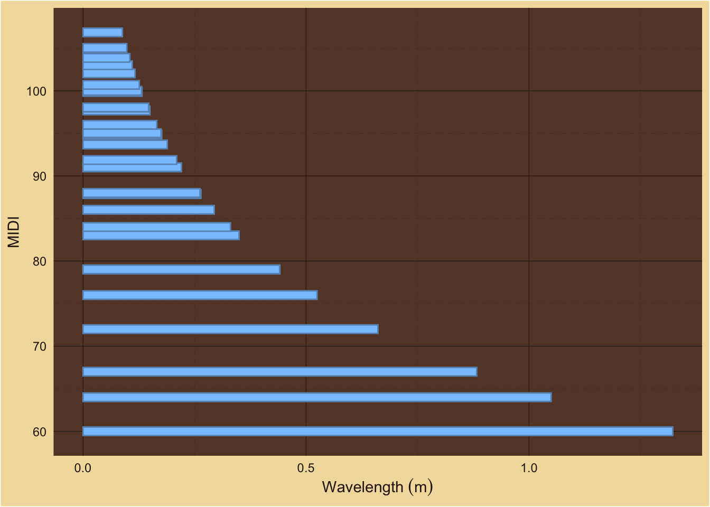
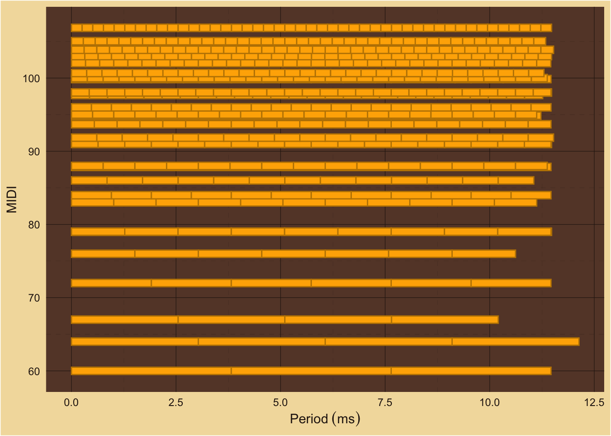
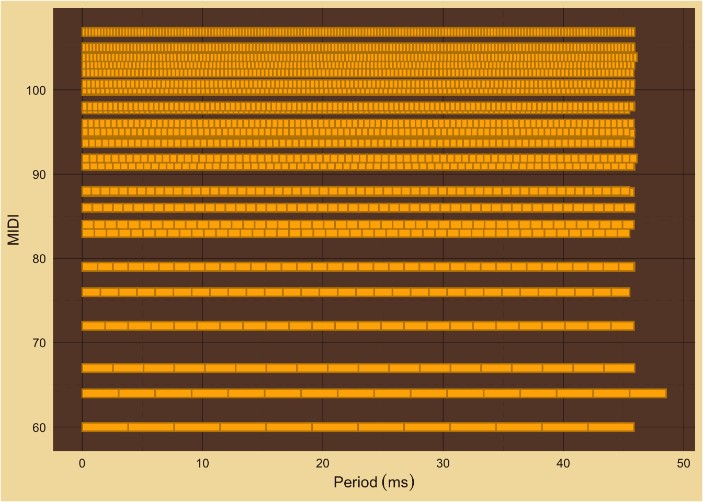
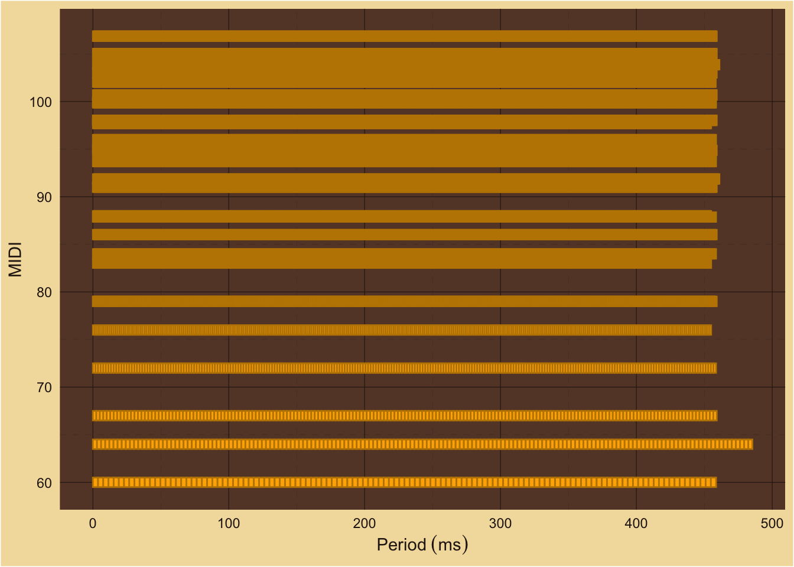

```{r, echo=F, message=F, include=F}
devtools::load_all(".")
source('./man/code/plot.R')
source('./man/code/utils.R')
knitr::opts_chunk$set(
 collapse = TRUE,
 comment = "#>",
 fig.path = "man/figures/README-",
 warning = FALSE,
 message = FALSE
)
```

## Estimating Spatiotemporal Periodicity

How long is the chord played? For the timbre study it was 1.3s per dyad.\

How does duration impact the two signals?\

### Spatial Signal

For the spatial signal, if the played duration is as long or longer than one 
period of the longest wavelength then all the information is available. For
example, C4's fundamental frequency is 262 Hz, the wavelength in air is 1.3m,
and the period is 3.8 ms. If the chord duration is 3.8ms or greater then the 
expected hair cells in the cochlea will be displaced and the pattern matching
(ALCD) part of the auditory system will have all the spatial information its ever
going to get about the chord. See Wiener's original analogy for the uncertainty principle.\

#### Wavelengths ~ Major Third with 10 Harmonics



### Temporal Signal

For the temporal signal, the longer the chord is played, the more information
that is available for estimating the periodicity.\

#### 12.5 ms ~ Major Third with 10 Harmonics



#### 50 ms ~ Major Third with 10 Harmonics



#### 500 ms ~ Major Third with 10 Harmonics



### Modeling with Duration

We start with the duration of 1.3s. How many periods will each partial have in 
that time frame?\

```{r, echo=F, message=F}
MT = c(60,64,67) %>% mami.codi(verbose=T, num_harmonics=10)
duration = 1.3
cycles = tibble::tibble(
  T_MT = 1 / MT$frequencies[[1]],
  T_count = duration / T_MT,
  T_count_ratios = T_count / T_count[1]
)
sb = cycles$T_count_ratios %>% 
  approximate_rational_fractions(default_variance() / 10, approximate_lcm_deviation())
knitr::kable(
  sb
)
```
dens: `r sb$den %>% unique() %>% sort()`\
LCD: `r lcm_integers(sb$den)`
```{r, echo=F, message=F}

MT = c(60,64,67) %>% mami.codi(verbose=T, num_harmonics=10)
duration = 1.3
cycles = tibble::tibble(
  T_MT = 1 / MT$frequencies[[1]],
  T_count = floor(duration / T_MT),
  T_count_ratios = T_count / T_count[1]
)
sb = cycles$T_count_ratios %>% 
  approximate_rational_fractions(default_variance() / 10, approximate_lcm_deviation())
knitr::kable(
  sb
)
```
dens: `r sb$den %>% unique() %>% sort()`\
LCD: `r lcm_integers(sb$den)`
