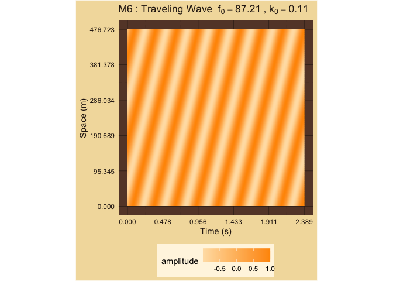
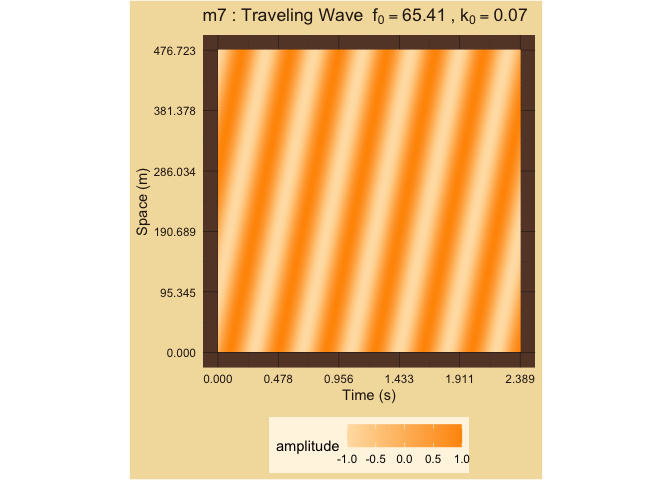

Fundamental Frequencies
================

# 2D Plots of Fundamental Frequencies f versus k

<!-- --><!-- --><!-- --><!-- --><!-- --><!-- --><!-- --><!-- --><!-- --><!-- --><!-- --><!-- --><!-- -->

### Framed Harmonics: 2

| Interval |        f0 |  l0 |  Majorness | Chord      | Dissonance |
|:---------|----------:|----:|-----------:|:-----------|-----------:|
| M3       | 0.1666667 |  12 |  1.0000000 | 60, 64, 72 |   6.169925 |
| m6       | 0.0833333 |   6 | -1.0000000 | 60, 68, 72 |   6.169925 |
| M6       | 0.3333333 |  12 |  2.0000000 | 60, 69, 72 |   5.169925 |
| m3       | 0.0833333 |   3 | -2.0000000 | 60, 63, 72 |   5.169925 |
| P5       | 0.5000000 |   3 |  0.5849625 | 60, 67, 72 |   2.584963 |
| P4       | 0.3333333 |   2 | -0.5849625 | 60, 65, 72 |   2.584963 |
| P1       | 1.0000000 |   1 |  0.0000000 | 60, 60, 72 |   0.000000 |
| P8       | 1.0000000 |   1 |  0.0000000 | 60, 72, 72 |   0.000000 |
| tt       | 0.0500000 |  20 |  0.0000000 | 60, 66, 72 |   8.643856 |
| M7       | 0.0833333 |   6 | -1.0000000 | 60, 71, 72 |   6.169925 |
| m2       | 0.1666667 |  12 |  1.0000000 | 60, 61, 72 |   6.169925 |
| M2       | 0.0500000 |   4 | -2.3219281 | 60, 62, 72 |   6.321928 |
| m7       | 0.2500000 |  20 |  2.3219281 | 60, 70, 72 |   6.321928 |
