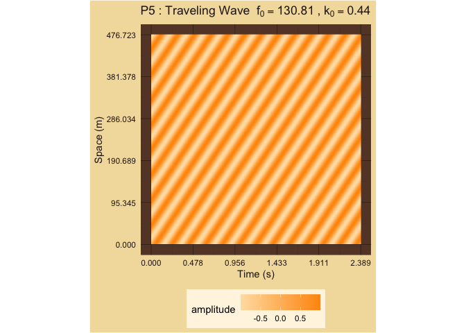

Fundamental Frequencies
================

# 2D Plots of Fundamental Frequencies f versus k

<!-- --><!-- --><!-- --><!-- --><!-- --><!-- --><!-- --><!-- --><!-- --><!-- --><!-- --><!-- --><!-- -->

### Framed Harmonics: 2

| Interval | Harmonics | TimeCycles | SpaceCycles |  Majorness | Dissonance | Chord      |
|:---------|----------:|-----------:|------------:|-----------:|-----------:|:-----------|
| M3       |         2 |          6 |          12 |  1.0000000 |   6.169925 | 60, 64, 72 |
| m6       |         2 |         12 |           6 | -1.0000000 |   6.169925 | 60, 68, 72 |
| M6       |         2 |          3 |          12 |  2.0000000 |   5.169925 | 60, 69, 72 |
| m3       |         2 |         12 |           3 | -2.0000000 |   5.169925 | 60, 63, 72 |
| P5       |         2 |          2 |           3 |  0.5849625 |   2.584963 | 60, 67, 72 |
| P4       |         2 |          3 |           2 | -0.5849625 |   2.584963 | 60, 65, 72 |
| P1       |         2 |          1 |           1 |  0.0000000 |   0.000000 | 60, 60, 72 |
| P8       |         2 |          1 |           1 |  0.0000000 |   0.000000 | 60, 72, 72 |
| tt       |         2 |         20 |          20 |  0.0000000 |   8.643856 | 60, 66, 72 |
| M7       |         2 |         12 |           6 | -1.0000000 |   6.169925 | 60, 71, 72 |
| m2       |         2 |          6 |          12 |  1.0000000 |   6.169925 | 60, 61, 72 |
| M2       |         2 |         20 |           4 | -2.3219281 |   6.321928 | 60, 62, 72 |
| m7       |         2 |          4 |          20 |  2.3219281 |   6.321928 | 60, 70, 72 |
