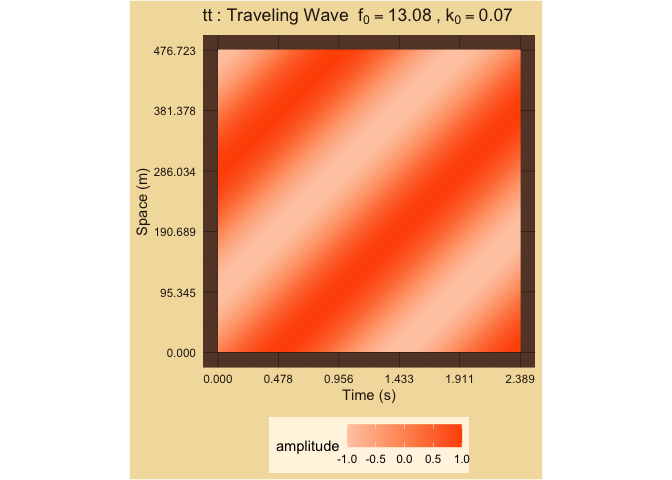
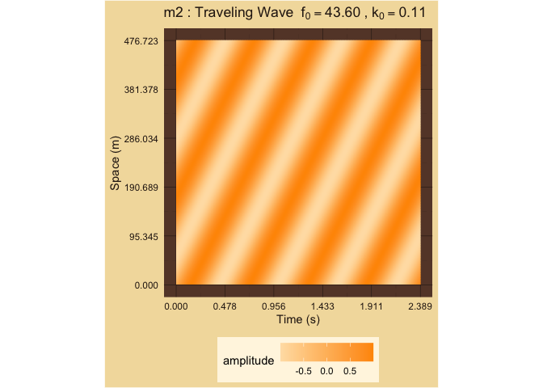

Fundamental Frequencies
================

# Wave Amplitude in Space and Time as Function of Wavelength and Frequency Cycle Times

#### M3

time cycles: 6

space cycles: 12

<!-- -->

#### m6

time cycles: 12

space cycles: 6

<!-- -->

#### M6

time cycles: 3

space cycles: 12

<!-- -->

#### m3

time cycles: 12

space cycles: 3

<!-- -->

#### P5

time cycles: 2

space cycles: 3

<!-- -->

#### P4

time cycles: 3

space cycles: 2

<!-- -->

#### P1

time cycles: 1

space cycles: 1

<!-- -->

#### P8

time cycles: 1

space cycles: 1

<!-- -->

#### tt

time cycles: 20

space cycles: 20

<!-- -->

#### M7

time cycles: 12

space cycles: 6

<!-- -->

#### m2

time cycles: 6

space cycles: 12

<!-- -->

#### M2

time cycles: 20

space cycles: 4

<!-- -->

#### m7

time cycles: 4

space cycles: 20

<!-- -->

### Framed Harmonics: 2

| Interval | Harmonics | TimeCycles | SpaceCycles |  Majorness | Dissonance | Chord      |
|:---------|----------:|-----------:|------------:|-----------:|-----------:|:-----------|
| M3       |         2 |          6 |          12 |  1.0000000 |   6.169925 | 60, 64, 72 |
| m6       |         2 |         12 |           6 | -1.0000000 |   6.169925 | 60, 68, 72 |
| M6       |         2 |          3 |          12 |  2.0000000 |   5.169925 | 60, 69, 72 |
| m3       |         2 |         12 |           3 | -2.0000000 |   5.169925 | 60, 63, 72 |
| P5       |         2 |          2 |           3 |  0.5849625 |   2.584963 | 60, 67, 72 |
| P4       |         2 |          3 |           2 | -0.5849625 |   2.584963 | 60, 65, 72 |
| P1       |         2 |          1 |           1 |  0.0000000 |   0.000000 | 60, 60, 72 |
| P8       |         2 |          1 |           1 |  0.0000000 |   0.000000 | 60, 72, 72 |
| tt       |         2 |         20 |          20 |  0.0000000 |   8.643856 | 60, 66, 72 |
| M7       |         2 |         12 |           6 | -1.0000000 |   6.169925 | 60, 71, 72 |
| m2       |         2 |          6 |          12 |  1.0000000 |   6.169925 | 60, 61, 72 |
| M2       |         2 |         20 |           4 | -2.3219281 |   6.321928 | 60, 62, 72 |
| m7       |         2 |          4 |          20 |  2.3219281 |   6.321928 | 60, 70, 72 |
