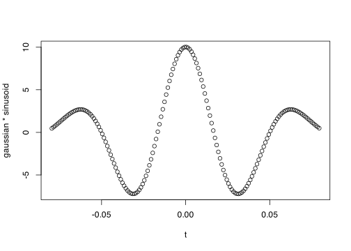

Gabor
================

“sub specie aeternitatis” p 431  

The above makes me think of the contrast between the infinity of Fourier
versus me with my ruler in one hand, stopwatch in the other and a tally
counter around my neck.  

“We know that any instrument, or combination of instruments, cannot
obtain more than at most 2(f2 — f1)tau independent data from the area
(f2 — f1)tau in the diagram. But instead of rigorously independent data,
which can be obtained in general only by calculation from the instrument
readings, it will be more convenient for the moment to
consider”practically” independent data, which can be obtained by direct
readings.” -Gabor  

“Decay time x Tuning width = Number of the order one.”  

For MaMi.CoDi:  

Wavelength ratio precision x Frequency ratio precision = Number of the
order one  

One observation happens in a “characteristic rectangle” in the
space-time diagram.

The conventional language is a blocker for me. When time is frozen and
we measure the wavelength in the cochlea that is a purely spatial
observation. But the convention is to label that a frequency measured in
Hz, which is 1/s. But time is frozen. There are no seconds? What
gives?  

It should be a spatial length measured in meters. Can we abandon the
label of time-frequency domain and replace it with space-time domain?  

But this can be a problem too:  

    #> # A tibble: 4 × 2
    #>   space          time           
    #>   <chr>          <chr>          
    #> 1 spatial length temporal length
    #> 2 wavelength     period         
    #> 3 count in space count in time  
    #> 4 wavenumber     frequency

    #> # A tibble: 1 × 4
    #>      f1    f2   tau_s data_count
    #>   <dbl> <dbl>   <dbl>      <dbl>
    #> 1  262. 2616. 0.00382       9.00

Gabor’s model starts with the orthogonal sine and cosine functions. And
uses the set of those 2 coefficients to create a data set of size
2(f2-f1)tau.  

MaMi.CoDi starts with the wavelength (row of hair cells, bank of reeds)
and frequency (phase-locking, oscillograph) signals to create a data set
of size 2(f2-f1)tau.

## 2.1 Time and Frequency

### Equation 1.1

<!-- -->

    #> # A tibble: 10 × 4
    #>        z     k ff           fft                
    #>    <dbl> <int> <cpl>        <cpl>              
    #>  1  262.     0 0+0.0000000i 14389.406+   0.000i
    #>  2  523.     1 0-0.6283185i -1308.128+4026.003i
    #>  3  785.     2 0-1.2566371i -1308.128+1800.483i
    #>  4 1047.     3 0-1.8849556i -1308.128+ 950.410i
    #>  5 1308.     4 0-2.5132741i -1308.128+ 425.036i
    #>  6 1570.     5 0-3.1415927i -1308.128+   0.000i
    #>  7 1831.     6 0-3.7699112i -1308.128- 425.036i
    #>  8 2093.     7 0-4.3982297i -1308.128- 950.410i
    #>  9 2355.     8 0-5.0265482i -1308.128-1800.483i
    #> 10 2616.     9 0-5.6548668i -1308.128-4026.003i

<!-- -->
