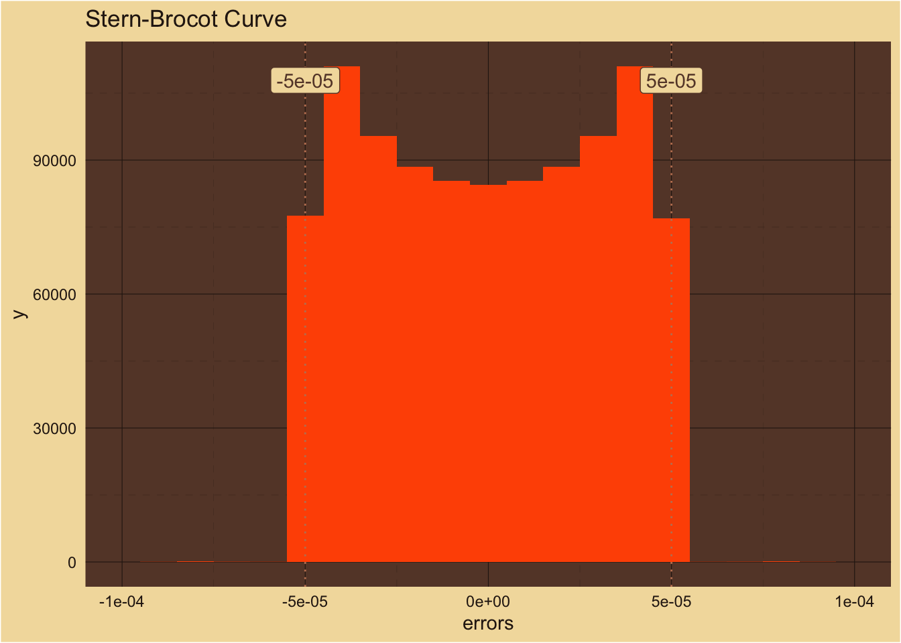
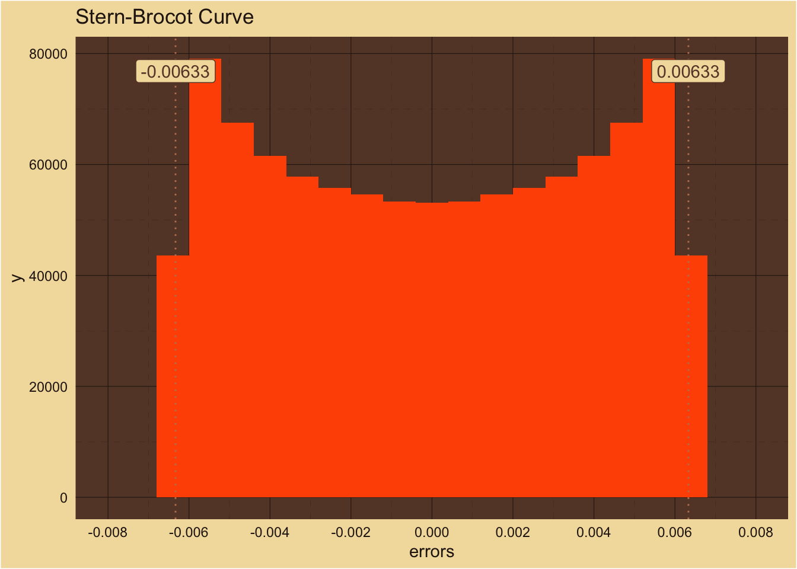
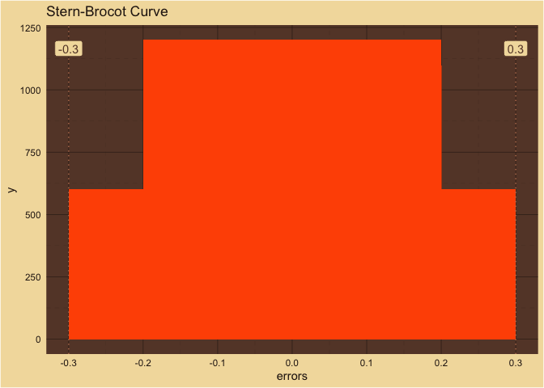
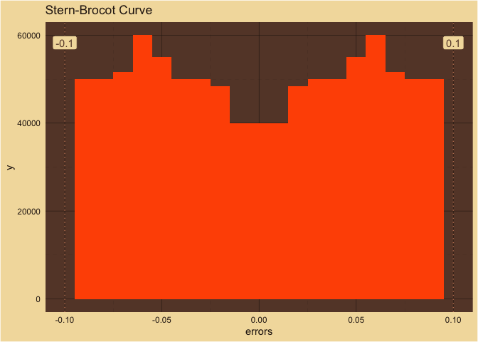
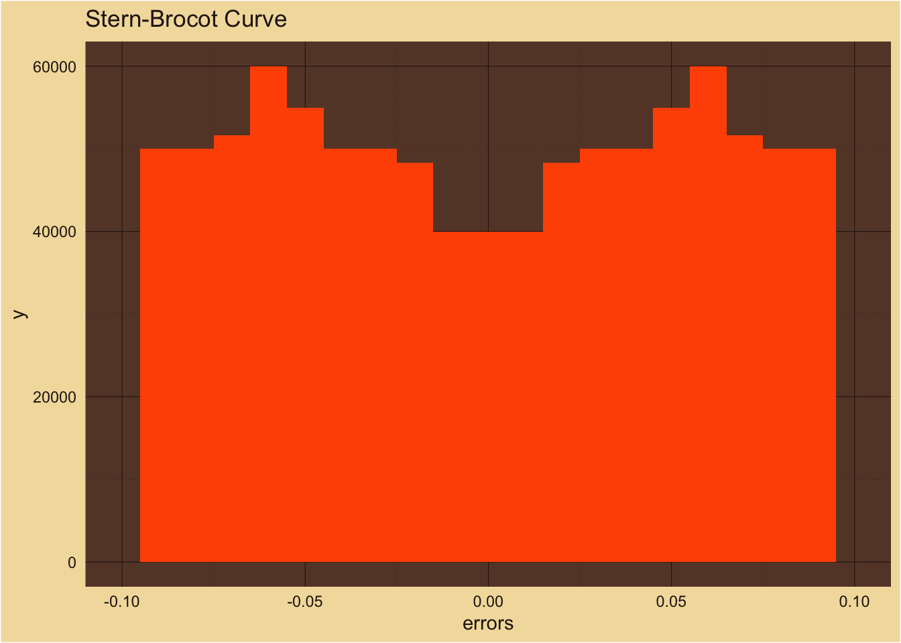

Math
================

### The Math

Consonance perception of a chord with multiple partials is both a wave
and a probabilistic phenomenon.

The probabilistic aspect comes from approximating rational numbers
within a given uncertainty using the Stern-Brocot tree.

<!-- -->  
Number of Samples: 1,000,000  
Number of Bins: 21  

<!-- -->  
Number of Samples: 1,000,000  
Number of Bins: 21  

<!-- -->  
Number of Samples: 1,000,000  
Number of Bins: 21  

<!-- -->  
Number of Samples: 1,000,000  
Number of Bins: 21  
A peak in a well?  

<!-- -->  
Number of Samples: 1,000,000  
Number of Bins: 21  

<!-- -->  
Number of Samples: 1,000,000  
Number of Bins: 21  

#### Free Wave Packets

$$\psi(x,t)= e^{-i \left(\pmb{\omega}}t - \pmb{k}x)$$

$$\phi(\pmb{k})=\frac{1}{\sqrt{2 \pi}} \int e^{-i \pmb{k} \pmb{\omega}}\psi(\pmb{\omega})d^N \omega $$

$\pmb{\omega}$ and $\pmb{k}$ are vectors of length $N$.

#### Fourier Transform

$$\psi(\pmb{\omega})=\frac{1}{\sqrt{2 \pi}} \int e^{i \pmb{k} \pmb{\omega}}\phi(\pmb{k})d^N k$$

$$\phi(\pmb{k})=\frac{1}{\sqrt{2 \pi}} \int e^{-i \pmb{k} \pmb{\omega}}\psi(\pmb{\omega})d^N \omega $$

$\pmb{\omega}$ and $\pmb{k}$ are vectors of length $N$.

#### Now Make $\psi$ and $\phi$ work

$\psi$ is temporal, the probability of the fundamental frequency.  

$\phi$ is spatial, the probability of the fundamental wavelength.  

#### Real Traveling Wave

$$\psi(x,t) = \sin \left( \frac{2\pi x}{\lambda_{0}} - 2 \pi f_{0} t \right)$$

#### Complex Traveling Wave

$$\psi(x,t) = e ^ {-i\left( 2 \pi f_{0} t - \frac{2\pi x}{\lambda_{0}} \right)}$$

#### State of the Chord

At time $t$ the probability for the chord to be in a given state is
given by

$$dP(x) = |\psi(x,t)|^2dx$$ It’s a probability so the integral must be
one:

$$P(x)=\int|\psi(x,t)|^2dx=1 $$

### Thoughts

$f(x)$ and $g(x)$ are both probabilities. The product of their uncertainty
satisfies the uncertainty principle.  

So what are they in our model?  

$f_{0}(f_{i \dots N})$ and $\lambda_{0}(\lambda_{i \dots N})$ are
probabilities that a set of frequencies or wavelengths will have a
specific fundamental value.  
