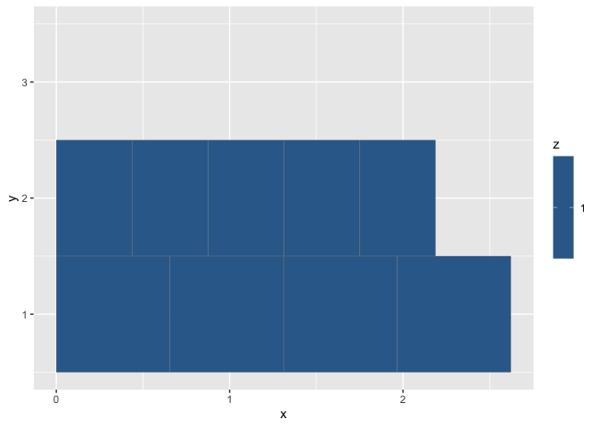
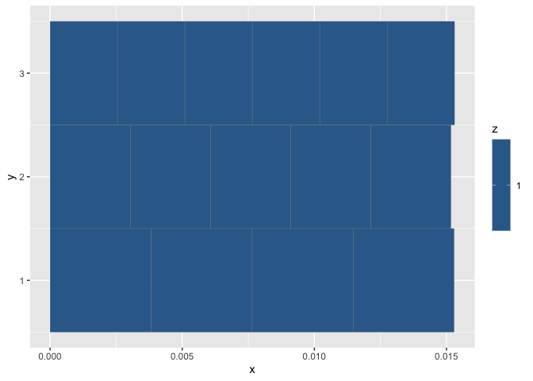

Frequency and Wavelength Relative Periodicity
================

## Chord

\[1\] 72 79

### Cycles Estimates

#### Spatial Estimate

| tol_l |     min_l | lcd_l |   chord_l |   chord_T |
|------:|----------:|------:|----------:|----------:|
|  0.15 | 0.4375051 |     2 | 0.8750102 | 0.0038223 |

    ## Warning: Removed 5 rows containing missing values or values outside the scale range
    ## (`geom_tile()`).

<!-- -->

#### Temporal Estimate

| tol_f |    min_f | lcd_f |  chord_f |   chord_T |
|------:|---------:|------:|---------:|----------:|
|  0.15 | 523.2511 |     2 | 261.6256 | 0.0038223 |

    ## Warning: Removed 5 rows containing missing values or values outside the scale range
    ## (`geom_tile()`).

<!-- -->

### Wavelength Ratios

| num | den |    ratio |      tone | reference_tone |
|----:|----:|---------:|----------:|---------------:|
|   1 |   1 | 1.000000 | 0.4375051 |      0.4375051 |
|   3 |   2 | 1.498307 | 0.6555170 |      0.4375051 |

### Frequency Ratios

| num | den |    ratio |     tone | reference_tone |
|----:|----:|---------:|---------:|---------------:|
|   1 |   1 | 1.000000 | 523.2511 |       523.2511 |
|   3 |   2 | 1.498307 | 783.9909 |       523.2511 |

#### References

[Periodic function from
Wikipedia](https://en.wikipedia.org/wiki/Periodic_function)
