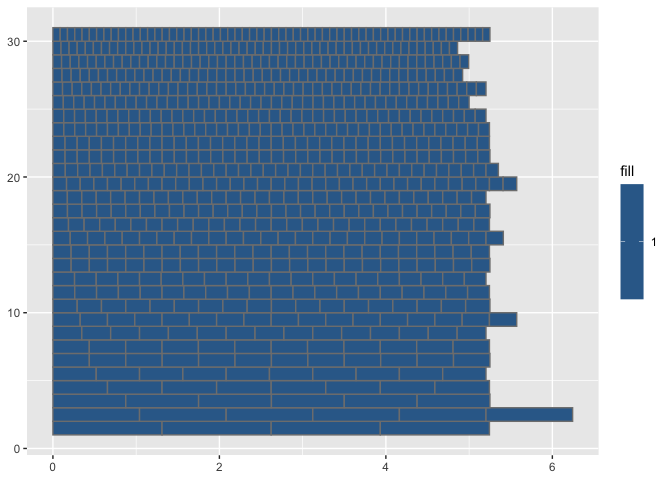
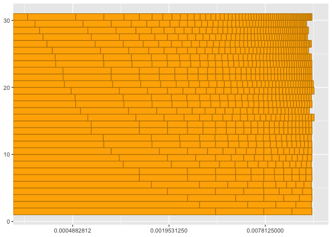

Period and Wavelength Relative Periodicity
================

## Chord

\[1\] 60 64 67

### Cycles Estimates

#### Spatial Estimate

| tol_l |    min_l | lcd_l |  chord_l |   chord_T |
|------:|---------:|------:|---------:|----------:|
|   0.1 | 0.087501 |    60 | 5.250061 | 0.2293354 |

<!-- -->

    ## Warning in ggplot2::scale_x_continuous(trans = "log2"): log-2 transformation
    ## introduced infinite values.

<!-- -->

#### Temporal Estimate

| tol_T |     min_T | lcd_T |   chord_T |
|------:|----------:|------:|----------:|
|   0.1 | 0.0002551 |    60 | 0.0153063 |

<!-- -->

    ## Warning in ggplot2::scale_x_continuous(trans = "log2"): log-2 transformation
    ## introduced infinite values.

<!-- -->

### Wavelength Ratios

| index | num | den |     ratio |      tone | reference_tone |
|------:|----:|----:|----------:|----------:|---------------:|
|    30 |   1 |   1 |  1.000000 | 0.0875010 |       0.087501 |
|    29 |   6 |   5 |  1.111111 | 0.0972234 |       0.087501 |
|    28 |   5 |   4 |  1.189207 | 0.1040568 |       0.087501 |
|    27 |   4 |   3 |  1.250000 | 0.1093763 |       0.087501 |
|    26 |   4 |   3 |  1.321341 | 0.1156187 |       0.087501 |
|    25 |   3 |   2 |  1.428571 | 0.1250015 |       0.087501 |
|    24 |   3 |   2 |  1.486509 | 0.1300710 |       0.087501 |
|    23 |   3 |   2 |  1.498307 | 0.1311034 |       0.087501 |
|    22 |   5 |   3 |  1.664786 | 0.1456704 |       0.087501 |
|    21 |   5 |   3 |  1.666667 | 0.1458350 |       0.087501 |
|    20 |   5 |   3 |  1.698867 | 0.1486526 |       0.087501 |
|    19 |   9 |   5 |  1.872884 | 0.1638792 |       0.087501 |
|    18 |   2 |   1 |  1.982012 | 0.1734281 |       0.087501 |
|    17 |   2 |   1 |  2.000000 | 0.1750020 |       0.087501 |
|    16 |  11 |   5 |  2.140439 | 0.1872906 |       0.087501 |
|    15 |   7 |   3 |  2.378414 | 0.2081137 |       0.087501 |
|    14 |   5 |   2 |  2.497178 | 0.2185057 |       0.087501 |
|    13 |   5 |   2 |  2.500000 | 0.2187525 |       0.087501 |
|    12 |   3 |   1 |  2.973018 | 0.2601421 |       0.087501 |
|    11 |   3 |   1 |  2.996614 | 0.2622068 |       0.087501 |
|    10 |  10 |   3 |  3.333333 | 0.2916701 |       0.087501 |
|     9 |  11 |   3 |  3.745768 | 0.3277585 |       0.087501 |
|     8 |   4 |   1 |  3.964024 | 0.3468561 |       0.087501 |
|     7 |   5 |   1 |  4.994357 | 0.4370113 |       0.087501 |
|     6 |   5 |   1 |  5.000000 | 0.4375051 |       0.087501 |
|     5 |   6 |   1 |  5.946035 | 0.5202842 |       0.087501 |
|     4 |  15 |   2 |  7.491535 | 0.6555170 |       0.087501 |
|     3 |  10 |   1 | 10.000000 | 0.8750102 |       0.087501 |
|     2 |  59 |   5 | 11.892071 | 1.0405683 |       0.087501 |
|     1 |  15 |   1 | 14.983071 | 1.3110340 |       0.087501 |

### Frequency Ratios

| index | num | den |     ratio |      tone | reference_tone |
|------:|----:|----:|----------:|----------:|---------------:|
|    30 |   1 |   1 |  1.000000 | 0.0002551 |      0.0002551 |
|    29 |   6 |   5 |  1.111111 | 0.0002835 |      0.0002551 |
|    28 |   5 |   4 |  1.189207 | 0.0003034 |      0.0002551 |
|    27 |   4 |   3 |  1.250000 | 0.0003189 |      0.0002551 |
|    26 |   4 |   3 |  1.321341 | 0.0003371 |      0.0002551 |
|    25 |   3 |   2 |  1.428571 | 0.0003644 |      0.0002551 |
|    24 |   3 |   2 |  1.486509 | 0.0003792 |      0.0002551 |
|    23 |   3 |   2 |  1.498307 | 0.0003822 |      0.0002551 |
|    22 |   5 |   3 |  1.664786 | 0.0004247 |      0.0002551 |
|    21 |   5 |   3 |  1.666667 | 0.0004252 |      0.0002551 |
|    20 |   5 |   3 |  1.698867 | 0.0004334 |      0.0002551 |
|    19 |   9 |   5 |  1.872884 | 0.0004778 |      0.0002551 |
|    18 |   2 |   1 |  1.982012 | 0.0005056 |      0.0002551 |
|    17 |   2 |   1 |  2.000000 | 0.0005102 |      0.0002551 |
|    16 |  11 |   5 |  2.140439 | 0.0005460 |      0.0002551 |
|    15 |   7 |   3 |  2.378414 | 0.0006067 |      0.0002551 |
|    14 |   5 |   2 |  2.497178 | 0.0006370 |      0.0002551 |
|    13 |   5 |   2 |  2.500000 | 0.0006378 |      0.0002551 |
|    12 |   3 |   1 |  2.973018 | 0.0007584 |      0.0002551 |
|    11 |   3 |   1 |  2.996614 | 0.0007645 |      0.0002551 |
|    10 |  10 |   3 |  3.333333 | 0.0008504 |      0.0002551 |
|     9 |  11 |   3 |  3.745768 | 0.0009556 |      0.0002551 |
|     8 |   4 |   1 |  3.964024 | 0.0010112 |      0.0002551 |
|     7 |   5 |   1 |  4.994357 | 0.0012741 |      0.0002551 |
|     6 |   5 |   1 |  5.000000 | 0.0012755 |      0.0002551 |
|     5 |   6 |   1 |  5.946035 | 0.0015169 |      0.0002551 |
|     4 |  15 |   2 |  7.491535 | 0.0019111 |      0.0002551 |
|     3 |  10 |   1 | 10.000000 | 0.0025511 |      0.0002551 |
|     2 |  59 |   5 | 11.892071 | 0.0030337 |      0.0002551 |
|     1 |  15 |   1 | 14.983071 | 0.0038223 |      0.0002551 |

#### References

[Periodic function from
Wikipedia](https://en.wikipedia.org/wiki/Periodic_Tunction)
