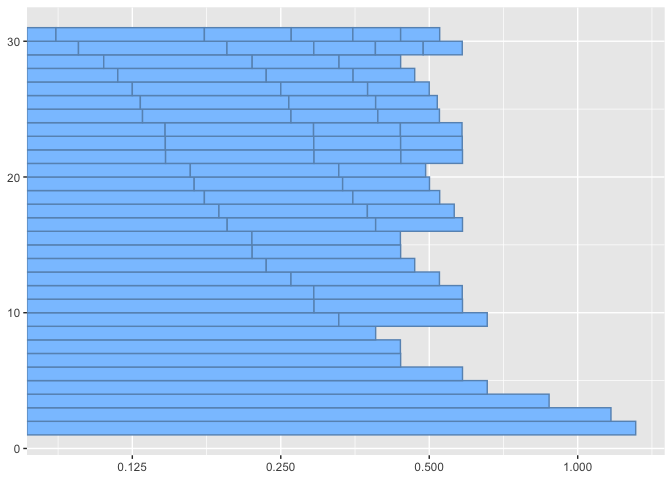
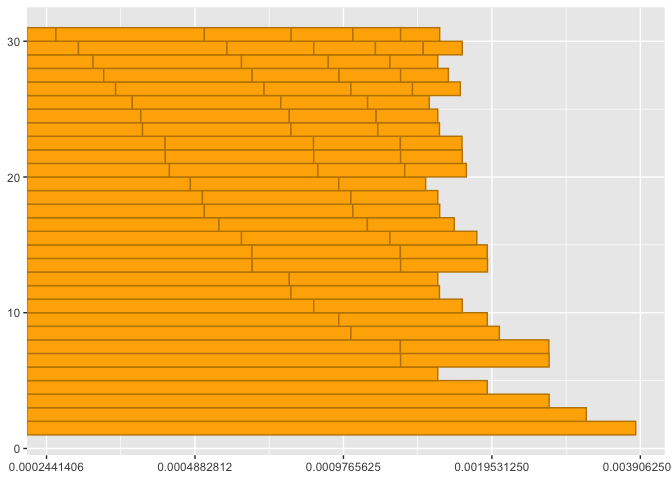

Frequency and Wavelength Relative Periodicity
================

# Chord Cycle Estimates

\[1\] 60 64 67

## Spatial

| tol_l |     min_l | lcd_l |  chord_l |   chord_T |
|------:|----------:|------:|---------:|----------:|
|  0.15 | 0.8750102 |     6 | 5.250061 | 0.0153063 |

<!-- -->

## Temporal

| tol_f |    min_f | lcd_f |   chord_T |
|------:|---------:|------:|----------:|
| 0.075 | 261.6256 |     6 | 0.0153063 |

<!-- -->

### Wavelength Ratios

| index | num | den |    ratio |      tone | reference_tone |
|------:|----:|----:|---------:|----------:|---------------:|
|     3 |   1 |   1 | 1.000000 | 0.8750102 |      0.8750102 |
|     2 |   4 |   3 | 1.189207 | 1.0405683 |      0.8750102 |
|     1 |   3 |   2 | 1.498307 | 1.3110340 |      0.8750102 |

### Frequency Ratios

| index | num | den |    ratio |     tone | reference_tone |
|------:|----:|----:|---------:|---------:|---------------:|
|     1 |   1 |   1 | 1.000000 | 261.6256 |       261.6256 |
|     2 |   4 |   3 | 1.259921 | 329.6276 |       261.6256 |
|     3 |   3 |   2 | 1.498307 | 391.9954 |       261.6256 |

## References

[Periodic function from
Wikipedia](https://en.wikipedia.org/wiki/Periodic_Tunction)
