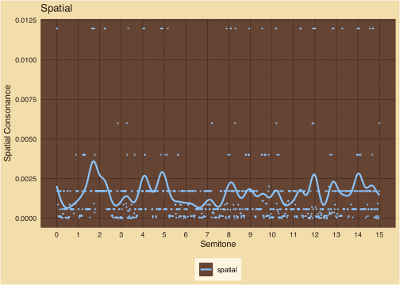
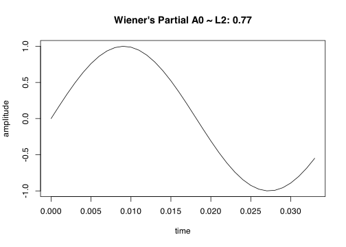

Shaping Consonance
================

``` r
chords$spatial_dissonance = log2(chords$spatial_dissonance+1)
print(plot_semitone_spatial(chords, 'Spatial'))
```

<!-- -->

``` r
chords$temporal_dissonance = log2(chords$temporal_dissonance+1)
print(plot_semitone_temporal(chords, 'Temporal'))
```

<!-- -->
