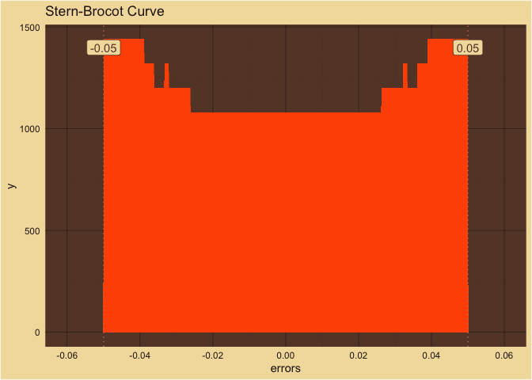
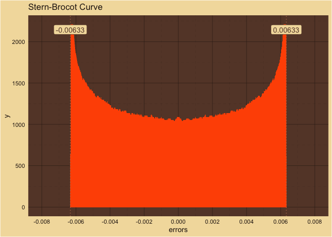
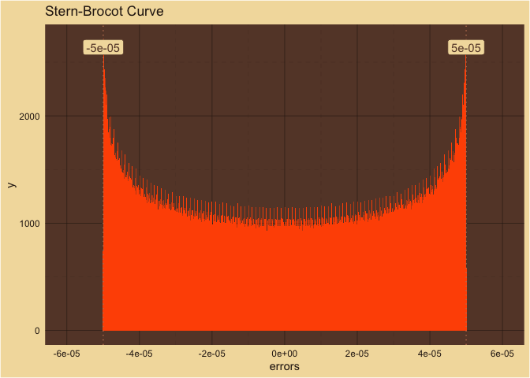

Stern-Brocot
================

Variance: 5^{-5}

<!-- -->  
Number of Samples: 1,000,000  
Number of Bins: 21  

Variance: 0.0063326

<!-- -->  
Number of Samples: 1,000,000  
Number of Bins: 21  

Variance: 0.05

<!-- -->  
Number of Samples: 1,000,000  
Number of Bins: 21  

Variance: 0.0795775

<!-- -->  
Number of Samples: 1,000,000  
Number of Bins: 21  
A peak in a well?  

Variance: 0.1

<!-- -->  
Number of Samples: 1,000,000  
Number of Bins: 21  

Variance: 0.5

<!-- -->  
Number of Samples: 1,000,000  
Number of Bins: 21  

Variance: 1

<!-- -->  
Number of Samples: 1,000,000  
Number of Bins: 21  

Variance: 10

<!-- -->  
Number of Samples: 1,000,000  
Number of Bins: 21  

Variance: 100

<!-- -->  
Number of Samples: 1,000,000  
Number of Bins: 21  

Variance: 1000

<!-- -->  
Number of Samples: 1,000,000  
Number of Bins: 21  
